# PlantUML概要

| ダイアグラム |                                 |                        | 内容                                                                                      |
| ------------ | ------------------------------- | ---------------------- | ----------------------------------------------------------------------------------------- |
| 構造図       |                                 |                        |
|              | 〇 クラス図                     |                        | クラスの定義とクラス間の関係を記述                                                        |
|              | 〇 オブジェクト図               |                        | クラス図の定義を具体化（インスタンス化）して記述                                          |
|              | ● パッケージ図                  |                        | クラスをグループ化して記述                                                                |
|              | 〇 コンポーネント図             |                        | コンポーネント、ポート、インターフェイス、コンポーネント間の関係を記述                    |
|              | ● コンポジット構造図            |                        | 複数のクラスの定義とクラス間の関係を記述                                                  |
|              | 〇 配置図                       |                        | 物理的な構成を記述                                                                        |
| ふるまい図   |                                 |                        |
|              | ● 相互作用図                    |                        |                                                                                           |
|              |                                 | 〇 シーケンス図        | 登場人物とシステム内のオブジェクト、通過するメッセージと発生順序を記述                    |
|              |                                 | ● コミュニケーション図 | クラスやオブジェクト間の応答と関係を記述                                                  |
|              |                                 | 〇 タイミング図        | 時間軸と状態変化を記述                                                                    |
|              |                                 | ● 相互作用概要図       | *相互作用図* をアクティビティ図の構成要素にしたもの                                       |
|              |                                 |                        |                                                                                           |
|              | 〇 ユースケース図               |                        | アクター（人／組織／別のシステム）とシステムのやり取りを記述                              |
|              | 〇 アクティビティ図             |                        | 「アクション（制御）」の遷移を記述                                                        |
|              | 〇 状態遷移図                   |                        | 「状態」の遷移を記述（ステート図 / ステートマシン図）                                     |
| その他       |                                 |                        |
|              | △ Archimate（アーキテクチャ図） |                        | システムの構造を記述                                                                      |
|              | △ AsciiMath                     |                        | 数式を記述                                                                                |
|              | △ Ditaa                         |                        | アスキーアートを画像化するものDitaa (DIagrams Through Ascii Art)                          |
|              | △ JSON                          |                        |                                                                                           |
|              | △ nwdiag（ネットワーク図）      |                        | ネットワーク機器の物理的な接続を記述                                                      |
|              | △ Salt（Wireframe）             |                        | ワイヤフレームによる GUI 設計ツール                                                       |
|              | △ WBS                           |                        | タスクを分割して階層構造を可視化するもの（Work Breakdown Structure）                      |
|              | △ YAML                          |                        |                                                                                           |
|              | △ ガントチャート                |                        | タスクごとのスケジュールを可視化するもの                                                  |
|              | △ マインドマップ                |                        | アイディアを可視化するもの                                                                |
|              | ▲ ER図                          |                        | RDBの構造（エンティティ・アトリビュート・リレーション・カーディナリティ）を可視化するもの |

## UMLダイアグラムの関係

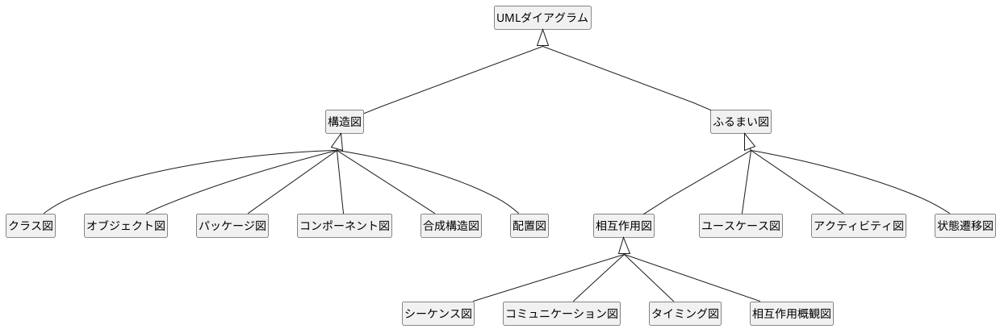


## 共通コマンド


### コメント

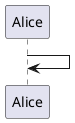


### 拡大

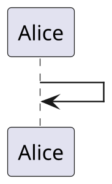


### 凡例

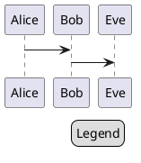


## 色

### 色の一覧

```plantuml

@startuml

colors

@enduml

```

#### 類似色

```plantuml

@startuml

colors aqua

@enduml

```

### 関数

| 名前                   | 説明                | 例                                | 結果      |
| ---------------------- | ------------------- | --------------------------------- | --------- |
| `%darken`              | 暗くする            | `%darken("red", 20)`              | `#CC0000` |
| `%is_dark`             | 暗い色か判定        | `%is_dark("#000000")`             | `true`    |
| `%is_light`            | 明るい色か判定      | `%is_light("#000000")`            | `false`   |
| `%lighten`             | 明るくする          | `%lighten("red", 20)`             | `#CC3333` |
| `%reverse_color`       | 色反転（RGB基準）   | `%reverse_color("#FF7700")`       | `#0088FF` |
| `%reverse_hsluv_color` | 色反転（HSLuv基準） | `%reverse_hsluv_color("#FF7700")` | `#602800` |

### 背景色指定

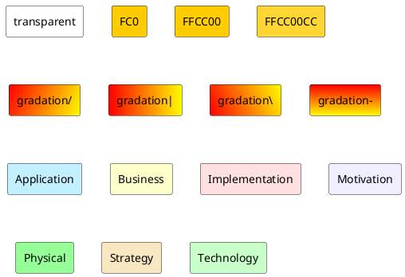

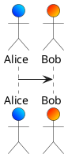

### フォント色


```plantuml

@startuml

skinparam classFontColor automatic /' 背景色に応じた色 '/
skinparam classHeaderBackgroundColor #000

class classA {
  testMethodCode()
}

@enduml

```


## 画像埋め込み

スプライト（モノクロで4、8、16段階のグレースケールの小さい画像）を埋め込む

```plantuml

@startuml

sprite $sprite1 {
    FFFFFFFFFFFFFFFFF
    F0123456789ABCDEF
    F1123456789ABCDEF
    F2223456789ABCDEF
    F3333456789ABCDEF
    F4444456789ABCDEF
    F5555556789ABCDEF
    F6666666789ABCDEF
    F7777777789ABCDEF
    F8888888889ABCDEF
    F9999999999ABCDEF
    FAAAAAAAAAAABCDEF
    FBBBBBBBBBBBBCDEF
    FDDDDDDDDDDDDDDEF
    FEEEEEEEEEEEEEEEF
    FFFFFFFFFFFFFFFFF
}

:Alice: -> :Bob: : <$sprite1>
:Bob: -> :Charlie: : <$sprite1,scale=2>
:Charlie: -> :Dave: : <$sprite1,color=Tomato>

@enduml

```

### SVGタグ

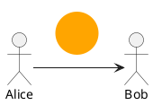

### 画像ファイルをスプライトに変換

```bash
$ java -jar plantuml.jar -encodesprite 16z foo.png
# -encodesprite : 4、8、16、4z、8z、16z
```


### アイコン画像


#### Archimate

```plantuml

@startuml

listspritess

@enduml

```


#### AWS

```plantuml

@startuml

scale .5

!define AWSPuml https://raw.githubusercontent.com/awslabs/aws-icons-for-plantuml/v14.0/dist

!include AWSPuml/AWSCommon.puml

!include AWSPuml/Analytics/all.puml
!include AWSPuml/ApplicationIntegration/all.puml
!include AWSPuml/Blockchain/all.puml
!include AWSPuml/BusinessApplications/all.puml
!include AWSPuml/CloudFinancialManagement/all.puml
!include AWSPuml/Compute/all.puml
!include AWSPuml/Containers/all.puml
!include AWSPuml/CustomerEnablement/all.puml
!include AWSPuml/Database/all.puml
!include AWSPuml/DeveloperTools/all.puml
!include AWSPuml/EndUserComputing/all.puml
!include AWSPuml/FrontEndWebMobile/all.puml
!include AWSPuml/GameTech/all.puml
!include AWSPuml/General/all.puml
!include AWSPuml/Groups/all.puml
!include AWSPuml/InternetOfThings/all.puml
!include AWSPuml/MachineLearning/all.puml
!include AWSPuml/ManagementGovernance/all.puml
!include AWSPuml/MediaServices/all.puml
!include AWSPuml/MigrationTransfer/all.puml
!include AWSPuml/NetworkingContentDelivery/all.puml
!include AWSPuml/QuantumTechnologies/all.puml
!include AWSPuml/Robotics/all.puml
!include AWSPuml/Satellite/all.puml
!include AWSPuml/SecurityIdentityCompliance/all.puml
!include AWSPuml/Serverless/all.puml
!include AWSPuml/Storage/all.puml


listspritess

@enduml

```


#### Azure

```plantuml

@startuml

scale .5

!define AzurePuml https://raw.githubusercontent.com/plantuml-stdlib/Azure-PlantUML/master/dist

!includeurl AzurePuml/AzureCommon.puml
!includeurl AzurePuml/AIMachineLearning/all.puml
!includeurl AzurePuml/Analytics/all.puml
!includeurl AzurePuml/Blockchain/all.puml
!includeurl AzurePuml/Compute/all.puml
!includeurl AzurePuml/Containers/all.puml
!includeurl AzurePuml/Databases/all.puml
!includeurl AzurePuml/DevOps/all.puml
!includeurl AzurePuml/General/all.puml
!includeurl AzurePuml/Health/all.puml
!includeurl AzurePuml/Identity/all.puml
!includeurl AzurePuml/Integration/all.puml
!includeurl AzurePuml/InternetOfThings/all.puml
!includeurl AzurePuml/Intune/all.puml
!includeurl AzurePuml/Management/all.puml
!includeurl AzurePuml/Media/all.puml
!includeurl AzurePuml/Migrate/all.puml
!includeurl AzurePuml/Mobile/all.puml
!includeurl AzurePuml/Networking/all.puml
!includeurl AzurePuml/Security/all.puml
!includeurl AzurePuml/Stack/all.puml
!includeurl AzurePuml/Storage/all.puml


listsprites

@enduml

```


#### C4 model

コンテキスト（context）、コンテナ（containers）、コンポーネント（components）、コード（code）

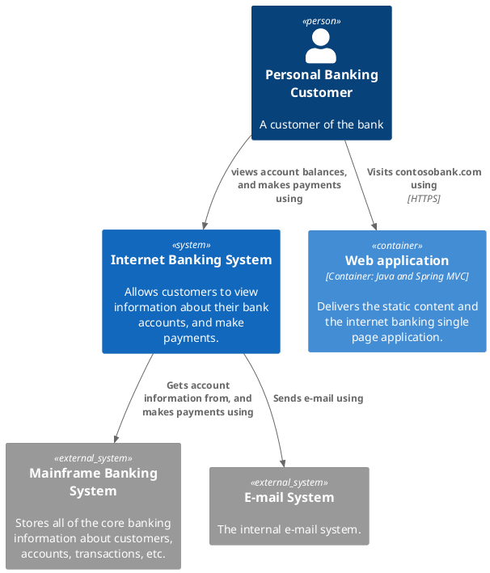


#### Cloudinsight

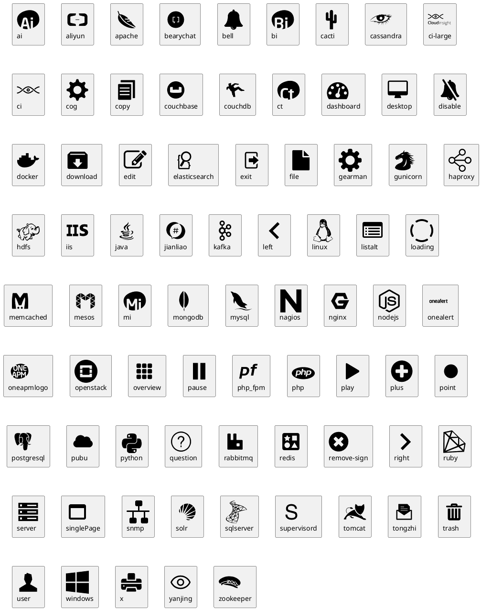


#### Cloudogu

```plantuml

@startuml

' Local
!include <cloudogu/common>


' GitHub
!define CLOUDOGUURL https://raw.githubusercontent.com/cloudogu/plantuml-cloudogu-sprites/master
' !includeurl CLOUDOGUURL/common.puml


' include
!includeurl CLOUDOGUURL/dogus/backup.puml
!include <cloudogu/dogus/cas>
!include <cloudogu/dogus/cloudogu>
!include <cloudogu/dogus/cockpit>
!includeurl CLOUDOGUURL/dogus/confluence.puml
!includeurl CLOUDOGUURL/dogus/easyredmine.puml
!include <cloudogu/dogus/jenkins>
!includeurl CLOUDOGUURL/dogus/jira.puml
!includeurl CLOUDOGUURL/dogus/ldapmapper.puml
!include <cloudogu/dogus/nexus>
!include <cloudogu/dogus/nginx>
!include <cloudogu/dogus/openldap>
!include <cloudogu/dogus/plantuml>
!includeurl CLOUDOGUURL/dogus/portainer.puml
!include <cloudogu/dogus/postfix>
!includeurl CLOUDOGUURL/dogus/postgresql.puml
!include <cloudogu/dogus/redmine>
!include <cloudogu/dogus/registrator>
!include <cloudogu/dogus/scm>
!include <cloudogu/dogus/smeagol>
!include <cloudogu/dogus/sonarqube>
!includeurl CLOUDOGUURL/dogus/swaggerui.puml
!include <cloudogu/dogus/usermgmt>

!include <cloudogu/tools/ansible>
!includeurl CLOUDOGUURL/tools/cucumber.puml
!includeurl CLOUDOGUURL/tools/cypress.puml
!include <cloudogu/tools/docker>
!include <cloudogu/tools/elastic>
!include <cloudogu/tools/etcd>
!includeurl CLOUDOGUURL/tools/fail2ban.puml
!includeurl CLOUDOGUURL/tools/gatsby.puml
!include <cloudogu/tools/grafana>
!include <cloudogu/tools/junit>
!include <cloudogu/tools/k8s>
!include <cloudogu/tools/prometheus>
!include <cloudogu/tools/qemu>
!includeurl CLOUDOGUURL/tools/react.puml
!include <cloudogu/tools/terraform>
!include <cloudogu/tools/ubuntu>
!includeurl CLOUDOGUURL/tools/virtualbox.puml
!include <cloudogu/tools/vmware>


skinparam node {
    backgroundColor #FFE4E1
    borderColor #Red
}

node "<$ubuntu>"

node "<$redmine>"

TOOL_K8S(k8s, Kubernetes) #ffffff

@enduml

```


#### Google Material Icons

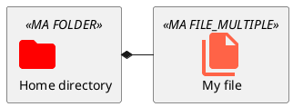


#### Kubernetes

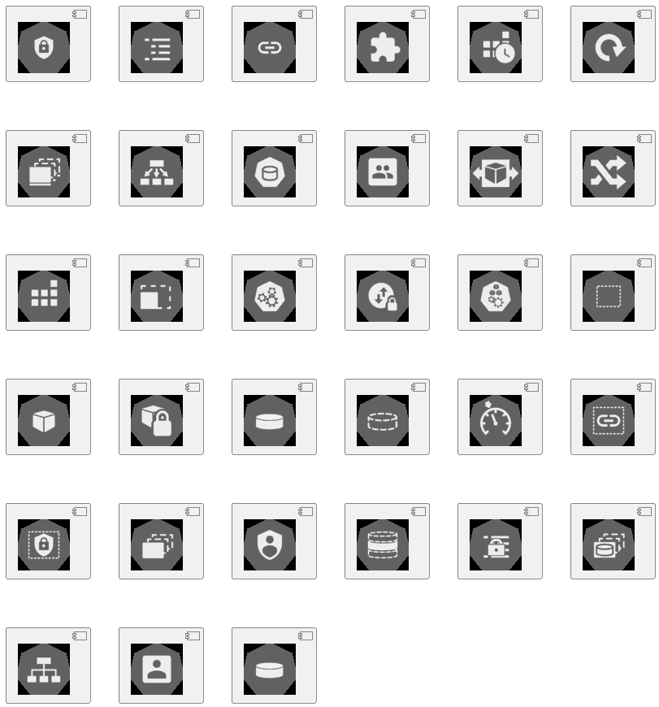


#### Logos

```plantuml

@startuml

!include <logos/debian>
!include <logos/flask>
!include <logos/nginx>
!include <logos/postgresql>
!include <logos/python>

skinparam monochrome true


actor User as users

rectangle "<$debian>\nDebian" as debian {
    rectangle "<$python>\nPython" as py {
        rectangle "<$flask>\nwebapp" as webapp
    }

    rectangle "<$nginx>\nNGINX" as httpd

    database "<$postgresql>\nDB" as db

    httpd -> webapp
    webapp --> db
}

users --> httpd

@enduml

```


#### Office

```plantuml

@startuml

scale .5

!define ICONURL https://raw.githubusercontent.com/Roemer/plantuml-office/master/office2014
!includeurl ICONURL/Clouds/azure.puml
!includeurl ICONURL/Clouds/cloud.puml
!includeurl ICONURL/Clouds/cloud_disaster.puml
!includeurl ICONURL/Clouds/cloud_disaster_red.puml
!includeurl ICONURL/Clouds/cloud_exchange_online.puml
!includeurl ICONURL/Clouds/cloud_service_request.puml
!includeurl ICONURL/Clouds/cloud_sharepoint_online.puml
!includeurl ICONURL/Clouds/office_365_cloud.puml
!includeurl ICONURL/Clouds/online_backup.puml
!includeurl ICONURL/Clouds/online_user.puml
!includeurl ICONURL/Clouds/private_cloud.puml
!includeurl ICONURL/Clouds/public_cloud.puml
!includeurl ICONURL/Clouds/public_im_cloud_service.puml
!includeurl ICONURL/Communications/3rd_party_call_center_solution.puml
!includeurl ICONURL/Communications/3rd_party_integration.puml
!includeurl ICONURL/Communications/3rd_party_service.puml
!includeurl ICONURL/Communications/application_sharing_workload.puml
!includeurl ICONURL/Communications/audio_conferencing_application.puml
!includeurl ICONURL/Communications/central_management_service.puml
!includeurl ICONURL/Communications/chat_room.puml
!includeurl ICONURL/Communications/conference_announcement_service.puml
!includeurl ICONURL/Communications/disconnected_mailbox.puml
!includeurl ICONURL/Communications/discovery_search_mailbox.puml
!includeurl ICONURL/Communications/dynamic_distribution_group.puml
!includeurl ICONURL/Communications/edge_subscription.puml
!includeurl ICONURL/Communications/email_workload.puml
!includeurl ICONURL/Communications/equipment_mailbox.puml
!includeurl ICONURL/Communications/exchange_active_sync.puml
!includeurl ICONURL/Communications/exchange_active_sync_blue.puml
!includeurl ICONURL/Communications/fax_partner.puml
!includeurl ICONURL/Communications/global_address_list.puml
!includeurl ICONURL/Communications/hybrid_voip_gateway.puml
!includeurl ICONURL/Communications/im_workload.puml
!includeurl ICONURL/Communications/journaling_rule.puml
!includeurl ICONURL/Communications/local_move_request.puml
!includeurl ICONURL/Communications/lync_control_panel.puml
!includeurl ICONURL/Communications/lync_phone_edition.puml
!includeurl ICONURL/Communications/lync_room_system.puml
!includeurl ICONURL/Communications/lync_server_management_tool.puml
!includeurl ICONURL/Communications/lync_storage_service.puml
!includeurl ICONURL/Communications/lync_web_app_client.puml
!includeurl ICONURL/Communications/mail_enabled_public_folder.puml
!includeurl ICONURL/Communications/mailbox_assistant.puml
!includeurl ICONURL/Communications/messages_queued.puml
!includeurl ICONURL/Communications/offline_address_book.puml
!includeurl ICONURL/Communications/personal_archive_mailbox.puml
!includeurl ICONURL/Communications/public_im_cloud_service.puml
!includeurl ICONURL/Communications/push_notification_service.puml
!includeurl ICONURL/Communications/queue_viewer.puml
!includeurl ICONURL/Communications/remote_mailbox.puml
!includeurl ICONURL/Communications/remote_move_request.puml
!includeurl ICONURL/Communications/response_group.puml
!includeurl ICONURL/Communications/response_group_service.puml
!includeurl ICONURL/Communications/room_mailbox.puml
!includeurl ICONURL/Communications/shared_mailbox.puml
!includeurl ICONURL/Communications/sip_uri_um_dial_plan.puml
!includeurl ICONURL/Communications/site_mailbox.puml
!includeurl ICONURL/Communications/skype_for_business_control_panel.puml
!includeurl ICONURL/Communications/skype_for_business_phone_edition.puml
!includeurl ICONURL/Communications/skype_for_business_room_system.puml
!includeurl ICONURL/Communications/skype_for_business_server_management_tool.puml
!includeurl ICONURL/Communications/skype_for_business_storage_service.puml
!includeurl ICONURL/Communications/skype_for_business_web_app_client.puml
!includeurl ICONURL/Communications/sms_gateway.puml
!includeurl ICONURL/Communications/smtp_connector.puml
!includeurl ICONURL/Communications/system_mailbox.puml
!includeurl ICONURL/Communications/tdm_pbx.puml
!includeurl ICONURL/Communications/telephone_extension_dial_plan.puml
!includeurl ICONURL/Communications/transport_rule.puml
!includeurl ICONURL/Communications/ucma_application.puml
!includeurl ICONURL/Communications/ucwa_application.puml
!includeurl ICONURL/Communications/um_auto_attendant.puml
!includeurl ICONURL/Communications/um_dial_plan_e164.puml
!includeurl ICONURL/Communications/um_dial_plan_secondary.puml
!includeurl ICONURL/Communications/um_enabled_mailbox.puml
!includeurl ICONURL/Communications/um_hunt_group.puml
!includeurl ICONURL/Communications/um_ip_gateway.puml
!includeurl ICONURL/Communications/user_mailbox.puml
!includeurl ICONURL/Communications/video_workload.puml
!includeurl ICONURL/Communications/voice_mail_preview_partner.puml
!includeurl ICONURL/Communications/voice_workload.puml
!includeurl ICONURL/Communications/voip_gateway.puml
!includeurl ICONURL/Communications/watcher_node.puml
!includeurl ICONURL/Communications/xmpp_service.puml
!includeurl ICONURL/Concepts/address_book.puml
!includeurl ICONURL/Concepts/anti_spam.puml
!includeurl ICONURL/Concepts/app_for_office.puml
!includeurl ICONURL/Concepts/app_for_sharepoint.puml
!includeurl ICONURL/Concepts/app_part.puml
!includeurl ICONURL/Concepts/application_android.puml
!includeurl ICONURL/Concepts/application_generic.puml
!includeurl ICONURL/Concepts/application_hybrid.puml
!includeurl ICONURL/Concepts/application_ios.puml
!includeurl ICONURL/Concepts/application_web.puml
!includeurl ICONURL/Concepts/application_windows.puml
!includeurl ICONURL/Concepts/archive.puml
!includeurl ICONURL/Concepts/attachment.puml
!includeurl ICONURL/Concepts/backup_local.puml
!includeurl ICONURL/Concepts/backup_online.puml
!includeurl ICONURL/Concepts/bandwidth.puml
!includeurl ICONURL/Concepts/bandwidth_calculator.puml
!includeurl ICONURL/Concepts/best_practices.puml
!includeurl ICONURL/Concepts/book_journal.puml
!includeurl ICONURL/Concepts/calculator.puml
!includeurl ICONURL/Concepts/calendar.puml
!includeurl ICONURL/Concepts/clipboard.puml
!includeurl ICONURL/Concepts/clock.puml
!includeurl ICONURL/Concepts/column.puml
!includeurl ICONURL/Concepts/connector.puml
!includeurl ICONURL/Concepts/contacts.puml
!includeurl ICONURL/Concepts/content_type.puml
!includeurl ICONURL/Concepts/credit_card.puml
!includeurl ICONURL/Concepts/document.puml
!includeurl ICONURL/Concepts/document_blank.puml
!includeurl ICONURL/Concepts/document_shared.puml
!includeurl ICONURL/Concepts/documents.puml
!includeurl ICONURL/Concepts/documents_shared.puml
!includeurl ICONURL/Concepts/download.puml
!includeurl ICONURL/Concepts/email.puml
!includeurl ICONURL/Concepts/email_approved.puml
!includeurl ICONURL/Concepts/email_expired.puml
!includeurl ICONURL/Concepts/email_rejected.puml
!includeurl ICONURL/Concepts/file_key.puml
!includeurl ICONURL/Concepts/firewall.puml
!includeurl ICONURL/Concepts/firewall_blue.puml
!includeurl ICONURL/Concepts/firewall_ghosted.puml
!includeurl ICONURL/Concepts/firewall_green.puml
!includeurl ICONURL/Concepts/firewall_orange.puml
!includeurl ICONURL/Concepts/folder.puml
!includeurl ICONURL/Concepts/folder_blue.puml
!includeurl ICONURL/Concepts/folder_ghosted.puml
!includeurl ICONURL/Concepts/folder_green.puml
!includeurl ICONURL/Concepts/folder_open.puml
!includeurl ICONURL/Concepts/folder_orange.puml
!includeurl ICONURL/Concepts/folder_public.puml
!includeurl ICONURL/Concepts/folder_shared.puml
!includeurl ICONURL/Concepts/folders.puml
!includeurl ICONURL/Concepts/form.puml
!includeurl ICONURL/Concepts/get_started.puml
!includeurl ICONURL/Concepts/globe_internet.puml
!includeurl ICONURL/Concepts/help.puml
!includeurl ICONURL/Concepts/home.puml
!includeurl ICONURL/Concepts/home_blue.puml
!includeurl ICONURL/Concepts/home_ghosted.puml
!includeurl ICONURL/Concepts/home_green.puml
!includeurl ICONURL/Concepts/home_orange.puml
!includeurl ICONURL/Concepts/home_page.puml
!includeurl ICONURL/Concepts/home_page_blue.puml
!includeurl ICONURL/Concepts/home_page_ghosted.puml
!includeurl ICONURL/Concepts/home_page_green.puml
!includeurl ICONURL/Concepts/home_page_orange.puml
!includeurl ICONURL/Concepts/hybrid.puml
!includeurl ICONURL/Concepts/input_output_filter.puml
!includeurl ICONURL/Concepts/install.puml
!includeurl ICONURL/Concepts/integration.puml
!includeurl ICONURL/Concepts/lab.puml
!includeurl ICONURL/Concepts/learn.puml
!includeurl ICONURL/Concepts/license.puml
!includeurl ICONURL/Concepts/link.puml
!includeurl ICONURL/Concepts/list_library.puml
!includeurl ICONURL/Concepts/mailbox.puml
!includeurl ICONURL/Concepts/mailbox2.puml
!includeurl ICONURL/Concepts/maintenance.puml
!includeurl ICONURL/Concepts/marketplace_shopping_bag.puml
!includeurl ICONURL/Concepts/meets_requirements.puml
!includeurl ICONURL/Concepts/migration.puml
!includeurl ICONURL/Concepts/moes.puml
!includeurl ICONURL/Concepts/navigation.puml
!includeurl ICONURL/Concepts/node_generic.puml
!includeurl ICONURL/Concepts/node_generic_blue.puml
!includeurl ICONURL/Concepts/node_generic_ghosted.puml
!includeurl ICONURL/Concepts/node_generic_green.puml
!includeurl ICONURL/Concepts/node_generic_orange.puml
!includeurl ICONURL/Concepts/office_installed.puml
!includeurl ICONURL/Concepts/on_premises.puml
!includeurl ICONURL/Concepts/on_premises_directory.puml
!includeurl ICONURL/Concepts/phishing.puml
!includeurl ICONURL/Concepts/pin.puml
!includeurl ICONURL/Concepts/platform_options.puml
!includeurl ICONURL/Concepts/properties.puml
!includeurl ICONURL/Concepts/publish.puml
!includeurl ICONURL/Concepts/remote_access.puml
!includeurl ICONURL/Concepts/script.puml
!includeurl ICONURL/Concepts/search.puml
!includeurl ICONURL/Concepts/service_application.puml
!includeurl ICONURL/Concepts/settings.puml
!includeurl ICONURL/Concepts/settings_office_365.puml
!includeurl ICONURL/Concepts/sign_up.puml
!includeurl ICONURL/Concepts/sound_file.puml
!includeurl ICONURL/Concepts/tasks.puml
!includeurl ICONURL/Concepts/technical_diagram.puml
!includeurl ICONURL/Concepts/upgrade_application.puml
!includeurl ICONURL/Concepts/upgrade_server.puml
!includeurl ICONURL/Concepts/upgrade_site.puml
!includeurl ICONURL/Concepts/upload.puml
!includeurl ICONURL/Concepts/video_play.puml
!includeurl ICONURL/Concepts/view_form.puml
!includeurl ICONURL/Concepts/voicemail.puml
!includeurl ICONURL/Concepts/voicemail_preview.puml
!includeurl ICONURL/Concepts/walkthrough.puml
!includeurl ICONURL/Concepts/web_conferencing.puml
!includeurl ICONURL/Concepts/web_page.puml
!includeurl ICONURL/Concepts/web_part.puml
!includeurl ICONURL/Concepts/web_services.puml
!includeurl ICONURL/Concepts/website.puml
!includeurl ICONURL/Concepts/whats_new.puml
!includeurl ICONURL/Concepts/windows_powershell.puml
!includeurl ICONURL/Concepts/writing_pen.puml
!includeurl ICONURL/Concepts/writing_pencil.puml
!includeurl ICONURL/Databases/address_book_store.puml
!includeurl ICONURL/Databases/application_store.puml
!includeurl ICONURL/Databases/database.puml
!includeurl ICONURL/Databases/database_availability_group.puml
!includeurl ICONURL/Databases/database_blue.puml
!includeurl ICONURL/Databases/database_cube.puml
!includeurl ICONURL/Databases/database_cube_blue.puml
!includeurl ICONURL/Databases/database_cube_ghosted.puml
!includeurl ICONURL/Databases/database_cube_green.puml
!includeurl ICONURL/Databases/database_cube_orange.puml
!includeurl ICONURL/Databases/database_ghosted.puml
!includeurl ICONURL/Databases/database_green.puml
!includeurl ICONURL/Databases/database_mini_1.puml
!includeurl ICONURL/Databases/database_mini_1_blue.puml
!includeurl ICONURL/Databases/database_mini_1_ghosted.puml
!includeurl ICONURL/Databases/database_mini_1_green.puml
!includeurl ICONURL/Databases/database_mini_1_orange.puml
!includeurl ICONURL/Databases/database_mini_2.puml
!includeurl ICONURL/Databases/database_mini_2_blue.puml
!includeurl ICONURL/Databases/database_mini_2_ghosted.puml
!includeurl ICONURL/Databases/database_mini_2_green.puml
!includeurl ICONURL/Databases/database_mini_2_orange.puml
!includeurl ICONURL/Databases/database_mini_3.puml
!includeurl ICONURL/Databases/database_mini_3_blue.puml
!includeurl ICONURL/Databases/database_mini_3_ghosted.puml
!includeurl ICONURL/Databases/database_mini_3_green.puml
!includeurl ICONURL/Databases/database_mini_3_orange.puml
!includeurl ICONURL/Databases/database_mirror.puml
!includeurl ICONURL/Databases/database_mirror_witness_node.puml
!includeurl ICONURL/Databases/database_orange.puml
!includeurl ICONURL/Databases/database_partition_2.puml
!includeurl ICONURL/Databases/database_partition_3.puml
!includeurl ICONURL/Databases/database_partition_4.puml
!includeurl ICONURL/Databases/database_partition_5.puml
!includeurl ICONURL/Databases/database_public_folder.puml
!includeurl ICONURL/Databases/database_server.puml
!includeurl ICONURL/Databases/database_server_blue.puml
!includeurl ICONURL/Databases/database_server_ghosted.puml
!includeurl ICONURL/Databases/database_server_green.puml
!includeurl ICONURL/Databases/database_server_orange.puml
!includeurl ICONURL/Databases/mailbox_database.puml
!includeurl ICONURL/Databases/monitoring_store.puml
!includeurl ICONURL/Databases/unified_contact_store.puml
!includeurl ICONURL/Databases/web_store.puml
!includeurl ICONURL/Devices/cd_dvd.puml
!includeurl ICONURL/Devices/cell_phone_android_proportional.puml
!includeurl ICONURL/Devices/cell_phone_android_stand_alone.puml
!includeurl ICONURL/Devices/cell_phone_generic.puml
!includeurl ICONURL/Devices/cell_phone_iphone_proportional.puml
!includeurl ICONURL/Devices/cell_phone_iphone_stand_alone.puml
!includeurl ICONURL/Devices/cell_phone_windows_phone_proportional.puml
!includeurl ICONURL/Devices/cell_phone_windows_phone_stand_alone.puml
!includeurl ICONURL/Devices/data_jack.puml
!includeurl ICONURL/Devices/device_bluetooth.puml
!includeurl ICONURL/Devices/device_fax.puml
!includeurl ICONURL/Devices/device_headset.puml
!includeurl ICONURL/Devices/device_laptop.puml
!includeurl ICONURL/Devices/device_lcd_monitor.puml
!includeurl ICONURL/Devices/device_mac_client.puml
!includeurl ICONURL/Devices/device_microphone.puml
!includeurl ICONURL/Devices/device_phone_digital.puml
!includeurl ICONURL/Devices/device_phone_traditional.puml
!includeurl ICONURL/Devices/device_phone_usb.puml
!includeurl ICONURL/Devices/device_phone_voip.puml
!includeurl ICONURL/Devices/device_printer.puml
!includeurl ICONURL/Devices/device_roundtable.puml
!includeurl ICONURL/Devices/device_stylus.puml
!includeurl ICONURL/Devices/device_tablet_android.puml
!includeurl ICONURL/Devices/device_tablet_ipad.puml
!includeurl ICONURL/Devices/device_tablet_ipad_mini.puml
!includeurl ICONURL/Devices/device_tablet_windows_7_inch.puml
!includeurl ICONURL/Devices/device_tablet_windows_8.puml
!includeurl ICONURL/Devices/device_tv.puml
!includeurl ICONURL/Devices/device_update_service.puml
!includeurl ICONURL/Devices/device_webcam.puml
!includeurl ICONURL/Devices/device_webcam_hd.puml
!includeurl ICONURL/Devices/hard_disk.puml
!includeurl ICONURL/Devices/ip_gateway.puml
!includeurl ICONURL/Devices/ip_pbx.puml
!includeurl ICONURL/Devices/load_balancer.puml
!includeurl ICONURL/Devices/management_console.puml
!includeurl ICONURL/Devices/modem.puml
!includeurl ICONURL/Devices/nic.puml
!includeurl ICONURL/Devices/router.puml
!includeurl ICONURL/Devices/session_border_controller.puml
!includeurl ICONURL/Devices/shadowed_router.puml
!includeurl ICONURL/Devices/switch.puml
!includeurl ICONURL/Devices/video_camera.puml
!includeurl ICONURL/Devices/video_gateway.puml
!includeurl ICONURL/Devices/workstation.puml
!includeurl ICONURL/Devices/workstation_pc.puml
!includeurl ICONURL/Devices/workstation_visual_studio.puml
!includeurl ICONURL/Security/active_directory.puml
!includeurl ICONURL/Security/address_book_policies.puml
!includeurl ICONURL/Security/certificate.puml
!includeurl ICONURL/Security/credentials.puml
!includeurl ICONURL/Security/domain.puml
!includeurl ICONURL/Security/email_address_policy.puml
!includeurl ICONURL/Security/federation_service.puml
!includeurl ICONURL/Security/federation_trust.puml
!includeurl ICONURL/Security/irm_protected_message.puml
!includeurl ICONURL/Security/key_permissions.puml
!includeurl ICONURL/Security/key_permissions_blue.puml
!includeurl ICONURL/Security/key_permissions_ghosted.puml
!includeurl ICONURL/Security/key_permissions_green.puml
!includeurl ICONURL/Security/key_permissions_orange.puml
!includeurl ICONURL/Security/lock_protected.puml
!includeurl ICONURL/Security/lock_protected_blue.puml
!includeurl ICONURL/Security/lock_protected_ghosted.puml
!includeurl ICONURL/Security/lock_protected_green.puml
!includeurl ICONURL/Security/lock_protected_orange.puml
!includeurl ICONURL/Security/lock_unprotected.puml
!includeurl ICONURL/Security/lock_unprotected_blue.puml
!includeurl ICONURL/Security/lock_unprotected_ghosted.puml
!includeurl ICONURL/Security/lock_unprotected_green.puml
!includeurl ICONURL/Security/lock_unprotected_orange.puml
!includeurl ICONURL/Security/lock_with_key_security.puml
!includeurl ICONURL/Security/lock_with_key_security_blue.puml
!includeurl ICONURL/Security/lock_with_key_security_ghosted.puml
!includeurl ICONURL/Security/lock_with_key_security_green.puml
!includeurl ICONURL/Security/lock_with_key_security_orange.puml
!includeurl ICONURL/Security/management_role.puml
!includeurl ICONURL/Security/policy.puml
!includeurl ICONURL/Security/protected_voice_mail.puml
!includeurl ICONURL/Security/retention_policy.puml
!includeurl ICONURL/Security/retention_policy_tag.puml
!includeurl ICONURL/Security/role_assignment_policy.puml
!includeurl ICONURL/Security/role_group.puml
!includeurl ICONURL/Security/secure_messaging.puml
!includeurl ICONURL/Security/security_access_portal.puml
!includeurl ICONURL/Security/sharing_policy.puml
!includeurl ICONURL/Security/split_domain_user.puml
!includeurl ICONURL/Security/token.puml
!includeurl ICONURL/Security/token_service.puml
!includeurl ICONURL/Security/trusted_application_server.puml
!includeurl ICONURL/Security/um_mailbox_policy.puml
!includeurl ICONURL/Security/universal_security_group.puml
!includeurl ICONURL/Servers/3rd_party_mail_server.puml
!includeurl ICONURL/Servers/active_directory_federation_services_proxy.puml
!includeurl ICONURL/Servers/active_directory_federation_services_server.puml
!includeurl ICONURL/Servers/active_directory_federation_services_server_blue.puml
!includeurl ICONURL/Servers/active_directory_federation_services_server_ghosted.puml
!includeurl ICONURL/Servers/active_directory_federation_services_server_green.puml
!includeurl ICONURL/Servers/active_directory_federation_services_server_orange.puml
!includeurl ICONURL/Servers/application_server.puml
!includeurl ICONURL/Servers/application_server_blue.puml
!includeurl ICONURL/Servers/application_server_ghosted.puml
!includeurl ICONURL/Servers/application_server_green.puml
!includeurl ICONURL/Servers/application_server_orange.puml
!includeurl ICONURL/Servers/call_admission_control_service.puml
!includeurl ICONURL/Servers/certificate_authority.puml
!includeurl ICONURL/Servers/cluster_server.puml
!includeurl ICONURL/Servers/cluster_server_blue.puml
!includeurl ICONURL/Servers/cluster_server_ghosted.puml
!includeurl ICONURL/Servers/cluster_server_green.puml
!includeurl ICONURL/Servers/cluster_server_orange.puml
!includeurl ICONURL/Servers/database_server.puml
!includeurl ICONURL/Servers/database_server_blue.puml
!includeurl ICONURL/Servers/database_server_ghosted.puml
!includeurl ICONURL/Servers/database_server_green.puml
!includeurl ICONURL/Servers/database_server_orange.puml
!includeurl ICONURL/Servers/datacenter.puml
!includeurl ICONURL/Servers/dirsync_server.puml
!includeurl ICONURL/Servers/domain_controller.puml
!includeurl ICONURL/Servers/exchange_2010_client_access_server_role.puml
!includeurl ICONURL/Servers/exchange_2010_edge_transport_server_role.puml
!includeurl ICONURL/Servers/exchange_2010_hub_transport_server_role.puml
!includeurl ICONURL/Servers/exchange_2010_mailbox_server_role.puml
!includeurl ICONURL/Servers/exchange_2010_um_server_role.puml
!includeurl ICONURL/Servers/exchange_2013_client_access_server.puml
!includeurl ICONURL/Servers/exchange_2013_edge_transport_server.puml
!includeurl ICONURL/Servers/exchange_2013_mailbox_server.puml
!includeurl ICONURL/Servers/exchange_2013_server.puml
!includeurl ICONURL/Servers/file_server.puml
!includeurl ICONURL/Servers/hybrid_server.puml
!includeurl ICONURL/Servers/mainframe.puml
!includeurl ICONURL/Servers/mainframe_host.puml
!includeurl ICONURL/Servers/monitoring_sql_reporting_services.puml
!includeurl ICONURL/Servers/network.puml
!includeurl ICONURL/Servers/office_web_apps_server.puml
!includeurl ICONURL/Servers/on_premises_server.puml
!includeurl ICONURL/Servers/physical_host_farm_solid_blue.puml
!includeurl ICONURL/Servers/physical_host_solid_blue.puml
!includeurl ICONURL/Servers/reverse_proxy.puml
!includeurl ICONURL/Servers/scom.puml
!includeurl ICONURL/Servers/server_disaster.puml
!includeurl ICONURL/Servers/server_farm.puml
!includeurl ICONURL/Servers/server_farm_blue.puml
!includeurl ICONURL/Servers/server_farm_ghosted.puml
!includeurl ICONURL/Servers/server_farm_green.puml
!includeurl ICONURL/Servers/server_farm_orange.puml
!includeurl ICONURL/Servers/server_generic.puml
!includeurl ICONURL/Servers/server_generic_blue.puml
!includeurl ICONURL/Servers/server_generic_ghosted.puml
!includeurl ICONURL/Servers/server_generic_green.puml
!includeurl ICONURL/Servers/server_generic_orange.puml
!includeurl ICONURL/Servers/server_side_code.puml
!includeurl ICONURL/Servers/sharepoint_server.puml
!includeurl ICONURL/Servers/skype_for_business_back_end_server.puml
!includeurl ICONURL/Servers/skype_for_business_back_end_server_mirror.puml
!includeurl ICONURL/Servers/skype_for_business_director.puml
!includeurl ICONURL/Servers/skype_for_business_director_array.puml
!includeurl ICONURL/Servers/skype_for_business_edge_server.puml
!includeurl ICONURL/Servers/skype_for_business_edge_server_pool.puml
!includeurl ICONURL/Servers/skype_for_business_front_end_pool.puml
!includeurl ICONURL/Servers/skype_for_business_front_end_server.puml
!includeurl ICONURL/Servers/skype_for_business_mediation_server.puml
!includeurl ICONURL/Servers/skype_for_business_monitoring_server.puml
!includeurl ICONURL/Servers/skype_for_business_persistent_chat_server.puml
!includeurl ICONURL/Servers/skype_for_business_server.puml
!includeurl ICONURL/Servers/sql_server.puml
!includeurl ICONURL/Servers/survivable_branch_appliance.puml
!includeurl ICONURL/Servers/survivable_branch_server.puml
!includeurl ICONURL/Servers/topology_builder.puml
!includeurl ICONURL/Servers/trusted_application_pool.puml
!includeurl ICONURL/Servers/trusted_application_server.puml
!includeurl ICONURL/Servers/tunnel_angled.puml
!includeurl ICONURL/Servers/tunnel_straight.puml
!includeurl ICONURL/Servers/video_interop_server.puml
!includeurl ICONURL/Servers/virtual_application_server.puml
!includeurl ICONURL/Servers/virtual_application_server_blue.puml
!includeurl ICONURL/Servers/virtual_database_server.puml
!includeurl ICONURL/Servers/virtual_database_server_blue.puml
!includeurl ICONURL/Servers/virtual_server.puml
!includeurl ICONURL/Servers/virtual_server_blue.puml
!includeurl ICONURL/Servers/virtual_web_server.puml
!includeurl ICONURL/Servers/virtual_web_server_blue.puml
!includeurl ICONURL/Servers/voicemail_preview_partner.puml
!includeurl ICONURL/Servers/web_server.puml
!includeurl ICONURL/Servers/web_server_blue.puml
!includeurl ICONURL/Servers/web_server_ghosted.puml
!includeurl ICONURL/Servers/web_server_green.puml
!includeurl ICONURL/Servers/web_server_orange.puml
!includeurl ICONURL/Servers/windows_router.puml
!includeurl ICONURL/Servers/windows_server.puml
!includeurl ICONURL/Services/3rd_party_service.puml
!includeurl ICONURL/Services/access_services.puml
!includeurl ICONURL/Services/business_connectivity_services.puml
!includeurl ICONURL/Services/call_admission_control_service.puml
!includeurl ICONURL/Services/central_management_service.puml
!includeurl ICONURL/Services/conference_announcement_service.puml
!includeurl ICONURL/Services/device_update_service.puml
!includeurl ICONURL/Services/email_service.puml
!includeurl ICONURL/Services/excel_services.puml
!includeurl ICONURL/Services/federation_service.puml
!includeurl ICONURL/Services/lync_storage_service.puml
!includeurl ICONURL/Services/lync_web_app_client.puml
!includeurl ICONURL/Services/mobility_service.puml
!includeurl ICONURL/Services/network_file_share_service.puml
!includeurl ICONURL/Services/online_hosted_services.puml
!includeurl ICONURL/Services/outlook_web_app.puml
!includeurl ICONURL/Services/powerpoint_automation_services.puml
!includeurl ICONURL/Services/push_notification_service.puml
!includeurl ICONURL/Services/registrar_service.puml
!includeurl ICONURL/Services/response_group_service.puml
!includeurl ICONURL/Services/skype_for_business_storage_service.puml
!includeurl ICONURL/Services/user_services.puml
!includeurl ICONURL/Services/verification_service.puml
!includeurl ICONURL/Services/visio_services.puml
!includeurl ICONURL/Services/web_services.puml
!includeurl ICONURL/Services/word_automation_services.puml
!includeurl ICONURL/Services/xmpp_service.puml
!includeurl ICONURL/Sites/access_services.puml
!includeurl ICONURL/Sites/blog_site.puml
!includeurl ICONURL/Sites/business_connectivity_services.puml
!includeurl ICONURL/Sites/excel_services.puml
!includeurl ICONURL/Sites/meeting_workspace_site.puml
!includeurl ICONURL/Sites/my_site.puml
!includeurl ICONURL/Sites/powerpoint_automation_services.puml
!includeurl ICONURL/Sites/publish.puml
!includeurl ICONURL/Sites/site_collection.puml
!includeurl ICONURL/Sites/site_shared.puml
!includeurl ICONURL/Sites/site_team.puml
!includeurl ICONURL/Sites/subsite.puml
!includeurl ICONURL/Sites/subsite_blue.puml
!includeurl ICONURL/Sites/subsite_ghosted.puml
!includeurl ICONURL/Sites/subsite_green.puml
!includeurl ICONURL/Sites/subsite_orange.puml
!includeurl ICONURL/Sites/upgrade_site.puml
!includeurl ICONURL/Sites/visio_services.puml
!includeurl ICONURL/Sites/website.puml
!includeurl ICONURL/Sites/website_public.puml
!includeurl ICONURL/Sites/wiki_site.puml
!includeurl ICONURL/Sites/word_automation_services.puml
!includeurl ICONURL/Users/administrator.puml
!includeurl ICONURL/Users/approver.puml
!includeurl ICONURL/Users/call_center_agent.puml
!includeurl ICONURL/Users/communications.puml
!includeurl ICONURL/Users/conferencing_attendant.puml
!includeurl ICONURL/Users/credentials.puml
!includeurl ICONURL/Users/csv_file.puml
!includeurl ICONURL/Users/distribution_group.puml
!includeurl ICONURL/Users/dynamic_distribution_group.puml
!includeurl ICONURL/Users/mail_user.puml
!includeurl ICONURL/Users/meeting.puml
!includeurl ICONURL/Users/mobile_user.puml
!includeurl ICONURL/Users/on_premises_user.puml
!includeurl ICONURL/Users/online_user.puml
!includeurl ICONURL/Users/outlook_user.puml
!includeurl ICONURL/Users/response_group.puml
!includeurl ICONURL/Users/response_group_service.puml
!includeurl ICONURL/Users/role_group.puml
!includeurl ICONURL/Users/skype_commercial_user.puml
!includeurl ICONURL/Users/skype_for_business_user.puml
!includeurl ICONURL/Users/tenant_admin.puml
!includeurl ICONURL/Users/um_enabled_user.puml
!includeurl ICONURL/Users/universal_security_group.puml
!includeurl ICONURL/Users/user.puml
!includeurl ICONURL/Users/user_accounts.puml
!includeurl ICONURL/Users/user_blue.puml
!includeurl ICONURL/Users/user_external.puml
!includeurl ICONURL/Users/user_ghosted.puml
!includeurl ICONURL/Users/user_green.puml
!includeurl ICONURL/Users/user_orange.puml
!includeurl ICONURL/Users/user_services.puml
!includeurl ICONURL/Users/user_store.puml
!includeurl ICONURL/Users/users.puml
!includeurl ICONURL/Users/users_blue.puml
!includeurl ICONURL/Users/users_ghosted.puml
!includeurl ICONURL/Users/users_green.puml
!includeurl ICONURL/Users/users_orange.puml
!includeurl ICONURL/Users/users_two.puml
!includeurl ICONURL/Users/users_two_blue.puml
!includeurl ICONURL/Users/users_two_ghosted.puml
!includeurl ICONURL/Users/users_two_green.puml
!includeurl ICONURL/Users/users_two_orange.puml
!includeurl ICONURL/Users/writer.puml


listsprites

@enduml

```


#### OpenIconic

```plantuml

@startuml

listopeniconic

@enduml

```


#### Open Security Architecture

```plantuml

@startuml

scale .5

!include <osa/arrow/green/left/left>
!include <osa/arrow/yellow/right/right>
!include <osa/awareness/awareness>
!include <osa/contract/contract>
!include <osa/database/database>
!include <osa/desktop/desktop>
!include <osa/desktop/imac/imac>
!include <osa/device_music/device_music>
!include <osa/device_scanner/device_scanner>
!include <osa/device_usb/device_usb>
!include <osa/device_wireless_router/device_wireless_router>
!include <osa/disposal/disposal>
!include <osa/drive_optical/drive_optical>
!include <osa/firewall/firewall>
!include <osa/hub/hub>
!include <osa/ics/drive/drive>
!include <osa/ics/plc/plc>
!include <osa/ics/thermometer/thermometer>
!include <osa/id/card/card>
!include <osa/laptop/laptop>
!include <osa/lifecycle/lifecycle>
!include <osa/lightning/lightning>
!include <osa/media_flash/media_flash>
!include <osa/media_optical/media_optical>
!include <osa/media_tape/media_tape>
!include <osa/mobile/pda/pda>
!include <osa/padlock/padlock>
!include <osa/printer/printer>
!include <osa/site_branch/site_branch>
!include <osa/site_factory/site_factory>
!include <osa/user/audit/audit>
!include <osa/user/blue/blue>
!include <osa/user/blue/security/specialist/specialist>
!include <osa/user/blue/sysadmin/sysadmin>
!include <osa/user/blue/tester/tester>
!include <osa/user/blue/tie/tie>
!include <osa/user/green/architect/architect>
!include <osa/user/green/business/manager/manager>
!include <osa/user/green/developer/developer>
!include <osa/user/green/green>
!include <osa/user/green/operations/operations>
!include <osa/user/green/project/manager/manager>
!include <osa/user/green/service/manager/manager>
!include <osa/user/green/warning/warning>
!include <osa/user/large/group/group>
!include <osa/user/white/hat/hat>
!include <osa/users/blue/green/green>
!include <osa/vpn/vpn>
!include <osa/wireless/network/network>
' !include <osa/user/black/hat/hat>
' !include <osa/user/black/hat>


listspritess

@enduml

```


#### Tupadr3

including Devicons and Font Awesome

```plantuml

@startuml

!include <tupadr3/common>
!include <tupadr3/font-awesome/cloud>
!include <tupadr3/font-awesome/users>


FA_CLOUD(cloud1, Cloud1) #ADD8E6
FA_CLOUD(cloud2, Cloud2) #FFFACD
FA_CLOUD(cloud3, Cloud3) #90EE90
FA_USERS(users, Users, rectangle, #White) #Tomato

users --> cloud1
users --> cloud2
users --> cloud3

cloud1 -[hidden]> cloud2
cloud2 -[hidden]> cloud3

@enduml

```


# テキストデータ


# JSON

```plantuml

@startjson

"Foobar"

@endjson

@startjson

123

@endjson

@startjson

true

@endjson

@startjson

#highlight "6" /' 13 '/

[ 1, 1, 2, 3, 5, 8, 13, 21, 34, 55, 89 ]

@endjson

@startjson

#highlight "key2"

{
    "key1": "val1",
    "key2": "val2",
    "key3": "val3"
}

@endjson

@startjson

{
    "null": null,
    "true": true,
    "false": false,
    "JSON_Number": [-1, -1.1, 1E5, "<color:green>TBC"],
    "JSON_String": [
        "😀",
        "\u3042\u3044\u3046 (\\u3042\\u3044\\u3046)",
        {
            "escape": {
                "quotation mark character (U+0022)":       "a\"b",
                "reverse solidus character (U+005C)":      "a\\b",
                "solidus character (U+002F)":              "a\/b",
                "backspace character (U+0008)":            "a\bb",
                "form feed character (U+000C)":            "a\fb",
                "line feed character (U+000A)":            "a\nb",
                "carriage return character (U+000D)":      "a\rb",
                "character tabulation character (U+0009)": "a\tb"
            }
        }
    ],
    "JSON_Object": {
        "{}": {},
        "k_int": 123,
        "k_str": "abc",
        "k_obj": {"k": "v"}
    },
    "JSON_Array" : [ /' 配列型 '/
        [],
        [true, false],
        [-1, 1],
        ["a", "b", "c"],
        ["mix", null, true, 1, {"k": "v"}]
    ]
}

@endjson

@startjson

#highlight "glossary" / "GlossDiv" / "title"

' https://json.org/example.html
{
    "glossary": {
        "title": "example glossary",
        "GlossDiv": {
            "title": "S",
            "GlossList": {
                "GlossEntry": {
                    "ID": "SGML",
                    "SortAs": "SGML",
                    "GlossTerm": "Standard Generalized Markup Language",
                    "Acronym": "SGML",
                    "Abbrev": "ISO 8879:1986",
                    "GlossDef": {
                        "para": "A meta-markup language, used to create markup languages such as DocBook.",
                        "GlossSeeAlso": ["GML", "XML"]
                    },
                    "GlossSee": "markup"
                }
            }
        }
    }
}

@endjson

@startjson

#highlight "menu" / "popup" / "menuitem" / "2"
#highlight "menu" / "popup" / "menuitem" / "2" / "value"
#highlight "menu" / "popup" / "menuitem" / "2" / "onclick"

' https://json.org/example.html
{"menu": {
  "id": "file",
  "value": "File",
  "popup": {
    "menuitem": [
      {"value": "New", "onclick": "CreateNewDoc()"},
      {"value": "Open", "onclick": "OpenDoc()"},
      {"value": "Close", "onclick": "CloseDoc()"}
    ]
  }
}}

@endjson

```

### クラス図・オブジェクト図でJSONを表示

```plantuml

@startjson

{
   "height": 180,
   "weight": 70
}

@endjson

@startuml

class Person

object personObj

json JSON {
   "height": 180,
   "weight": 70
}

@enduml

```

### 配置図・ユースケース図・コンポーネント図でJSONを表示

```plantuml

@startuml

allowmixing


actor User

json JSON {
   "height": 180,
   "weight": 70
}
@enduml

@startuml

allowmixing

database {
  json "store.json" as J {
    "id": 1,
    "height": 180,
    "weight": 70
  }
}

@enduml

```


## YAML

```plantuml

@startyaml

#highlight "6" /' 13 '/

' 配列
- 1
- 1
- 2
- 3
- 5
- 8
- 13
- 21
- 34
- 55
- 89

@endyaml

@startyaml

#highlight "key2"

' ハッシュ
key1: val1
key2: val2
key3: val3

@endyaml

@startyaml

' データ型

# YAMLのコメント

decimal:
  - 123
  - 1,234,567,890
octal: 0644
hexa:  0xFF
float: 0.05
bool:
  - true
  - yes
  - on
  - false
  - no
  - off
null:
  - ~
  - null
date: 2005-01-01
stamp: 2005-01-01 00:00:00 +09:00
str:
  - 'true'
  - "2005"

@endyaml

```


# 構造図


## クラス図

### 要素

```plantuml

@startuml

abstract        abstract
abstract class  "abstract class"
annotation      annotation
circle          circle
()              circle_short_form
class           class
diamond         diamond
<>              diamond_short_form
entity          entity
enum            enum
interface       interface


class class {
    -privateField : int
    #protectedField : int
    ~int packagePrivateField
    +int publicField
    {static} staticField : int
    {abstract} int abstractField

    ' skinparam classAttributeIconSize 0 でマークをつけない
    -privateMethod()
    #protectedMethod()
    ~void packagePrivateMethod()
    +publicMethod() : int
    {static} void staticMethod()
    {abstract} abstractMethod() : int
    ..
    .. separator ..
    __
    __ separator __
    --
    -- separator --
    ==
    == separator ==
}

@enduml

```

### 関係

```plantuml

@startuml

ClassAssociation01 -- ClassAssociation11
ClassAssociation01 --> ClassAssociation12
note on link : 誘導可能性
ClassAssociation01 x--> ClassAssociation13
note on link : 誘導可能性

note left of ClassAssociation01 : 関連


@enduml

```

```plantuml

@startuml

' skinparam groupInheritance 1 /' 継承の矢印の矢じりをグループ化しない '/
skinparam groupInheritance 2 /' 継承の矢印の矢じりが2つ以上の場合にグループ化 '/

' ClassGeneralization01 ^-- ClassGeneralization11
ClassGeneralization01 <|-- ClassGeneralization11
ClassGeneralization01 <|-- ClassGeneralization12
ClassGeneralization01 <|-- ClassGeneralization13
ClassGeneralization11 -[hidden]> ClassGeneralization12
ClassGeneralization12 -[hidden]> ClassGeneralization13

note left of ClassGeneralization11
    ClassGeneralization01 を
    ClassGeneralization11,12,13 で継承

    サブクラス -> スーパークラス
    （派生 / is-a / extends / 汎化 / 継承 / A is a B / A is a kind of B）
end note

@enduml

```

```plantuml

@startuml

class ClassRealization
interface InterfaceRealization

' InterfaceRealization ^.. ClassRealization
InterfaceRealization <|.. ClassRealization

note left of ClassRealization
    InterfaceRealization を
    ClassRealization で実現

    実装クラス -> インターフェース
    （実現 / realization / implements / 実装）
end note

@enduml

```

```plantuml

@startuml

ClassAggregation01 o-- ClassAggregation11

note left of ClassAggregation01
    ClassAggregation01 が全体、
    ClassAggregation11 が部分で、
    結びつきが弱い
    （集約 / A has a B）
end note

ClassComposition01 *-- ClassComposition11

note left of ClassComposition01
    ClassComposition01 が全体、 ClassComposition11 が部分で、
    結びつきが強く、 ClassComposition11 なしに成り立たない
    （合成 / コンポジション / B is a part of B）
end note

@enduml

```

```plantuml

@startuml

ClassDependency01 ..> ClassDependency11

note left of ClassDependency01
    ClassDependency01 が ClassDependency11 に依存
    （ClassDependency01 が ClassDependency11 のフィールド／メソッドを利用している）
end note

@enduml

```

```plantuml

@startuml

Class01 ..# Class02
Class03 ..+ Class04

@enduml

```

### 多重度

```plantuml

@startuml

Class01 "1" -- "4..6" Class02 : 1 対 4～6
Class03 "1" -- "0..*" Class04 : 1 対 多
Class05"1..*" -- "*" Class06 : 1以上 対 多


' IE記法
' 最小(オプショナリティ) / 最大(カーディナリティ)

Class11 ||--o| Class12 : 1 対 0 or 1
Class13 ||--|| Class14 : 1 対 1

Class15 ||--o{ Class16 : 1 対 0以上
Class17 ||--|{ Class18 : 1 対 1以上

Class19 }o--|{ Class20 : 0以上 対 1以上

@enduml

```

### パッケージと名前空間

```plantuml

@startuml

package Package01 <<Node>> {
  class Class01
}

package Package02 <<Rectangle>> {
  class Class02
}

package Package03 <<Folder>> {
  class Class03
}

package Package04 <<Frame>> {
  class Class04
}

package Package05 <<Cloud>> {
  class Class05
}

package Package06 <<Database>> {
  class Class06
}

Package01 +-- Package02

' ''''''''''

class ABC
class XYZ
ABC --|> XYZ

namespace jp.example1 {
    class ABC
    class XYZ
    jp.example2.XYZ <|-- ABC
    XYZ <|-- ABC
}

namespace jp.example2 {
    class ABC
    class XYZ
    ABC --|> .XYZ
}

@enduml

```

### 外観

```plantuml

@startuml

' 空の属性・操作を省略
' hide empty members

' その他の省略
' hide empty fields, hide empty attributes
' hide empty methods
' hide fields, hide attributes
' hide circle
' hide stereotype
' hide members
' hide Class51
' hide <<Serializable>> members

' 孤立したクラスの省略
' hide @unlinked

' 削除
' remove Class51

' 孤立したクラスの削除
' remove @unlinked


' bold、dashed、dotted、hidden、plain
Class01 -- Class11 #line:red;line.bold;text:red : red;bold
Class02 -- Class12 #line:green;line.dashed;text:green : green;dashed
Class03 -- Class13 #line:blue;line.dotted;text:blue : blue;dotted
Class01 -[#red,bold]- Class11
Class02 -[#green,dashed,thickness=2]- Class12
Class03 -[#blue,dotted,thickness=4]- Class13

class Class04 #pink ##[bold]red
class Class14 << (C,#FFEE00) utility >> #pink;line:red;text:red
Class04 -- Class14

' 水平方向 left, right, up, down
class Class31 <<boundary>>
note top : アクターが利用するクラス
class Class32 <<entity>>
note top : データを保持するクラス
class Class33 <<control>>
note top : 業務や機能を管理するクラス
Class31 -left- Class32
Class31 -      Class33

' bold、dashed、dotted、hidden、plain
Class34 -[hidden]>  Class35 /' 水平方向に揃える '/
Class31 -[hidden]-> Class34 /' 垂直方向に揃える '/
Class01 -[hidden]> Class02
Class02 -[hidden]> Class03

class "非 文 字" as Class07 <<Serializable>>
class Class08 as "non-letters in the class (or enum...)"
Class07 -- Class08

' 孤立したクラスの省略
' hide @unlinked
class Class09

@enduml

```

```plantuml

@startuml

boundary バウンダリー <<boundary>>
entity エンティティ <<entity>>
control コントロール <<control>>

@enduml

```

### 例

```plantuml

@startuml

' 空の属性・操作を省略
hide empty members


package Machine #CDE {
    class Vehicle
    class Car
    class Engine
    class Wagon
    class Wheel
    class FuelMeter <<boundary>>
    class FuelTank
}


' クラス

Baggage : int depth
Baggage : int height
Baggage : int width

class Car {
    String maker
    String model
    displacement : int
    numberOfDoors : int=2 {>0}

    reverse() : void
    beep() : void
    turnOnHeadlights(highbeam : bool) : void
}

Driver : drive()
Driver : int id
Driver : Decimal height
Driver : Decimal weight

class Email {
    int id
    int driver_id
    int address
}

class Engine {
    int weight
}

class DriveLog <<entity>> #Azure {
    DateTime date
    Location origin
    Location destination

    save()
}

class Location #Aquamarine {
    + String name
    + Decimal latitude
    + Decimal longitude
}

class Owner {
    String name
    bool buy()
    {field} 括弧を含む属性()
    {method} 括弧を含まない操作
}

class Vehicle {
    Decimal speed
    int numberOfPassengers
    String fuelType
    go(float acceleration)
    go(int maxSpeed)
    stop()
}

class Wheel {
    int radius
}


' インターフェース
Vehicle -() Driveable

interface Movable <<interface>> {
    goForward()
    goBack()
}


' リレーション

Vehicle <|-- Car
' note left on link, note right on link, note top on link, note bottom on link
note right on link : 派生

Movable <|.. Vehicle
note right on link : 実現

Driver "1..*" -> "0..*" Car : drives >
note right on link : 依存
(Driver, Car) .. DriveLog

Driver::id *-- Email::driver_id

Car *- Engine : has an >
note right on link : コンポジション（カスケード削除する）
Car *- Wheel : has 4 >
Car *- FuelMeter : has >
Car *- FuelTank : has >

Car o- Seat : has >
note right on link : 集約（カスケード削除しない）

Car <|-- Wagon
note on link : 派生

Car -- Owner : < owns

Car "1" *-- "many" Baggage : carries

FuelMeter ..> FuelTank
note right on link : 依存


' N 項関連
<> diamond
DriveLog . diamond
diamond - "from 0..*" Location
diamond - "to 0..* " Location


' Notes

' note left of, note right of, note top of, note bottom of
note right of Car
    <b>b</b> <color:royalBlue>color:royalBlue</color> <i>i</i> <s>s</s> <size:24>size:24</size> <u>u</u>
end note

' フィールド・メソッドの注釈は note left of, note right ofのみ
note right of Vehicle::"go(float acceleration)"
    Must set an acceleration
end note

note right of Vehicle::"go(int maxSpeed)"
    Must set a max speed
end note

note right of Vehicle::stop
    To stop
end note

note left of DriveLog
    関連クラス
end note

@enduml

```


## オブジェクト図

```plantuml

@startuml

object "カローラ : Car" as corolla {
    maker = トヨタ
    model = カローラ
    int   = 1200
    numberOfDoors = 4
}

object "センチュリー : Car" as century {
    maker = トヨタ
    model = センチュリー
    int   = 4968
    numberOfDoors = 4
}

object "太郎 : Driver" as taro {
    id = 1
    height = 180
    weight = 70
}

object " : Driver" as driver {
    id = 2
    height = 180
    weight = 70
}
note top : オブジェクト名が定まっていない時は省略

object "コントソ : Team" as contoso {
    id = 1
}

rectangle {
    object " : エンジン" as engine

    object " : タイヤ" as tire1
    object " : タイヤ" as tire2
    object " : タイヤ" as tire3
    object " : タイヤ" as tire4
}

taro --> corolla : 運転
taro --> century : 運転

driver --> contoso : 所属
taro   --> contoso : 所属

tire1 o- corolla
note on link : 集約
tire2 o- corolla
tire3 o- corolla
tire4 o- corolla
tire1 -[hidden]-> tire2
tire2 -[hidden]-> tire3
tire3 -[hidden]-> tire4

engine *- corolla
note on link : コンポジション


package マップテーブル（連想配列） {
    object Mirai {
        maker = トヨタ
        model = MIRAI
    }
    object プリウス {
        maker = トヨタ
        model = プリウス
    }

    map Car {
        corolla => カローラ
        century => センチュリー
        mirai *-> Mirai
        prius =>
    }
    プリウス --> Car::prius
}

@enduml

```


### PERT図

Program Evaluation and Review Technique

```plantuml

@startuml PERT

left to right direction
' Horizontal lines: -->, <--, <-->
' Vertical lines: ->, <-, <->
title PERT: Project Name

map Kick.Off {
}

map "ヒアリング" as task.1 {
    Start => End
}

map "要件定義" as task.2 {
    Start => End
}

map "プログラム設計" as task.3 {
    Start => End
}

map "実装" as task.4 {
    Start => End
}

map "テスト" as task.5 {
    Start => End
}

map "設計書作成" as task.6 {
    Start => End
}

map "運用設計" as task.7 {
    Start => End
}

map "手順書作成" as task.8 {
    Start => End
}

map "テスト仕様書作成" as task.9 {
    Start => End
}

map "デプロイ" as task.10 {
    Start => End
}


Kick.Off --> task.1 : Label 1
Kick.Off --> task.7 : Label 7
task.1 --> task.2
task.2 --> task.3
task.3 --> task.4
task.3 --> task.6
task.4 --> task.5
task.4 --> task.6
task.6 --> task.5
task.6 --> task.9
task.7 --> task.8
task.8 --> task.9
task.9 --> task.5
task.5 --> task.10

@enduml

```


## パッケージ図

```plantuml

@startuml

hide circle


package メインメニュー {}

package 検索処理 {}

package 描画処理 {
    class リスト表示
    class セル表示
}

package 入出力処理 {
    class データベース
    class ファイル
}

メインメニュー -[dashed]> 検索処理 : <<access>>

検索処理 -[dashed]> 描画処理 : <<import>>

note on link : インポート：依存先のパッケージ内のクラス・インターフェイスを依存元とその依存元のパッケージ・クラス・インターフェイスで利用できる

検索処理 -[dashed]-> 入出力処理 : <<access>>

note on link : アクセス：依存先のパッケージ内のクラス・インターフェイスを依存元のパッケージ・クラス・インターフェイスで利用できる

@enduml

```

```plantuml

@startuml

hide empty members


namespace サーバー検索 {
    class Search {
        void search()
        void search(String term)
    }
}

namespace ローカル検索 {
    class Search {
        void search()
        void search(int id)
    }
}

namespace 検索 {
    class Search {
        void search()
        void search(int id)
        void search(String term)
    }
}

検索 -[dashed]> サーバー検索 : <<merge>>
検索 -[dashed]-> ローカル検索 : <<merge>>

@enduml

```


## コンポーネント図

```plantuml

@startuml

skinparam interface {
    Shadowing false
    BorderColor<<hidden>> transparent
    BackgroundColor<<hidden>> transparent
    FontColor<<hidden>> transparent
}
hide <<hidden>> stereotype


component "EC site" <<subsystem>> as ECsite {
    portin pi1
    portin pi2
    portin pi3

    portout po1
    portout po2
    portout po3

    component ":Search" as c1
    component ":Shopping cart" as c2
    component ":Authentication" as c3
    () Session as d1
}

component Warehouse <<subsystem>> {
    portin pi4
    portin pi5

    component ":Inventory" as c4
}

component Payment <<subsystem>> {
    portin pi6
    portin pi7

    portout po4

    component ":Orders" as c5
    component ":Customers" as c6
    component ":Accounts" as c7

    () "Manage profile" as d6
    () "Manage account" as d7
}


() "Search inventory" as d2
() "Manage order" as d3
() "Manage profile" as d4
() "Manage inventory" as d5
interface ProductSearch as i1
interface Shopping as i2
interface Signin as i3


c1 #-down- po1
c2 #-down- po2
c2 #-right-( d1
c3 #-down- po3
c4 #-- pi5
c5 --( d6
c5 #-- po4
c6 --( d7
d1 -right-# c3
d2 -- pi4
d3 -- pi6
d4 -- pi7
d5 - pi5
d6 -- c6
d7 -- c7
i1 -- pi1
i2 -- pi2
i3 -- pi3
pi1 -down-# c1
pi2 -down-# c2
pi3 -down-# c3
pi4 --# c4
pi6 --# c5
pi7 --# c6
po1 --( d2
po2 --( d3
po3 -( d4
po4 -( d5


package "Group" {

    component Component $tagComponent

    node "Node" {
        [Component] as c11

        note left of c11 : left note

        note as n
            floating note
        end note
        c11 .. n
    }

    folder "Folder" {
        component c12 [
            This component
            has a long comment
            on several lines
        ]

        component [Yellow component] #PaleGreen
    }

    frame "Frame" {
        sprite $rightarrow [16x16/16] {
            FFFFFFFFFFFFFFFF
            FFFFFFFFFFFFFFFF
            FFFFFFFFFFFFFFFF
            FFFFFFFFFFFFFFFF
            FFFFFFFFFF0FFFFF
            FFFFFFFFFF00FFFF
            FF00000000000FFF
            FF000000000000FF
            FF00000000000FFF
            FFFFFFFFFF00FFFF
            FFFFFFFFFF0FFFFF
            FFFFFFFFFFFFFFFF
            FFFFFFFFFFFFFFFF
            FFFFFFFFFFFFFFFF
            FFFFFFFFFFFFFFFF
            FFFFFFFFFFFFFFFF
        }

        rectangle "process" <<$rightarrow>> {
            [sprite] <<$rightarrow>>
        }
    }

    cloud "Cloud" {
    }

    database "DB" {
    }

}

@enduml

```

```plantuml

@startuml

skinparam component {
    ArrowColor Tomato
    ArrowFontColor OrangeRed
    ArrowFontName Impact
    BackgroundColor PaleGreen
    BackgroundColor<<Apache>> Pink
    BorderColor SeaGreen
    BorderColor<<Apache>> Red
    FontName Courier
    FontSize 16
}

skinparam databaseBackgroundColor Aqua

skinparam interface {
    backgroundColor #MistyRose
    borderColor #Red
}

skinparam node {
    borderColor Gold
    backgroundColor Yellow
    backgroundColor<<shared_node>> Magenta
}

Component "Web Server" as WS << Apache >>
component "Component" as C1

database DB

() "Data Access" as DA

node Node

DA - C1
C1 ..> () HTTP : use
HTTP - WS

@enduml

```


## 合成構造図

```plantuml

@startuml

skinparam componentStyle rectangle

skinparam interface {
    Shadowing false
    BorderColor<<hidden>> transparent
    BackgroundColor<<hidden>> transparent
    ' FontColor<<hidden>> transparent
}

hide <<hidden>> stereotype


interface Sound
interface Video
interface Keyboard <<hidden>>
interface Mouse <<hidden>>

component PC {
    component Motherboard
    component BIOS
    component CPU
    component Memory
    component GPU
    component SSD
    component "Power supply" as PowerSupply
    component "Sound card" as SoundCard
    component "Video card" as VideoCard
    component I/O as IO {
        component USB
        component HDMI
    }
    component "Network interface" as NetworkInterface{
        component Ethernet
        component Wifi
    }

    port UsbPort
    portout SoundPort
    portout VideoPort

    USB -- UsbPort
    SoundCard --> SoundPort
    VideoCard --> VideoPort

    Motherboard --# BIOS
    Motherboard --# CPU
    Motherboard --# Memory
    Motherboard --# GPU
    Motherboard --# SSD
    Motherboard --# PowerSupply

    Motherboard --# SoundCard
    Motherboard --# VideoCard
    Motherboard --# IO
    Motherboard --# NetworkInterface

    ' BIOS -[hidden]-> CPU
    ' CPU -[hidden]-> Memory
    ' Memory -[hidden]-> GPU
    ' GPU -[hidden]-> SSD
    ' SSD -[hidden]-> PowerSupply
    ' PowerSupply -[hidden]-> SoundCard
    ' SoundCard -[hidden]-> VideoCard

    IO -[hidden]-> NetworkInterface
}

UsbPort --( Keyboard
UsbPort --( Mouse
SoundPort --> Sound
VideoPort --> Video

@enduml

```

### クラス図・オブジェクト図と合成構造図の違い

```plantuml

@startuml

rectangle クラス図 {
    class "自動車" as Car
    class "エンジン" as Engine
    class "タイヤ" as Wheel

    Car "1" *- "1" Engine : has an >
    note right on link : コンポジション（カスケード削除する）
    Car "1" o-- "4" Wheel : has 4 >
    note right on link : 集約（カスケード削除しない）
}

rectangle オブジェクト図 {
    object " : 自動車" as car

    object " : エンジン" as engine

    object " : タイヤ" as wheel1
    object " : タイヤ" as wheel2
    object " : タイヤ" as wheel3
    object " : タイヤ" as wheel4

    wheel1 o-- car
    wheel2 o-- car
    wheel3 o-- car
    wheel4 o-- car
    note on link : 集約
    wheel1 -[hidden]> wheel2
    wheel2 -[hidden]> wheel3
    wheel3 -[hidden]> wheel4

    engine *- car
    note on link : コンポジション
}

@enduml

```

```plantuml

@startuml

skinparam interface {
    Shadowing false
    BorderColor<<hidden>> transparent
    BackgroundColor<<hidden>> transparent
    ' FontColor<<hidden>> transparent
}

hide <<hidden>> stereotype


rectangle 合成構造図 {

    skinparam componentStyle rectangle


    component 自動車 as scCar{
        component " : エンジン" as partEngine
        note right of partEngine : パート　→オブジェクトを示す

        component " : タイヤ[4]" as partWheel

        () iRequired
        note top of iProvided : 提供側インターフェイス

        () iRequired <<hidden>>
        note top of iRequired : 要求側インターフェイス

        iProvided -right- partEngine
        iRequired )-up- partEngine
    }
    note top of scCar : 構造化分類子（structured-classifiers）　→クラスを示す

}

@enduml

```


## 配置図

```plantuml

@startuml

<style>
componentDiagram {
    BackGroundColor WhiteSmoke
    LineThickness 1
    LineColor Silver
}

document {
    BackGroundColor white
}

' ''''''''''

actor {
  BackGroundColor #ff9999/#ffff99
  LineThickness 2
  LineColor #Red
}

' agent {
'   BackGroundColor #fdcecc
' }

artifact {
  BackGroundColor #fbd0cc
}

' boundary {
'   BackGroundColor #f9d2cc
' }

card {
  BackGroundColor #f7d4cc
}

' circle {
'   BackGroundColor #f5d6cc
' }

cloud {
  BackGroundColor #f3d8cc
}

' collections {
'   BackGroundColor #f1dacc
' }

component {
  BackGroundColor #efdccc
}

' control {
'   BackGroundColor #eddecc
' }

database {
  BackGroundColor #ebe0cc
}

' entity {
'   BackGroundColor #e9e2cc
' }

file {
  BackGroundColor #e7e4cc
}

folder {
  BackGroundColor #e6e6cc
}

frame {
  BackGroundColor #e4e7cc
}

hexagon {
  BackGroundColor #e2e9cc
}

' interface {
'   BackGroundColor #e0ebcc
' }

' label {
'   BackGroundColor #deedcc
' }

node {
  BackGroundColor #dcefcc
}

package {
  BackGroundColor #daf1cc
}

' person {
'   BackGroundColor #d8f3cc
' }

queue {
  BackGroundColor #d6f5cc
}

rectangle {
  BackGroundColor #d4f7cc
}

stack {
  BackGroundColor #d2f9cc
}

storage {
  BackGroundColor #d0fbcc
}

' usecase {
'   BackGroundColor #cefdcc
' }
</style>

package 要素 {
    ' :アクタ―:
    actor アクター
    actor/ "アクター/"
    agent エージェント
    boundary 境界
    circle 円
    collections コレクション
    control コントロール
    entity エンティティ
    ' () インターフェイス
    interface インターフェイス
    label ラベル
    person 人型
    ' (ユースケース)
    usecase ユースケース [
        説明文
        ----
        <b>b</b><i>i</i>
        ====
        <color:red>red</color>
        ....
        <u>u</u>
    ]
    usecase/ "ユースケース/"

    cloud co #AliceBlue;line:Navy;line.dotted;text:MediumBlue [
        cloud description
    ]

    file fi #Linen;line:LightSlateGray;line.dashed;text:LightSlateGray {
        [c1]
        [c2]
    }

    frame fr {
        node no #LightSkyBlue;line:DarkSlateBlue;line.dotted;text:DarkSlateBlue
    }
}

package 入れ子にできる要素 {
    artifact アーティファクト {
        card カード {
            cloud クラウド {
                ' [コンポーネント]
                component コンポーネント {
                    database データベース {
                        file ファイル {
                            folder フォルダ {
                                frame フレーム {
                                    hexagon 六角形 {
                                        node ノード {
                                            package パッケージ {
                                                queue キュー {
                                                    rectangle 四角形 {
                                                        stack スタック {
                                                            storage ストレージ {
                                                            }
                                                        }
                                                    }
                                                }
                                            }
                                        }
                                    }
                                }
                            }
                        }
                    }
                }
            }
        }
    }
}

package リンク {
    actor actor1
    actor actor2
    actor actor3
    actor actor4
    actor actor5
    actor1 -- actor2 : --
    actor1 .. actor3 : ..
    actor1 ~~ actor4 : ~~
    actor1 == actor5 : ==

    node node1
    node node2
    node node3
    node node4
    node node5
    node node6
    node node7
    node node8
    node node9
    node node10
    node node11
    node node12
    node node13
    node node14
    node node15

    node1 --(0 node2
    node1 --* node3
    node1 --# node4
    node1 --^ node5
    node1 --+ node6
    node1 --> node7
    node1 -->> node8
    node1 --0 node9
    node1 --o node10

    node11 -(0- node12
    node11 -(0)- node13
    node11 -0- node14
    node11 -0)- node15

    node node21
    node node22
    node node23
    node node24
    node node25
    node node26
    node node27
    node node28
    node node29
    node node30
    node node31
    node node32
    node node33
    node node34
    node node35
    node node36

    node21 --> node22         : ∅
    node21 -[bold]-> node23   : [bold]
    node21 -[dashed]-> node24 : [dashed]
    node21 -[dotted]-> node25 : [dotted]
    node21 -[hidden]-> node26 : [hidden]
    node21 -[plain]-> node27  : [plain]

    node21 -[#red]-> node28   : [#red]
    node21 -[#green]-> node29 : [#green]
    node21 -[#blue]-> node30  : [#blue]

    node21 -[thickness=1]-> node31              : [thickness=1]
    node21 -[#red,dashed,thickness=2]-> node32  : [#red,dashed,thickness=2]
    node21 -[#blue,dotted,thickness=8]-> node33 : [#blue,dotted,thickness=8]

    node21 --> node34 #line:red;line.bold;text:red  : red bold
    node21 --> node35 #green;line.dashed;text:green : green dashed
    node21 --> node36 #blue;line.dotted;text:blue   : blue dotted
}

@enduml

```


# ふるまい図


## 相互作用図


### シーケンス図

```plantuml

@startuml

'header Page Header
left header Page Header Left

footer Page %page% of %lastpage% Footer

title Diagram Title

caption Figure.1

participant Alice as Foo
participant Bob as Bar #FF9999    /' 背景色 '/
participant Bar2 order 99 #orange /' 順番変更 '/
participant Multiline [           /' 複数行 '/
    =Title
    ----
    ""SubTitle""
]
participant "マルチ バイト"

actor       Actor       as Foo1
boundary    Boundary    as Foo2
control     Control     as Foo3
entity      Entity      as Foo4
database    Database    as Foo5
collections Collections as Foo6
queue       Queue       as Foo7

Foo -> Foo1 : To actor
Foo -> Foo7 : To queue
Foo -> Bar2 : To orange
[-> Foo1
Foo1 ->]

Foo -> Foo : 自己メッセージ
Foo <- Foo : This is a signal to self.\nmultiline\ntext

' 処理の遅延
...

Foo -> Bar  : 同期メッセージ
Foo <-- Bar : 戻りメッセージ
Foo ->> Bar : 非同期メッセージ

Foo ->x Bar
Foo -> Bar
Foo ->> Bar
Foo -\ Bar
Foo \\- Bar
Foo //-- Bar
Foo ->o Bar
Foo o\\-- Bar
Foo <-> Bar
Foo <->o Bar
Foo -[#red]> Bar : hello
Bar -[#0000FF]-> Foo : ok

@enduml

```


#### メッセージ連番

```plantuml

@startuml

autonumber 100 10 "<font color=blue><b>Message 000</b></font>"
Foo -> Foo1
Foo -> Foo2
Foo -> Foo3
autonumber stop
Foo -> Foo4
Foo -> Foo5
autonumber resume
Foo -> Foo6
Foo -> Foo7

autonumber 1.1.1
Foo -> Foo8
Foo -> Foo9
Foo -> Foo10
autonumber inc B
Foo -> Foo11
Foo -> Foo12
autonumber inc A
Foo -> Foo13
note right
  ** %autonumber% **
end note
Foo -> Foo14

@enduml

```


#### テキスト位置

```plantuml

@startuml

'header Page Header
left header Page Header Left

footer Page %page% of %lastpage% Footer

title Diagram Title

caption Figure.1

participant Alice as Foo
participant Bob as Bar #FF9999    /' 背景色 '/
participant Bar2 order 99 #orange /' 順番変更 '/
participant Multiline [           /' 複数行 '/
    =Title
    ----
    ""SubTitle""
]
participant "マルチ バイト"

actor       Actor       as Foo1
boundary    Boundary    as Foo2
control     Control     as Foo3
entity      Entity      as Foo4
database    Database    as Foo5
collections Collections as Foo6
queue       Queue       as Foo7

Foo -> Foo1 : To actor
Foo -> Foo7 : To queue
Foo -> Bar2 : To orange

Foo -> Foo : 自己メッセージ
Foo <- Foo : This is a signal to self.\nmultiline\ntext

' 処理の遅延
...

Foo -> Bar  : 同期メッセージ
Foo <-- Bar : 戻りメッセージ
Foo ->> Bar : 非同期メッセージ

Foo ->x Bar
Foo -> Bar
Foo ->> Bar
Foo -\ Bar
Foo \\- Bar
Foo //-- Bar
Foo ->o Bar
Foo o\\-- Bar
Foo <-> Bar
Foo <->o Bar
Foo -[#red]> Bar : hello
Bar -[#0000FF]-> Foo : ok

@enduml

```


#### ライフライン


##### 分類子の生成／削除

- `++` 対象を活性化
- `--` 起点側を非活性化
- `**` 対象のインスタンスを生成
- `!!` 対象のインスタンスを破棄

```plantuml

@startuml

Alice -> App ++ : run
App --> Alice -- : ret

Alice ->  Bob ++   #yellow : hello1
Bob   ->  Eve --++ #gold   : hello2
Eve   --> Alice --         : ok

Alice -> App ++ : run

App -> DB ** : create

App -> DB : execute
activate DB
DB --> App : results
deactivate DB

App -> DB !! : delete

return success

@enduml

```


##### 分類子の活性

```plantuml

@startuml
participant User

User -> "Web server": Request
activate "Web server"
"Web server" --> User: Done
deactivate "Web server"

User -> "Web server": Request
activate "Web server"
return Done

autoactivate on
User -> "Web server": Request
return Done

autoactivate off

|||

User -> "Web server": Request
activate "Web server"

"Web server" -> API: Call
activate API

API -> DB: Request
activate DB
DB --> API: Return
destroy DB

API --> "Web server": Return JSON
deactivate API

"Web server" --> User: Show items
deactivate "Web server"

|||

User -> "Web server": Request
activate "Web server" #FCC

"Web server" -> "Web server": Internal call
activate "Web server" #FAA

"Web server" -> API: Call
activate API

API --> "Web server": Return JSON
deactivate API
deactivate "Web server"
"Web server" --> User: Done
deactivate "Web server"

@enduml

```


#### グループ化

```plantuml

@startuml

== ログイン ==

Client -> Server: 認証リクエスト(ID,PW)

' 条件分岐（if, else if. else）
alt 認証成功
    Server --> Client: ユーザー情報
else 認証失敗
    Server --> Client: Wrong password
else 通信エラー
    Server --> Client: Retry later
end

== 管理者メニュー ==

Client -> Server: 管理者メニュー

' 条件分岐（ifのみ）
opt 管理者か？
    Server --> Client : 管理メニュー表示
end

== 検索 ==

Client -> Server: 検索リクエスト(keyword)

' ループ
' loop                    /' 無限ループ '/
' loop 1, 100             /' 開始, 終了 '/
loop for each search item /' Foreach '/
    Server -> Server : 検索結果集計

    break length = 5000
        Server --> Client : エラー
    end
end

Server --> Client : 検索結果

== 情報取得 ==

' 並列処理
par
    Client -> API : 天気リクエスト
    API --> Client : 天気(JSON)
    critical
        Client -> Client : 画面表示
    end
else
    Client -> API : ニュースリクエスト
    API --> Client : ニュース(JSON)
    critical
        Client -> Client : 画面表示
    end
end

== 外部参照 ==

ref over Client, Server
    Order
    Payment
    Delivery
end ref

== ログイン ==

group

    alt
        ' 必須の処理
        group consider {Send password}
            Client -> Server : Send password
            activate Client
            activate Server
            Client -> Server : Send client info
        end
        ' 必須ではない処理
        group ignore {Send client info}
            Client -> Server : Send password
            Client -> Server : Send client info
        end

        ' 妥当な処理
        skinparam sequenceGroupBorderColor blue
        group assert
            Server -> DB : Check password
            note right : Check whether password is correct
            activate DB
            DB -> DB: Search user's credential
            deactivate DB
        end

    else credential not matched
        ' 不正な処理
        skinparam sequenceGroupBorderColor red
        group neg
            Server --> Client : Show error message
        end
    end

end

@enduml

```


### コミュニケーション図（コラボレーション図）

```plantuml

@startuml

rectangle Member
rectangle ECsite
rectangle Warehouse
rectangle Goods
rectangle Order

Member ->> ECsite : 1: sign-in
ECsite -->> Warehouse : 2: submit order
ECsite -- Goods
Warehouse -- Goods
Warehouse -- Order
Goods -right- Order

@enduml

```


### タイミング図

```plantuml

@startuml

' 汎用値ライフライン
concise "申請者" as Applicant
concise "承認者" as Approver
concise "ロガー" as Logger

' 状態ライフライン
robust "ワークフローシステム" as Workflow

' ''''''''''


scale 3600 as 60 pixels

highlight 9:00:00 to 10:00:00 #Gold;line:DimGray : 朝会
highlight 17:00:00 to 18:00:00 #Gold;line:DimGray : 夕会


' 初期状態
Applicant is 不在 #DimGray
Approver is 不在 #DimGray
Logger is 待機


' 時系列順の定義
' @2022/08/30
@8:00:00
Logger is 監視
note top of Logger : 監視開始

@18:00:00
Applicant is 不在 #DimGray
Approver is 不在 #DimGray
Logger is 待機


' インスタンス指向の定義
@Applicant
8:00:00 is 待機
9:00:00 is 打合せ
10:00:00 is 作成
11:00:00 is 申請
11:30:00 is 待機
15:00:00 is 確認
17:00:00 is 打合せ
Applicant@12:00:00 <-> @13:00:00 : 昼休み

@Approver
8:00:00 is 待機
9:00:00 is 打合せ
10:00:00 is 待機
11:30:00 is 承認 #MistyRose
15:00:00 is 待機
17:00:00 is 打合せ
Approver@12:30:00 <-> @13:30:00 : 昼休み


' メッセージ
Applicant@11:30:00 -> Approver@11:30:00 : 申請
Approver@15:00:00 -> Applicant@15:00:00 : 承認


@Workflow
Workflow has 不定,待機,作成,申請,承認,確認 /' 順序を定義 '/
8:00:00 is 待機
10:00:00 is 作成
11:00:00 is 申請
11:30:00 is 承認
15:00:00 is 確認
17:00:00 is 待機
18:00:00 is {hidden}              /' 非表示 '/
18:30:00 is {待機,不定} #DarkGray /' 不定状態 '/

@enduml

```

```plantuml

@startuml

<style>
timingDiagram {
  .red {
    LineColor DarkRed
  }
  .blue {
    LineColor DarkBlue
    LineThickness 2
  }
}
</style>


' クロック信号（矩形波）
clock "クロック1" as Clock1 with period 3600
clock "クロック2" as Clock2 with period 3600 pulse 600 offset 1800

' バイナリ信号（2値）
binary "バイナリ1" as Binary1 <<red>>
binary "バイナリ2" as Binary2 <<blue>>

' ''''''''''


scale 3600 as 60 pixels


' 時系列順の定義
@0

@1800
Binary1 is high
Binary2 is low

@7200
Binary1 -> Binary2 : Notify
Binary1 is low
Binary2 is high

@10800
Binary2 -> Binary1 : Notify
Binary1 is high
Binary2 is low

@14400

@enduml

```


### 相互作用概観図

相互作用図をアクティビティ図の構成要素として使用したもの


## ユースケース図

```plantuml

@startuml

rectangle Actors {
    ' 棒人間
    :Actor1:
    :Actor: as Actor2
    actor Actor3
    actor :Another\nactor: as Actor4

    actor :Business actor:/ as BAct

    ' Awesome man
    skinparam actorStyle awesome
    :Actor5:

    ' Hollow man
    skinparam actorStyle hollow
    :Actor6:
}

rectangle Usecases {
    (UC1)
    (Usecase) as (UC2)
    usecase UC3
    usecase (Another\nusecase) as UC4

    usecase UC5 as "
    aaa
    --
    bbb
    ..
    ccc
    ==
    ddd
    ___
    eee
    -- ff --
    .. gg ..
    == hh ==
    __ ii __
    "

    usecase (Business usecase)/ as BUC
}
' -- (ダッシュ)
' .. (ピリオド)
' == (イコール)
' __ (アンダースコア)
' これらのペアで囲んで、その間に

rectangle Systems {
    package System1 {
        (UC6)
    }

    skinparam packageStyle rect
    package System2 {
        (UC7)
    }
}

rectangle Colors {
    skinparam actorStyle none

    actor foo #pink;line:red;line.bold;text:red
    usecase bar1 #mistyrose;line:red;line.bold;text:green
    usecase bar2 #palegreen;line:green;line.dashed;text:green
    usecase bar3 #aliceblue;line:blue;line.dotted;text:blue

    foo --> (bar) : normal
    foo --> (bar1) #line:red;line.bold;text:red  : red bold
    foo --> (bar2) #green;line.dashed;text:green : green dashed
    foo --> (bar3) #blue;line.dotted;text:blue   : blue dotted
}

@enduml

```

```plantuml

@startuml


' 作図方向
' top to bottom direction /' 既定値 '/
' left to right direction


actor "Admin user" as Admin
actor "Clerk" as Clerk
actor "Normal user" as User <<Human>>

actor "NginX" as HTTPD <<Application>>
actor "PostgreSQL" as DB <<Application>>


' 継承
User <|-- Admin
User <|-- Clerk


package "E-commerce website" {
    Admin --> (管理者メニュー)
    (管理者サインイン) --> (管理者メニュー)
    (管理者メニュー) -left-> (店員追加)
    (管理者メニュー) --> (店員変更)
    (管理者メニュー) -right-> (店員削除)
    (管理者メニュー) ..> (サインイン) : <<include>>

    Clerk --> (店員メニュー)
    (店員メニュー) --> (商品登録)
    (店員メニュー) --> (商品変更)
    (店員メニュー) --> (商品削除)
    (店員メニュー) ..> (サインイン) : <<include>>
    User --> (アカウント登録)
    User --> (商品検索)
    (商品検索) --> (会員メニュー)
    (会員メニュー) ..> (サインイン) : <<include>>

    User --> (会員メニュー) : 直接サインイン

    note "This note is connected\nto several objects." as N2
    N2 .. (サインイン)
    N2 .. (店員サインイン)
    N2 .. (管理者サインイン)

    ' note right of 、 note top of 、 note bottom of
    note left of (サインイン)
        サインイン処理
    end note

    ' 長い矢印
    (会員メニュー) -----> (アカウント変更)
    (会員メニュー) -----> (アカウント削除)

    (会員メニュー) --> (カートアイテム追加)
    (会員メニュー) --> (カートアイテム変更)
    (会員メニュー) --> (カートアイテム削除)
    (カートアイテム追加) --> (注文)
    (カートアイテム変更) --> (注文)
    (カートアイテム削除) --> (注文)

    (会員メニュー) --> (注文)
    (注文) .> (支払) : include
    (届け先住所の指定（変更）) .> (注文) : extends
}

@enduml


```


## アクティビティ図

```plantuml

@startuml

start

repeat
    -[#0099FF]->
    #CCFFFF:Sign in;
    -[#blue,dashed]->
    #aqua/CCFFFF:Check credential;
    -[#darkblue,dotted]->

    backward :Wrong password;
    note right : username and / or password is incorrect
repeat while (Valid?) is (no) not (yes)
-[#orange,bold]->
(A)
note right : Connector
-[hidden]->
#paleturquoise:(A)


group 条件文
    partition #aliceblue "**partition** if (...) then (...)" {
        note
            //パーティションのノート//
        end note

        if (User is enabled?) then (yes)
        else (no)
            :Please sign up;
            stop
        endif
    }

    package #aliceblue "**package** if (...) is (...) then" {
        if (Is admin?) is (<color:red>yes) then
            :Show admin menu;
        else
        endif
    }

    rectangle #aliceblue "**rectangle** if (...) equals (...) then" {
        if (Demo flag?) equals (true) then
            :Show live demo;
        else
        endif
    }

    card #aliceblue "**card** else if" {
        ' !pragma useVerticalIf on /' 垂直モード '/
        if (condition A) then (yes)
            :process A;
        elseif (condition B) then (yes)
            :process B;
        (no) elseif (condition C) then (yes)
            :process C;
        else (nothing)
            :process D;
        endif
    }

    group switch
        switch (test?)
            case ( condition A )
                :process A;
            case ( condition B )
                :process B;
            case ( condition C )
                :process C;
        endswitch
    end group
end group


group ラベル
    if (condition A) then (yes)
        '位置合わせのための空白ラベル
        label sp_a
        label sp_b
        'ラベル
        label process_a
        :process A;
    else (no)
        if (condition B) then (yes)
            label process_b
            goto process_a
        else
            :process C;
        endif
    endif
end group


group 繰り返し
    while (not empty)
        note left : 繰り返し（前判定）
        :read data;
    endwhile

    while (buffer?) is (not empty)
        :read file;
    endwhile (empty)
    :close file;

    if (condition A) then
        while (infinite loop)
            :Infinite loop;
        endwhile
        -[hidden]->
        detach
    else
    :pass;
    endif
end group


group 並列処理
    fork
        :Search product;
        :Add to cart;
        split
            :Order;
            :Payment;
            if (Paid?) then (yes)
                :Notify;
            else
                :Payment failure;
                stop
            endif
        split again
            :Cancel order;
        end split
    fork again
        :View profile;
        split
            :Change profile;
        split again
            :Change password;
        end split
    fork again
        :View histories;
    fork again
        :View account data;
        fork
            :Export account data;
        fork again
            :Import account data;
        end merge
    end fork
end group

group SDLプロセス図
:定義済み処理|
:イベント受信<
:イベント送信>
:データ/
:\\
:処理]
:条件分岐}
end group

#CCFFFF:Sign out;

end


floating note left
    = 装飾
    ~**escape**
    **bold** <b>b</b>
    //italics// <i>i</i>
    ""monospaced""
    --stricken-out-- <s:green>s:green</s>
    __underlined__ <u>u</u> <u:red>u:red</u>
    ~~wave-underlined~~ <w:#0000FF>w:#0000FF</w>
    x<sub>2</sub><sup>3</sup>
    <color:red>color:red</color>
    <back:blue>back:blue</back>
    <size:18>size:18</size>
    

    = コード
    <code>
    def main():
        pass
    </code>

    = リスト
    * 1
    * 2
        ** 2-1
    == 番号リスト
    # a
    # b
    ## b-1

    = 水平線
    ----
    ====
    ....

    = リンク
    [[https://github.com/]]
    [[https://github.com/ya-androidapp ya-androidapp]]
    [[https://github.com/ya-androidapp?tab=repositories{tooltip} repositories]]

    = テーブル
    |= |= A |= B |= C |
    | 1 | <#aqua> A1 | B1 | C1 |
    <#palegreen>| 2 | A2 | B2 | C2 |

end note

@enduml

```

### 複数開始／複数終了

```plantuml

@startuml

split
   -[hidden]->
   :A;
split again
   -[hidden]->
   :B;
split again
   -[hidden]->
   :C;
end split

end

@enduml

```

```plantuml

@startuml

start

split
   :A;
   kill
split again
   :B;
   detach
split again
   :C;
   kill
end split

@enduml

```

### スイムレーン・スタイル

```plantuml

@startuml

<style>
activityDiagram {
    BackgroundColor #AliceBlue
    BorderColor #CornflowerBlue
    FontColor #SteelBlue
    FontName arial

    diamond {
        BackgroundColor #HoneyDew
        FontColor #MediumSeaGreen
        FontName arial
        FontSize 15
        LineColor #MediumTurquoise
    }

    arrow {
        FontColor #DimGray
        FontName arial
        FontSize 15
        LineColor #SlateGray
        LineThickness 2
    }

    partition {
        BackgroundColor #LightGoldenRodYellow
        FontColor #DarkOrange
        LineColor #DarkOrange
        RoundCorner 10
    }

    note {
        BackgroundColor #Lavender
        FontColor #Violet
        LineColor #Violet
    }
}
document {
   BackgroundColor transparent
}
</style>

|Swimlane1|
start
partition start {
    :Activity 1;
    note right : Note 1
}

|#AliceBlue|Swimlane2|
if (flag?) is (true) then
#LightPink:Activity **2**;
else (not red)

|#PaleTurquoise|S3| Swimlane3 /' エイリアス（別名） '/
#LightGreen:Activity //3//;
endif

|S3|
:Activity 4;

|Swimlane1|
:Activity 5;

|Swimlane2|
:Activity 6;

|S3|
:Activity 7;
stop

@enduml

```


## 状態遷移図

```plantuml

@startuml

hide empty description


state c <<choice>>
state end_state <<end>>
state fork_state <<fork>>
state join_state <<join>>
state Playing : do / To play
state Paused : entry / To pause
state Stopped : entry / To stop

state Configured {
    [*] -down-> Configured1
    ||
    [*] -down-> Configured2
    ||
    [*] -down-> Configured3
}

state Prepared {
    [*] -right-> Prepared1
    --
    [*] -right-> Prepared2
}


' 条件
join_state --> c
c --> Choice1 : cond >= 123
c --> Choice2 : cond < 123
Choice1 --> [*]
Choice2 --> end_state


' 非同期実行
Stopped --> fork_state
fork_state --> Fork1
fork_state --> Fork2
Fork1 --> join_state
Fork2 --> join_state


' Note
note left of Configured : 同時状態
note left of Prepared : 同時状態
note left of fork_state : 非同期実行
note left of c : 条件


' 遷移
[*] --> Initialized
Initialized --> Configured
Configured --> Prepared
Prepared --> Stopped

Stopped -right-> Playing
Playing -left-> Stopped
Paused -left-> Playing
Playing -right-> Paused

@enduml

```

```plantuml

@startuml

skinparam State {
    BackgroundColor MintCream
    BorderColor Green
    FontColor LightSlateGray
    FontName Sanserif
    FontSize 15
    FontStyle bold
}


state EntryExitPoints {
    state entry1 <<entryPoint>>
    state entry2 <<entryPoint>>
    state exit1 <<exitPoint>>
    state state1
    state state2
    entry1 --> state1
    entry2 -> state1
    state1 -[#red]> state2
    state2 --> exit1
}

note top of EntryExitPoints : 入場点と退場点

[*] --> entry1
[*] --> entry2
exit1 --> [*]
note on link
    state-transition
end note


state InputOutputPoints {
    state input1 <<inputPin>>
    state input2 <<inputPin>>
    state output1 <<outputPin>>
    state state3
    state state4 #LightPink
    input1 --> state3
    input2 -> state3
    state3 -down[#Tomato,dashed]-> state4
    state4 --> output1
}

note top of InputOutputPoints : 入力ピンと出力ピン

[*] --> input1
[*] --> input2
output1 --> [*]


state ExpansionInputOutputPoints {
    state einput1 <<expansionInput>>
    state einput2 <<expansionInput>>
    state eoutput1 <<expansionOutput>>
    state state5
    state state6
    state state7 #aliceblue;line:blue;line.dashed;text:blue : s4 description
    einput1 --> state5
    einput2 -> state5
    state5 -left[dotted]-> state6
    state6 --> eoutput1
    state6 -[hidden]-> state7
}

note top of ExpansionInputOutputPoints : 展開

[*] --> einput1
[*] --> einput2
eoutput1 --> [*]

@enduml

```


# その他の図


## Archimate（アーキテクチャ図）

### アーキテクチャの要素

```plantuml

@startuml

archimate #Business Business
archimate #Application Application
archimate #Motivation Motivation
archimate #Strategy Strategy
archimate #Technology Technology
archimate #Physical Physical
archimate #Implementation Implementation

@enduml

```

### リレーション

```plantuml

@startuml

rectangle RelationType {
    left to right direction
    skinparam nodesep 4

    !include <archimate/Archimate>


    Rel_Triggering(i15, j15, Triggering)
    Rel_Specialization(i14, j14, Specialization)
    Rel_Serving(i13, j13, Serving)
    Rel_Realization(i12, j12, Realization)
    Rel_Influence(i11, j11, Influence)
    Rel_Flow(i10, j10, Flow)
    Rel_Composition(i9, j9, Composition)
    Rel_Association_dir(i8, j8, Association_dir)
    Rel_Association(i7, j7, Association)
    Rel_Assignment(i6, j6, Assignment)
    Rel_Aggregation(i5, j5, Aggregation)
    Rel_Access_w(i4, j4, Access_w)
    Rel_Access_rw(i3, j3, Access_rw)
    Rel_Access_r(i2, j2, Access_r)
    Rel_Access(i1, j1, Access)
}

@enduml

@startuml

!include <archimate/Archimate>
left to right direction
skinparam nodesep 5

<style>
    interface {
        shadowing 0
        backgroundcolor transparent
        linecolor transparent
        FontColor transparent
    }
</style>


rectangle Other {
    () i14
    () j14
}


rectangle Dynamic {
    () i10
    () j10
    () i15
    () j15
}

rectangle Dependency {
    () i13
    () j13
    () i4
    () j4
    () i11
    () j11
    () i7
    () j7
}

rectangle Structural {
    () i9
    () j9
    () i5
    () j5
    () i6
    () j6
    () i12
    () j12
}

Rel_Triggering(i15, j15, Triggering)
Rel_Specialization(i14, j14, Specialization)
Rel_Serving(i13, j13, Serving)
Rel_Realization(i12, j12, Realization)
Rel_Influence(i11, j11, Influence)
Rel_Flow(i10, j10, Flow)
Rel_Composition(i9, j9, Composition)
Rel_Association_dir(i7, j7, \nAssociation_dir)
Rel_Association(i7, j7, Association)
Rel_Assignment(i6, j6, Assignment)
Rel_Aggregation(i5, j5, Aggregation)
Rel_Access_w(i4, j4, Access_w)
Rel_Access_rw(i4, j4, Access_rw)
Rel_Access_r(i4, j4, Access_r)
Rel_Access(i4, j4, Access)

@enduml

```

### ジャンクション

```plantuml

@startuml

!define Junction_Or circle #black
!define Junction_And circle #whitesmoke


Junction_And JunctionAnd
Junction_Or JunctionOr

archimate #Business Element1
archimate #Business Element2
archimate #Business Element3
archimate #Business Element4

Element1 -right-> JunctionOr
JunctionOr -right-> Element2
JunctionOr -down-> Element3
Element2 -right-> JunctionAnd
Element3 -up-> JunctionAnd
JunctionAnd -right-> Element4

@enduml

```

### アーキテクチャ図で使用できるアイコン

```plantuml

@startuml

listsprites

@enduml

```


### Office

```plantuml

@startuml

!include <tupadr3/common>

!include <office/Servers/database_server>
!include <office/Servers/application_server>
!include <office/Clouds/azure>
!include <office/Clouds/office_365_cloud>


rectangle "\r Users" as users

' OFF_AZURE(azure,Azure)
rectangle "\r Azure" {
    OFF_APPLICATION_SERVER(app,AppServer)
    OFF_DATABASE_SERVER(db,DB)
    app <-> db
}

OFF_OFFICE_365_CLOUD(o365,O365)

users <--> app
users <-> o365

@enduml

```


### AWS

- [awslabs/aws-icons-for-plantuml](https://github.com/awslabs/aws-icons-for-plantuml)

```plantuml

@startuml

!define AWSPuml https://raw.githubusercontent.com/awslabs/aws-icons-for-plantuml/master/dist
!includeurl AWSPuml/AWSCommon.puml

' 簡易ビュー
' !includeurl AWSPuml/AWSSimplified.puml

!includeurl AWSPuml/General/Users.puml
!includeurl AWSPuml/Mobile/APIGateway.puml
!includeurl AWSPuml/Compute/Lambda.puml
!includeurl AWSPuml/Database/DynamoDB.puml


Users(users, "Users", "Application users")
APIGateway(apig, "API Gateway", "Exposed endpoint")
Lambda(myLambda, "My Application", "Application that read or write data")
DynamoDB(myDB, "My Database", "Data store")

users <-> apig
apig <-> myLambda
myLambda <-> myDB


' Sprite
!includeurl AWSPuml/Database/AmazonRedshift.puml
database "<color:#Tomato><$AmazonRedshift></color>" as myDWH1
AmazonRedshift(myDWH2, "My DWH", "Big data")
rectangle "<color:AWS_SYMBOL_COLOR><$AmazonRedshift></color>" as myDWH3

users -[hidden]-> myDWH1
myDWH1 -[hidden]> myDWH2
myDWH2 -[hidden]> myDWH3

@enduml

```


### Azure

- [plantuml-stdlib/Azure-PlantUML](https://github.com/plantuml-stdlib/Azure-PlantUML)

```plantuml

@startuml

!define AzurePuml https://raw.githubusercontent.com/plantuml-stdlib/Azure-PlantUML/release/2-1/dist
!includeurl AzurePuml/AzureCommon.puml

!includeurl AzurePuml/Compute/AzureFunction.puml
!includeurl AzurePuml/Databases/AzureCosmosDb.puml
!includeurl AzurePuml/Web/AzureAPIManagement.puml


actor "User" as users
AzureAPIManagement(apim, "API Management", "Exposed endpoint")
AzureFunction(myFunction, "My Application", "Application that read or write data")
AzureCosmosDb(myDB, "My Database", "Document DB")

users <-> apim
apim <-> myFunction
myFunction <-> myDB


' Sprite
!includeurl AzurePuml/AIMachineLearning/AzureMachineLearningStudio.puml
database "<color:#Tomato><$AzureMachineLearningStudio></color>" as myStudio1
AzureMachineLearningStudio(myStudio2, "ML Studio", "Generate AI model")
rectangle "<color:AWS_SYMBOL_COLOR><$AzureMachineLearningStudio></color>" as myStudio3

users -[hidden]-> myStudio1
myStudio1 -[hidden]> myStudio2
myStudio2 -[hidden]> myStudio3

@enduml

```

```plantuml

@startuml

!define AzurePuml https://raw.githubusercontent.com/plantuml-stdlib/Azure-PlantUML/master/dist
!includeurl AzurePuml/AzureCommon.puml

!includeurl AzurePuml/AIMachineLearning/AzureBatchAI.puml
!includeurl AzurePuml/AIMachineLearning/AzureBotService.puml
!includeurl AzurePuml/AIMachineLearning/AzureCognitiveServices.puml
!includeurl AzurePuml/AIMachineLearning/AzureMachineLearningService.puml
!includeurl AzurePuml/AIMachineLearning/AzureMachineLearningStudio.puml
!includeurl AzurePuml/AIMachineLearning/AzureMachineLearningStudioClassic.puml
!includeurl AzurePuml/AIMachineLearning/AzureMachineLearningStudioWebServicePlan.puml
!includeurl AzurePuml/AIMachineLearning/AzureMachineLearningStudioWorkspace.puml
!includeurl AzurePuml/AIMachineLearning/AzureTranslatorText.puml
!includeurl AzurePuml/AIMachineLearning/MicrosoftGenomics.puml
!includeurl AzurePuml/Analytics/AzureAnalysisServices.puml
!includeurl AzurePuml/Analytics/AzureDatabricks.puml
!includeurl AzurePuml/Analytics/AzureDataCatalog.puml
!includeurl AzurePuml/Analytics/AzureDataExplorer.puml
!includeurl AzurePuml/Analytics/AzureDataLakeStoreGen1.puml
!includeurl AzurePuml/Analytics/AzureEventHub.puml
!includeurl AzurePuml/Analytics/AzureEventHubCluster.puml
!includeurl AzurePuml/Analytics/AzureHDInsightCluster.puml
!includeurl AzurePuml/Analytics/AzureLogAnalyticsWorkspace.puml
!includeurl AzurePuml/Analytics/AzurePowerBIEmbedded.puml
!includeurl AzurePuml/Analytics/AzurePurviewAccount.puml
!includeurl AzurePuml/Analytics/AzureStreamAnalyticsJob.puml
!includeurl AzurePuml/Analytics/AzureSynapseAnalytics.puml
!includeurl AzurePuml/Analytics/PowerBI.puml
!includeurl AzurePuml/Blockchain/AzurBlockchainMember.puml
!includeurl AzurePuml/Blockchain/AzurBlockchainService.puml
!includeurl AzurePuml/Blockchain/AzurBlockchainTokenService.puml
!includeurl AzurePuml/Blockchain/AzureBlockchainConnection.puml
!includeurl AzurePuml/Blockchain/AzureBlockchainConsortium.puml
!includeurl AzurePuml/Compute/AzureAppService.puml
!includeurl AzurePuml/Compute/AzureAppServicePlan.puml
!includeurl AzurePuml/Compute/AzureAppServicePlanLinux.puml
!includeurl AzurePuml/Compute/AzureAutomanagedVirtualMachine.puml
!includeurl AzurePuml/Compute/AzureAvailabiltySet.puml
!includeurl AzurePuml/Compute/AzureBatch.puml
!includeurl AzurePuml/Compute/AzureBatchAccount.puml
!includeurl AzurePuml/Compute/AzureCloudServices.puml
!includeurl AzurePuml/Compute/AzureContainerService.puml
!includeurl AzurePuml/Compute/AzureDisk.puml
!includeurl AzurePuml/Compute/AzureDiskEncryptionSet.puml
!includeurl AzurePuml/Compute/AzureDiskSnapshot.puml
!includeurl AzurePuml/Compute/AzureFunction.puml
!includeurl AzurePuml/Compute/AzureImageClassic.puml
!includeurl AzurePuml/Compute/AzureImageDefinition.puml
!includeurl AzurePuml/Compute/AzureImageVersion.puml
!includeurl AzurePuml/Compute/AzureMeshApplication.puml
!includeurl AzurePuml/Compute/AzureServerFarm.puml
!includeurl AzurePuml/Compute/AzureServiceFabric.puml
!includeurl AzurePuml/Compute/AzureSharedImageGallery.puml
!includeurl AzurePuml/Compute/AzureSpringCloud.puml
!includeurl AzurePuml/Compute/AzureVirtualDesktop.puml
!includeurl AzurePuml/Compute/AzureVirtualDesktopApplicationGroup.puml
!includeurl AzurePuml/Compute/AzureVirtualDesktopHostPool.puml
!includeurl AzurePuml/Compute/AzureVirtualDesktopWorkspace.puml
!includeurl AzurePuml/Compute/AzureVirtualMachine.puml
!includeurl AzurePuml/Compute/AzureVirtualMachineClassic.puml
!includeurl AzurePuml/Compute/AzureVirtualMachineScaleSet.puml
!includeurl AzurePuml/Compute/AzureWebSlot.puml
!includeurl AzurePuml/Compute/AzureWebTest.puml
!includeurl AzurePuml/Compute/AzureWorkspace.puml
!includeurl AzurePuml/Containers/AzureContainerApp.puml
!includeurl AzurePuml/Containers/AzureContainerInstance.puml
!includeurl AzurePuml/Containers/AzureContainerRegistry.puml
!includeurl AzurePuml/Containers/AzureKubernetesService.puml
!includeurl AzurePuml/Containers/AzureServiceEnvironment.puml
!includeurl AzurePuml/Databases/AzureCosmosDb.puml
!includeurl AzurePuml/Databases/AzureDatabaseForMariaDB.puml
!includeurl AzurePuml/Databases/AzureDatabaseForMySQL.puml
!includeurl AzurePuml/Databases/AzureDatabaseForPostgreSQL.puml
!includeurl AzurePuml/Databases/AzureDatabaseMigrationService.puml
!includeurl AzurePuml/Databases/AzureDataBricks.puml
!includeurl AzurePuml/Databases/AzureDataExplorerCluster.puml
!includeurl AzurePuml/Databases/AzureDataFactory.puml
!includeurl AzurePuml/Databases/AzureInstancePool.puml
!includeurl AzurePuml/Databases/AzureManagedDatabase.puml
!includeurl AzurePuml/Databases/AzureRedisCache.puml
!includeurl AzurePuml/Databases/AzureSql.puml
!includeurl AzurePuml/Databases/AzureSqlDatabase.puml
!includeurl AzurePuml/Databases/AzureSqlDataWarehouse.puml
!includeurl AzurePuml/Databases/AzureSqlElasticPool.puml
!includeurl AzurePuml/Databases/AzureSqlManagedInstance.puml
!includeurl AzurePuml/Databases/AzureSqlServer.puml
!includeurl AzurePuml/Databases/AzureSqlStretchDatabase.puml
!includeurl AzurePuml/Databases/AzureSqlVirtualMachine.puml
!includeurl AzurePuml/Databases/AzureSSISLiftAndShift.puml
!includeurl AzurePuml/Databases/AzureVirtualCluster.puml
!includeurl AzurePuml/DevOps/AzureApplicationInsights.puml
!includeurl AzurePuml/DevOps/AzureArtifacts.puml
!includeurl AzurePuml/DevOps/AzureBoards.puml
!includeurl AzurePuml/DevOps/AzureDevOps.puml
!includeurl AzurePuml/DevOps/AzureDevOpsOrganisation.puml
!includeurl AzurePuml/DevOps/AzureDevTestLabs.puml
!includeurl AzurePuml/DevOps/AzureLabServices.puml
!includeurl AzurePuml/DevOps/AzurePipelines.puml
!includeurl AzurePuml/DevOps/AzureRepos.puml
!includeurl AzurePuml/DevOps/AzureTestPlans.puml
!includeurl AzurePuml/General/Azure.puml
!includeurl AzurePuml/General/AzureWorkbook.puml
!includeurl AzurePuml/General/AzureWorkflow.puml
!includeurl AzurePuml/Health/DICOMService.puml
!includeurl AzurePuml/Health/FHIRService.puml
!includeurl AzurePuml/Health/HealthDataServices.puml
!includeurl AzurePuml/Health/MedTechService.puml
!includeurl AzurePuml/Identity/AzureActiveDirectory.puml
!includeurl AzurePuml/Identity/AzureActiveDirectoryB2C.puml
!includeurl AzurePuml/Identity/AzureActiveDirectoryConnectHealth.puml
!includeurl AzurePuml/Identity/AzureActiveDirectoryDomainServices.puml
!includeurl AzurePuml/Identity/AzureActiveDirectoryGroup.puml
!includeurl AzurePuml/Identity/AzureActiveDirectoryIdentityProtection.puml
!includeurl AzurePuml/Identity/AzureActiveDirectoryRolesAndAdministrators.puml
!includeurl AzurePuml/Identity/AzureActiveDirectoryUser.puml
!includeurl AzurePuml/Identity/AzureAppRegistration.puml
!includeurl AzurePuml/Identity/AzureEnterpriseApplication.puml
!includeurl AzurePuml/Identity/AzureIdentityGovernance.puml
!includeurl AzurePuml/Identity/AzureManagedIdentity.puml
!includeurl AzurePuml/Integration/AzureBizTalk.puml
!includeurl AzurePuml/Integration/AzureEventGrid.puml
!includeurl AzurePuml/Integration/AzureEventGridDomain.puml
!includeurl AzurePuml/Integration/AzureEventGridSubscription.puml
!includeurl AzurePuml/Integration/AzureEventGridTopic.puml
!includeurl AzurePuml/Integration/AzureIntegrationAccount.puml
!includeurl AzurePuml/Integration/AzureLogicApps.puml
!includeurl AzurePuml/Integration/AzurePartnerTopic.puml
!includeurl AzurePuml/Integration/AzureServiceBus.puml
!includeurl AzurePuml/Integration/AzureServiceBusQueue.puml
!includeurl AzurePuml/Integration/AzureServiceBusTopic.puml
!includeurl AzurePuml/Integration/AzureSystemTopic.puml
!includeurl AzurePuml/InternetOfThings/AzureDeviceProvisioningService.puml
!includeurl AzurePuml/InternetOfThings/AzureDigitalTwins.puml
!includeurl AzurePuml/InternetOfThings/AzureIoTCentral.puml
!includeurl AzurePuml/InternetOfThings/AzureIoTCentralApplications.puml
!includeurl AzurePuml/InternetOfThings/AzureIoTEdge.puml
!includeurl AzurePuml/InternetOfThings/AzureIoTHub.puml
!includeurl AzurePuml/InternetOfThings/AzureMaps.puml
!includeurl AzurePuml/InternetOfThings/AzureTimeSeriesDataSet.puml
!includeurl AzurePuml/InternetOfThings/AzureTimeSeriesInsights.puml
!includeurl AzurePuml/InternetOfThings/AzureTimeSeriesInsightsAccessPolicy.puml
!includeurl AzurePuml/InternetOfThings/AzureTimeSeriesInsightsEnvironment.puml
!includeurl AzurePuml/InternetOfThings/AzureTimeSeriesInsightsEventSource.puml
!includeurl AzurePuml/Intune/AzureIntune.puml
!includeurl AzurePuml/Intune/AzureIntuneApple.puml
!includeurl AzurePuml/Intune/AzureIntuneGoogle.puml
!includeurl AzurePuml/Intune/AzureIntuneWindows.puml
!includeurl AzurePuml/Management/AppConfiguration.puml
!includeurl AzurePuml/Management/AzureArc.puml
!includeurl AzurePuml/Management/AzureArcMachine.puml
!includeurl AzurePuml/Management/AzureAutomation.puml
!includeurl AzurePuml/Management/AzureBackup.puml
!includeurl AzurePuml/Management/AzureBlueprints.puml
!includeurl AzurePuml/Management/AzureCompliance.puml
!includeurl AzurePuml/Management/AzureCostAlert.puml
!includeurl AzurePuml/Management/AzureCostAnalysis.puml
!includeurl AzurePuml/Management/AzureCostBudget.puml
!includeurl AzurePuml/Management/AzureCostManagement.puml
!includeurl AzurePuml/Management/AzureCostManagementAndBilling.puml
!includeurl AzurePuml/Management/AzureGeoRecovery.puml
!includeurl AzurePuml/Management/AzureLighthouse.puml
!includeurl AzurePuml/Management/AzureLogAnalytics.puml
!includeurl AzurePuml/Management/AzureManagedApplicationCenter.puml
!includeurl AzurePuml/Management/AzureManagedApplications.puml
!includeurl AzurePuml/Management/AzureManagementGroups.puml
!includeurl AzurePuml/Management/AzureManagementPortal.puml
!includeurl AzurePuml/Management/AzureMetrics.puml
!includeurl AzurePuml/Management/AzureMonitor.puml
!includeurl AzurePuml/Management/AzurePolicy.puml
!includeurl AzurePuml/Management/AzureRecoveryServiceVault.puml
!includeurl AzurePuml/Management/AzureResourceGraphExplorer.puml
!includeurl AzurePuml/Management/AzureResourceGroupList.puml
!includeurl AzurePuml/Management/AzureResourceGroups.puml
!includeurl AzurePuml/Management/AzureResourceLinked.puml
!includeurl AzurePuml/Management/AzureScheduler.puml
!includeurl AzurePuml/Management/AzureSiteRecovery.puml
!includeurl AzurePuml/Management/AzureSolutions.puml
!includeurl AzurePuml/Management/AzureSubscription.puml
!includeurl AzurePuml/Management/AzureTag.puml
!includeurl AzurePuml/Management/AzureUserPrivacy.puml
!includeurl AzurePuml/Media/AzureMedia.puml
!includeurl AzurePuml/Media/AzureMediaFile.puml
!includeurl AzurePuml/Media/AzureMediaServices.puml
!includeurl AzurePuml/Migrate/AzureDataBoxEdge.puml
!includeurl AzurePuml/Migrate/AzureMigrate.puml
!includeurl AzurePuml/Mobile/AzureMobileApp.puml
!includeurl AzurePuml/Mobile/AzureMobileEngagement.puml
!includeurl AzurePuml/Mobile/AzureNotificationHub.puml
!includeurl AzurePuml/Mobile/AzureNotificationHubNamespace.puml
!includeurl AzurePuml/Mobile/AzureNotificationHubs.puml
!includeurl AzurePuml/Networking/AzureApplicationGateway.puml
!includeurl AzurePuml/Networking/AzureAzureDDoSProtection.puml
!includeurl AzurePuml/Networking/AzureBastion.puml
!includeurl AzurePuml/Networking/AzureCDNProfile.puml
!includeurl AzurePuml/Networking/AzureDNS.puml
!includeurl AzurePuml/Networking/AzureDNSServer.puml
!includeurl AzurePuml/Networking/AzureExpressRoute.puml
!includeurl AzurePuml/Networking/AzureExpressRouteCircuit.puml
!includeurl AzurePuml/Networking/AzureExpressRouteDirect.puml
!includeurl AzurePuml/Networking/AzureFirewall.puml
!includeurl AzurePuml/Networking/AzureFirewallManager.puml
!includeurl AzurePuml/Networking/AzureFrontDoor.puml
!includeurl AzurePuml/Networking/AzureFrontDoorService.puml
!includeurl AzurePuml/Networking/AzureIPAddressSpace.puml
!includeurl AzurePuml/Networking/AzureIPGroups.puml
!includeurl AzurePuml/Networking/AzureLoadBalancer.puml
!includeurl AzurePuml/Networking/AzureNAT.puml
!includeurl AzurePuml/Networking/AzureNetworkInterface.puml
!includeurl AzurePuml/Networking/AzureNSG.puml
!includeurl AzurePuml/Networking/AzurePrivateLink.puml
!includeurl AzurePuml/Networking/AzurePrivateLinkHub.puml
!includeurl AzurePuml/Networking/AzurePrivateLinkService.puml
!includeurl AzurePuml/Networking/AzurePublicIPAddress.puml
!includeurl AzurePuml/Networking/AzurePublicIPAddressClassic.puml
!includeurl AzurePuml/Networking/AzurePublicIPPrefix.puml
!includeurl AzurePuml/Networking/AzureRouteFilter.puml
!includeurl AzurePuml/Networking/AzureRouteTable.puml
!includeurl AzurePuml/Networking/AzureServiceEndpoint.puml
!includeurl AzurePuml/Networking/AzureServiceEndpointPolicy.puml
!includeurl AzurePuml/Networking/AzureSubnet.puml
!includeurl AzurePuml/Networking/AzureTrafficManager.puml
!includeurl AzurePuml/Networking/AzureVirtualNetwork.puml
!includeurl AzurePuml/Networking/AzureVirtualNetworkPeering.puml
!includeurl AzurePuml/Networking/AzureVirtualWAN.puml
!includeurl AzurePuml/Networking/AzureVPNGateway.puml
!includeurl AzurePuml/Networking/AzureWAFPolicies.puml
!includeurl AzurePuml/Security/AzureAccessControl.puml
!includeurl AzurePuml/Security/AzureApplicationSecurityGroup.puml
!includeurl AzurePuml/Security/AzureConditionalAccess.puml
!includeurl AzurePuml/Security/AzureDefender.puml
!includeurl AzurePuml/Security/AzureKeyVault.puml
!includeurl AzurePuml/Security/AzureSecurityCenter.puml
!includeurl AzurePuml/Security/AzureSentinel.puml
!includeurl AzurePuml/Stack/AzureStack.puml
!includeurl AzurePuml/Stack/AzureStackCapacity.puml
!includeurl AzurePuml/Stack/AzureStackInfrastructureBackup.puml
!includeurl AzurePuml/Stack/AzureStackMultiTenancy.puml
!includeurl AzurePuml/Stack/AzureStackOffer.puml
!includeurl AzurePuml/Stack/AzureStackPlan.puml
!includeurl AzurePuml/Stack/AzureStackUpdate.puml
!includeurl AzurePuml/Stack/AzureStackUserSubscription.puml
!includeurl AzurePuml/Storage/AzureBlobStorage.puml
!includeurl AzurePuml/Storage/AzureDataBox.puml
!includeurl AzurePuml/Storage/AzureDataLakeStorage.puml
!includeurl AzurePuml/Storage/AzureDiskStorage.puml
!includeurl AzurePuml/Storage/AzureDiskStorageClassic.puml
!includeurl AzurePuml/Storage/AzureFileStorage.puml
!includeurl AzurePuml/Storage/AzureManagedDisks.puml
!includeurl AzurePuml/Storage/AzureNetAppFiles.puml
!includeurl AzurePuml/Storage/AzureQueueStorage.puml
!includeurl AzurePuml/Storage/AzureStorage.puml
!includeurl AzurePuml/Storage/AzureStorageClassic.puml
!includeurl AzurePuml/Storage/AzureStorageContainer.puml
!includeurl AzurePuml/Storage/AzureStorSimple.puml
!includeurl AzurePuml/Web/AzureAdvancedTools.puml
!includeurl AzurePuml/Web/AzureAPIManagement.puml
!includeurl AzurePuml/Web/AzureAppServiceCertificate.puml
!includeurl AzurePuml/Web/AzureAppServiceDomain.puml
!includeurl AzurePuml/Web/AzureCDN.puml
!includeurl AzurePuml/Web/AzureContainerSettings.puml
!includeurl AzurePuml/Web/AzureCORS.puml
!includeurl AzurePuml/Web/AzureDeploymentCredentials.puml
!includeurl AzurePuml/Web/AzureLogStream.puml
!includeurl AzurePuml/Web/AzureProperties.puml
!includeurl AzurePuml/Web/AzureQuota.puml
!includeurl AzurePuml/Web/AzureSearch.puml
!includeurl AzurePuml/Web/AzureSignalRService.puml
!includeurl AzurePuml/Web/AzureWebApp.puml


' ''''''''''

' !include <azure/Databases/AzureCosmosDb.puml>
' !includeurl AzurePuml/Databases/AzureCosmosDb.puml
AzureCosmosDb(outputCosmosDb, "Output Database", "1,000 RUs")

@enduml

```


### GCP

- [davidholsgrove/gcp-icons-for-plantuml](https://github.com/davidholsgrove/gcp-icons-for-plantuml)

```plantuml

@startuml

!define GCPPuml https://raw.githubusercontent.com/davidholsgrove/gcp-icons-for-plantuml/master/dist/
!includeurl GCPPuml/GCPCommon.puml

!define GCP_COLOR #4285f4
!includeurl GCPPuml/DataAnalytics/BigQuery.puml


BigQuery(bigquery, "Our BigQuery", "Data analytics")

@enduml

```


## ER図

クラス図と同じ文法で、classの代わりにentityを使う

```plantuml

@startuml

hide circle
skinparam linetype ortho

entity "**actor**" {
  + ""actor_id"": //integer [PK]//
  --
  *""first_name"": //character varying(45) //
  *""last_name"": //character varying(45) //
  *""last_update"": //timestamp without time zone //
}

entity "**address**" {
  + ""address_id"": //integer [PK]//
  --
  *""address"": //character varying(50) //
  ""address2"": //character varying(50) //
  *""district"": //character varying(20) //
  *""city_id"": //smallint [FK]//
  ""postal_code"": //character varying(10) //
  *""phone"": //character varying(20) //
  *""last_update"": //timestamp without time zone //
}

entity "**category**" {
  + ""category_id"": //integer [PK]//
  --
  *""name"": //character varying(25) //
  *""last_update"": //timestamp without time zone //
}

entity "**city**" {
  + ""city_id"": //integer [PK]//
  --
  *""city"": //character varying(50) //
  *""country_id"": //smallint [FK]//
  *""last_update"": //timestamp without time zone //
}

entity "**country**" {
  + ""country_id"": //integer [PK]//
  --
  *""country"": //character varying(50) //
  *""last_update"": //timestamp without time zone //
}

entity "**customer**" {
  + ""customer_id"": //integer [PK]//
  --
  *""store_id"": //smallint //
  *""first_name"": //character varying(45) //
  *""last_name"": //character varying(45) //
  ""email"": //character varying(50) //
  *""address_id"": //smallint [FK]//
  *""activebool"": //boolean //
  *""create_date"": //date //
  ""last_update"": //timestamp without time zone //
  ""active"": //integer //
}

entity "**film**" {
  + ""film_id"": //integer [PK]//
  --
  *""title"": //character varying(255) //
  ""description"": //text //
  ""release_year"": //year //
  *""language_id"": //smallint [FK]//
  *""rental_duration"": //smallint //
  *""rental_rate"": //numeric(4,2) //
  ""length"": //smallint //
  *""replacement_cost"": //numeric(5,2) //
  ""rating"": //mpaa_rating //
  *""last_update"": //timestamp without time zone //
  ""special_features"": //text[] //
  *""fulltext"": //tsvector //
}

entity "**film_actor**" {
  + ""actor_id"": //smallint [PK][FK]//
  + ""film_id"": //smallint [PK][FK]//
  --
  *""last_update"": //timestamp without time zone //
}

entity "**film_category**" {
  + ""film_id"": //smallint [PK][FK]//
  + ""category_id"": //smallint [PK][FK]//
  --
  *""last_update"": //timestamp without time zone //
}

entity "**inventory**" {
  + ""inventory_id"": //integer [PK]//
  --
  *""film_id"": //smallint [FK]//
  *""store_id"": //smallint //
  *""last_update"": //timestamp without time zone //
}

entity "**language**" {
  + ""language_id"": //integer [PK]//
  --
  *""name"": //character(20) //
  *""last_update"": //timestamp without time zone //
}

entity "**payment**" {
  + ""payment_id"": //integer [PK]//
  --
  *""customer_id"": //smallint [FK]//
  *""staff_id"": //smallint [FK]//
  *""rental_id"": //integer [FK]//
  *""amount"": //numeric(5,2) //
  *""payment_date"": //timestamp without time zone //
}

entity "**rental**" {
  + ""rental_id"": //integer [PK]//
  --
  *""rental_date"": //timestamp without time zone //
  *""inventory_id"": //integer [FK]//
  *""customer_id"": //smallint [FK]//
  ""return_date"": //timestamp without time zone //
  *""staff_id"": //smallint [FK]//
  *""last_update"": //timestamp without time zone //
}

entity "**staff**" {
  + ""staff_id"": //integer [PK]//
  --
  *""first_name"": //character varying(45) //
  *""last_name"": //character varying(45) //
  *""address_id"": //smallint [FK]//
  ""email"": //character varying(50) //
  *""store_id"": //smallint //
  *""active"": //boolean //
  *""username"": //character varying(16) //
  ""password"": //character varying(40) //
  *""last_update"": //timestamp without time zone //
  ""picture"": //bytea //
}

entity "**store**" {
  + ""store_id"": //integer [PK]//
  --
  *""manager_staff_id"": //smallint [FK]//
  *""address_id"": //smallint [FK]//
  *""last_update"": //timestamp without time zone //
}

legend top left
    リレーション
    ----
        0か1  |o--
        1のみ ||--
        0以上 }o--
        1以上 }|--
end legend

"**address**"   }--  "**city**"

"**city**"   }--  "**country**"

"**customer**"   }--  "**address**"

"**film**"   }--  "**language**"

"**film_actor**"   }--  "**actor**"

"**film_actor**"   }--  "**film**"

"**film_actor**"   }--  "**film**"

"**film_category**"   }--  "**category**"

"**film_category**"   }--  "**film**"

"**inventory**"   }--  "**film**"

"**payment**"   }--  "**customer**"

"**payment**"   }--  "**rental**"

"**payment**"   }--  "**staff**"

"**rental**"   }--  "**customer**"

"**rental**"   }--  "**inventory**"

"**rental**"   }--  "**inventory**"

"**rental**"   }--  "**staff**"

"**staff**"   }--  "**address**"

"**store**"   }--  "**address**"

"**store**"   }--  "**staff**"

@enduml

```


## 数式

### AsciiMath

```plantuml

@startuml

:<math>x = (-b +- sqrt(b^2 – 4ac))/(2a)</math>;

note left
<math>ax^2 + bx + c = 0</math>
end note

@enduml

```

### JLaTeXMath

```plantuml

@startuml

:<latex>( \sin x )^{\prime} = \cos x </latex>;

:<latex>( \cos x )^{\prime} = ( \sin (x+\pi /2)  )^{\prime} = \cos (x+\pi/2) = - \sin x</latex>;

:<latex>\begin{eqnarray}  ( \tan x )^{\prime} &=& ( \frac{\sin x}{\cos x}  )^{\prime}  = \frac{ (\sin x)^{\prime} \cos x - \sin x ( \cos x )^{\prime}}{\cos^{2} x} \\ &=& \frac{  \cos^{2} x + \sin^{2} x }{\cos^{2} x} = \frac{ 1 }{\cos^{2} x} \end{eqnarray}</latex>;

@enduml

```


## Ditaa

```plantuml

@startditaa

+--------+
| c3CC   | /----\ /----\ /----\ /----\
|   +----+ |c00F| |c06F| |c09F| |c0CF|
|   |c0FC| |    | |    | |    | |    |
+---+----+ \----/ \----/ \----/ \----/

---

+---------+
|{d}      |
|Document |<-+   +---------+
|         |  |   | Storage |
+----*----+  \-->|{s}      |
     ^           |         |
     |           +---------+
   /-+
   |
   v
+--*--+
|{d}  |
| Doc |
+-----+

---

+--------+
|{c}     |
| Choice |
|        |
+--------+

+----------+
|{d}       |
| Document |
|          |
+----------+

+-----+
|{io} |
| I/O |
|     |
+-----+

+------------------+
|{mo}              |
| Manual operation |
|                  |
+------------------+

+---------+
|{o}      | +=--------+
| Ellipse | | Ellipse | +---------+
+---------+ | {o}     | : Ellipse |
            +---------+ | {o}     |
                        +---------+

イコール(水平方向)またはコロン(垂直方向)を1つ以上含む線は破線で描画される

+---------+
|{s}      |
| Storage |
|         |
+---------+

+-----------+
|{tr}       |
| Trapezoid |
|           |
+-----------+

---

Point markers

*----*
|    |      /--*
*    *      |
|    |  -*--+
*----*

---

Text handling

/-----------------\
| Things to do    |
| cGRE            |
| o Cut the grass |
| o Buy jam       |
| o Fix car       |
| o Make website  |
\-----------------/


@endditaa

```


## Salt（Wireframe）

```plantuml

@startsalt

{
    Message label

    ==

    [Search button]

    --

    ()  radio button

    (X) radio button

    ..

    []  Checkbox

    [X] Checkbox

    ~~

    "Input text"

    Textarea (50x8)
    {+
        Lorem ipsum dolor sit amet,
        consectetur adipiscing elit.
        Sed auctor lacinia tempor.
        Sed a ornare nibh. Maecenas
        sodales ut ipsum a faucibus.
        .
        .
        "                                                  "
    }

    {
        {S
            Both scroll
            "                    "
        } |
        {SI
            Vertical scroll
            .
            "                    "
        } |
        {S-
            Horizontal scroll
            "                    "
        }
    }

    ==

    ^Select menu^

    {
        ^Select1^ |
        ^Select2^^item 1^^item 2^
    }

    .
    .

    ==

    Table

    {#
        記号          |#   |! |- |+
        表示される罫線|縦横|縦|横|.
        .             | * | * | * | 外枠
    }
    ' . 空白セル
    ' * 左のセルと結合

    {+
        ID       | "John Doe        "
        Password | "********        "
        [Cancel] | [  OK  ]
    }

    ==

    {^"Group box"
        Upload file:  | { "~/foobar.txt " | [Browse...] }

        [Cancel] | [  OK  ]
    }

    ==

    木構造

    {T
        + C:
        ++ Program Files
        +++ Donec
        ++++ Quis
        +++ Nisl
        ++++ Ultricies
    }

    {
        {T#
            +Region          | File count | Size
            + C:             | 123456     | 30GiB
            ++ Program Files | 23456      | 20GiB
            +++ Donec        | 345        | 100MiB
            ++++ Quis        | 56         | 50MiB
            +++ Nisl         | 67         | 100MiB
            ++++ Ultricies   | 8         |  10MiB
        }
    }

    ==

    Tab

    {+
        {/ <b>Main | Sub | Other }
    }

    ..

    {+
        {/ <b>Main
        Sub
        Other }
    }

    ==

    Menu

    {+
        {* File | Edit | View | Help
            File | Open | Save | SaveAs
            ' Edit | Cut | Copy | Paste
            ' View | Option
            ' Help | About
        }
        .
        .
        .
        .
    }

    ==

    画像

    疑似スプライト

    {
        <<folder
        ............
        .XXXXX......
        .X...X......
        .XXXXXXXXXX.
        .X........X.
        .X........X.
        .X........X.
        .X........X.
        .XXXXXXXXXX.
        ............
        >>

        { <<folder>> | [ Select files ] }
    }

    ..

    OpenIconic

    <&image>

}

@endsalt

```

###アクティビティ図でSaltを表示

```plantuml

@startuml

start

while (\n{{\nsalt\n{+\nPassword | "****     " | [ OK ]}\n}}\n) is (Incorrect)
  :log;
  if (cond) then (yes)
    :sleep;
  else (no)
  endif
endwhile (correct)

:print;

repeat :read data;
  :print data;
repeat while (\n{{\nsalt\n{^"Next step"\n Read more \n[Yes]|[No]\n}\n}}\n)

stop

@enduml

@startuml

(*) --> "
{{
    salt
    {+
        <b>Main menu
        ^Select2^^item 1^^item 2^
        .
        .
        [Next]
    }
}}
" as mainmenu

mainmenu -->[Navigate] "
{{
    salt
    {+
        ()  Option1
        (X) Option2
        [Next]
    }
}}
" as screen1

screen1 -> "
{{
    salt
    {+
        [Cancel]
    }
}}
" as screen2

screen1 --> "Some Test"

if "Some Test" then
  -->[true] "Some Activity"
  -right-> (*)
else
  ->[false] "Something else"
  --> (*)
endif

@enduml

```


## nwdiag（ネットワーク図）

```plantuml

@startuml

!include <office/Devices/device_mac_client>
!include <office/Servers/application_server>
!include <office/Servers/database_server>


nwdiag {
    inet [shape = cloud, description = "Internet"];
    inet -- utm;

    network dmz{
        color = "LightPink";
        address = "192.168.0.0/24"

        utm [address = ".254"];

        group App {
            color = "MistyRose";
            description = "Application servers";

            app01 [address = ".8", description = "<$application_server>\n App01"];
            app02 [address = ".9", description = "<$application_server>\n App02"];
        }
    }
    network internal {
        address = "172.16.0.0/24";

        app01 [address = "172.16.0.1"];
        app02 [address = "172.16.0.2"];
        db01 [address = "172.16.0.100", description = "<$database_server>\n db01", shape = "database"];
        db02 [address = "172.16.0.101", description = "<$database_server>\n db02", shape = "database"];

        group DB {
            color = "LightSkyBlue";
            description = "Databases";

            db01;
            db02;
        }
    }

    network intra {
        color = "LightCyan"
        address = "192.168.1.0/24"

        utm [address = ".254"];

        pc01 [address = ".8", description = "<$device_mac_client>\n PC01"];
        pc02 [address = ".9", description = "<$device_mac_client>\n PC02"];
        ptr01 [address = ".10", description = "<&print*4>\n Ptr01"];
    }
}

@enduml

```

```plantuml

@startuml

nwdiag {
    network Shapes {
        ' 配置図と同じ形状

        Actor       [shape = actor]
        Agent       [shape = agent]
        Artifact    [shape = artifact]
        Boundary    [shape = boundary]
        Card        [shape = card]
        Cloud       [shape = cloud]
        Collections [shape = collections]
        Component   [shape = component]
        Control     [shape = control]
        Database    [shape = database]
        Entity      [shape = entity]
        File        [shape = file]
        Folder      [shape = folder]
        Frame       [shape = frame]
        Hexagon     [shape = hexagon]
        Interface   [shape = interface]
        Label       [shape = label]
        Node        [shape = node]
        Package     [shape = package]
        Person      [shape = person]
        Queue       [shape = queue]
        Stack       [shape = stack]
        Rectangle   [shape = rectangle]
        Storage     [shape = storage]
        Usecase     [shape = usecase]
    }
}

@enduml

```


## WBS

```plantuml

@startwbs

* WBS
**:プロジェクト
管理;
***_ 箱なし(_)
***[#LightCyan] LightCyan
*** スケジュール
*** プロジェクト体制
*** 品質計画
** 要求分析
*** ヒアリング
*** 要求分析
*** 課題一覧
*** 業務フロー
*** 要求仕様書
** 設計
*** 基本設計
**** 方式設計
***** プラットフォーム設計
***** アーキテクチャ設計
**** 機能設計
***** ロジック設計
***** DB設計
***** 画面設計
***** 帳票設計
***** インタフェース設計
***** バッチ設計
**** 非機能要件ほか
***** 性能設計
***** セキュリティ設計
***** 移行計画
***** 運用設計
***** 障害設計
*** 詳細設計
**** データ構造設計
**** コーディング規約
**** プログラム設計
** 製造
*** 実装
**** コーディング
**** コードレビュー
*** 単体テスト
**** テスト仕様
**** テストデータ作成
**** テスト実施
**** 結果分析
** テスト
*** 結合テスト
**** テスト計画
**** テスト仕様
**** テストデータ作成
**** テスト実施
**** 結果分析
*** 総合テスト
**** テスト計画
**** テスト仕様
**** テスト環境構築
**** テストデータ作成
**** テスト実施
**** 結果分析
** 移行
*** 移行計画
**** 移行スケジュール
**** 移行手順設計
**** コンティンジェンシープラン
*** 移行ツール
**** 移行ツール設計
**** 移行ツール実装
**** 移行ツール単体テスト
*** 移行リハーサル
*** 移行実施
** 受け入れテスト
*** テスト計画
*** テスト仕様
*** テスト環境構築
*** テストデータ作成
*** テスト実施
*** 結果分析
** 運用保守
*** インシデント管理
*** リリース管理
** 教育
*** 教育計画
*** マニュアル作成
*** トレーニング環境構築
*** 教育実施

@endwbs

```

```plantuml

@startwbs

<style>
wbsDiagram {
    Linecolor LightSteelBlue

    arrow {
      LineColor SteelBlue
    }

    boxless {
      FontColor LightSeaGreen
    }

    :depth(0) {
        BackgroundColor Bisque
        LineColor red
        Margin 10
        MaximumWidth 100
        Padding 20
        RoundCorner 5
    }

    arrow {
      :depth(2) {
        LineColor MediumTurquoise
        LineStyle 4
        LineThickness 1.5
      }
    }
    node {
      :depth(2) {
        LineStyle 2
        LineThickness 4
      }
    }
}
</style>

* 1
**_ 1-1
***_ 1-1-1
***_ 1-1-2
** 1-2
*** 1-2-1
****< 1-2-1-1(L)
****> 1-2-1-2(R)
***< 1-2-2(L)
***< 1-2-3(L)
** 1-3
+++ 1-3-1
+++ 1-3-2
++++ 1-3-2-1
++++ 1-3-2-2
++++ 1-3-2-3
++- 1-3-3(-)
+++- 1-3-3-1(-)
+++- 1-3-3-2(-)
---- 1-3-3-3(-)

@endwbs

```


## ガントチャート

```plantuml

@startgantt

language ja

project starts the 2022/01/01

saturday are closed
sunday are closed

-- 色 --

[要求分析] as [RA] lasts 4 days and is colored in Tomato

note bottom
    [要求分析] as [RA] lasts 4 days and is colored in Tomato
end note

2022/01/12 is colored in LightGreen

' 本日の色
today is 30 days after start and is colored in #DarkTurquoise

-- 依存関係 --

[基本設計] lasts 1 week and starts at [RA]'s end with Tomato dotted link /' リンクの色 bold , dashed , dotted '/
[詳細設計] lasts 1 week and starts 3 days after [基本設計]'s end
then [製造] lasts 2 weeks

[単体テスト] lasts 3 week and 4 days
[製造] -> [単体テスト]

[テスターの雇用] lasts 6 days and ends at [単体テスト]'s start

-- 進捗表示 --

[製造] -> [単体テストA]
[製造] -> [単体テストB]

[単体テストA] lasts 2 weeks and is 40% completed
[単体テストB] lasts 2 weeks and is 40% completed and is colored in Gold

-- マイルストーン --

[単体テストB] -> [単体テストC]

[単体テストC開始] happens 2022-02-21
[単体テストC終了] happens 2022-02-31
[単体テストC] occurs from [単体テストC開始] to [単体テストC終了]

then [結合テスト] lasts 5 days
[結合テストが完了] happens at [結合テスト]'s end
[総合テスト] lasts 5 days
[総合テスト] starts at [結合テストが完了]'s end

[総合テストが完了] happens 2022-03-17
[移行] lasts 3 days
[移行] starts at [総合テスト]'s end

' 全タスク完了のマイルストーン
[納品] happens at [結合テスト]'s end
[納品] happens at [総合テスト]'s end
[納品] happens at [移行]'s end

-- ハイパーリンク --

[Task hyperlink] lasts 10 days and links to [[https://plantuml.com/ja/gantt-diagram]]

-- 削除されたタスク --

[削除されたタスク] lasts 10 days
[削除されたタスク] is deleted

@endgantt

```

### 期間と休業日

```plantuml

@startgantt

-- 日単位 --

[Task 1 (1日)] lasts 1 day
[Task 2 (2日)] lasts 2 days
[Task 3 (3日)] lasts 3 days
[Task 4 (4日)] lasts 4 days
[Task 5 (5日)] lasts 5 days
[Task 6 (5日)] lasts 6 days

-- 週単位 --

[Task 11 (1週間)] lasts 1 week
[Task 12 (1週間と1日)] lasts 1 week and 1 day
[Task 13 (1週間と2日)] lasts 1 week and 2 day
[Task 14 (2週間)] lasts 2 weeks

@endgantt

@startuml

language ja

project starts the 2022/01/01

saturday are closed
sunday are closed

-- 日単位（土日は休業日） --

[Task 1 (1日)] lasts 1 day
[Task 2 (2日)] lasts 2 days
[Task 3 (3日)] lasts 3 days
[Task 4 (4日)] lasts 4 days
[Task 5 (5日)] lasts 5 days
[Task 6 (5日)] lasts 6 days

-- 週単位（土日は休業日） --

[Task 11 (1週間)] lasts 1 week
[Task 12 (1週間と1日)] lasts 1 week and 1 day
[Task 13 (1週間と2日)] lasts 1 week and 2 day
[Task 14 (2週間)] lasts 2 weeks

' タスクを同じ行に表示
[Task 12 (1週間と1日)] -> [Task 13 (1週間と2日)]
[Task 13 (1週間と2日)] -> [Task 14 (2週間)]
[Task 13 (1週間と2日)] displays on same row as [Task 12 (1週間と1日)]
[Task 14 (2週間)] displays on same row as [Task 13 (1週間と2日)]

-- 期日・期間指定 --

[要求分析] lasts 10 days
[要求分析] starts 2022-01-04

[設計] lasts 2 weeks
[設計] starts 2022-01-10

[製造] starts 2022-01-14 and ends 2022-01-25

[単体テスト] starts 2022-01-22 and lasts 10 days

-- 中断 --

[結合テスト] starts 2022-02-07 and lasts 10 days
[結合テスト] pauses on 2022-02-08
[結合テスト] pauses on wednesday

-- 個別の休業日 --

2022/03/01 is closed
[個別の休業日前後] starts 2022-02-28 and lasts 2 days

2022-04-01 to 2022-04-30 is closed
2022-04-02 is open

[休業期間中の営業日] starts 2022-04-02 and lasts 1 day

[5/1] starts 2022-05-01 and lasts 1 day

@enduml

```

### リソース

```plantuml

@startgantt

' リソース名を非表示する場合
' hide ressources names
' hide ressources footbox


[Task 1] on {Alice} lasts 20 days
[Task 2] on {Alice:10%} lasts 2 days
[Task 3] on {Bob:50%} lasts 10 days
[Task 4] on {Bob:25%} lasts 5 days

[Task 5] on {Alice:25%} {Bob:25%} lasts 5 days

@endgantt

@startgantt

project starts on 2022-01-01

[Task 1] on {Alice} lasts 10 days

' リソースごとの休業日を指定
{Alice} is off on 2022-01-01 to 2022-01-03

@endgantt

```

### 倍率

- printscale
- ganttscale
- projectscale

- daily
- weekly
- monthly
- quarterly
- yearly

```plantuml

@startgantt

saturday are closed
sunday are closed

Project starts the 1st of january 2022

[Task 1] lasts 10 weeks
[Task 1] links to [[http://plantuml.com]]

@endgantt

@startuml

printscale weekly

saturday are closed
sunday are closed

Project starts the 1st of january 2022

[Task 1] lasts 10 weeks
[Task 1] links to [[http://plantuml.com]]

@enduml

@startuml

printscale weekly zoom 2

saturday are closed
sunday are closed

Project starts the 1st of january 2022

[Task 1] lasts 10 weeks
[Task 1] links to [[http://plantuml.com]]

@enduml

```


## マインドマップ

```plantuml

@startmindmap

*[#fefefe] 日本
--[#ff5050] 北海道
---[#ff9999] 道北
---[#ff9999] 道東
---[#ff9999] 道央
---[#ff9999] 道南
--[#ffff00] 東北
---[#ffff99] 北東北
---[#ffff99] 南東北
--[#33cc33] 関東
---[#99ff99] 北関東
---[#99ff99] 南関東
++[#33cccc] 中部
+++[#66ffff] 甲信越
+++[#66ffff] 北陸
+++[#66ffff] 東海
++[#3366ff] 近畿
+++[#99ccff] 関西
**[#ff00ff]:中国
四国;
+++[#ff99ff] 中国
+++[#ff99ff] 四国
++[#ff6600] 九州
+++[#ffcc99] 北部九州
+++[#ffcc99] 南九州
+++[#ffcc99] 沖縄

' マルチルート
* イギリス
-- イングランド
--- 東部
--- ミッドランド東部
--- ロンドン
--- 北東部
--- 北西部
--- 南東部
--- 南西部
--- ミッドランド西部
--- ヨークシャー＆ハンバー
** スコットランド
** ウェールズ
** 北アイルランド

@endmindmap

@startmindmap

<style>
mindmapDiagram {
    ' <<gold>>
    .gold {
      BackgroundColor gold
    }

    node {
        BackgroundColor DimGrey
    }

    :depth(0) {
      BackGroundColor #e6f0ff
    }

    :depth(1) {
      BackGroundColor #99c2ff
    }

    :depth(2) {
      BackGroundColor #4d94ff
    }

    :depth(3) {
      BackGroundColor #1a75ff
    }

    boxless {
        FontColor red
    }
}
</style>

* 臺灣

left side

** <&lightbulb> 直轄市 /' OpenIconicアイコン '/
*** 台北市 <<gold>>
*** 高雄市
*** 新北市
*** 台中市
*** 台南市
*** 桃園市
**_ 市
*** 基隆市
*** 新竹市
*** 嘉義市

right side

** 県
*** 新竹県
*** 苗栗県
*** 彰化県
*** 南投県
*** 雲林県
*** 嘉義県
*** 屏東県
*** 宜蘭県
*** 花蓮県
*** 台東県
*** 澎湖県
*** 金門県
*** 連江県

@endmindmap

```


---

Copyright (c) 2022 YA-androidapp(https://github.com/YA-androidapp) All rights reserved.


