# PlantUML概要

| ダイアグラム                    | 内容                                                                                      |
| ------------------------------- | ----------------------------------------------------------------------------------------- |
| シーケンス図                    | 登場人物とシステム内のオブジェクト、通過するメッセージと発生順序を記述                    |
| ユースケース図                  | アクター（人／組織／別のシステム）とシステムのやり取りを記述                              |
| クラス図                        | クラスの定義とクラス間の関係を記述                                                        |
| オブジェクト図                  | クラス図の定義を具体化（インスタンス化）して記述                                          |
| アクティビティ図                | 「アクション（制御）」の遷移を記述                                                        |
| コンポーネント図                | コンポーネント、ポート、インターフェイス、コンポーネント間の関係を記述                    |
| 配置図                          | 物理的な構成を記述                                                                        |
| 状態遷移図（ステートマシン図）  | 「状態」の遷移を記述                                                                      |
| タイミング図                    | 時間軸と状態変化を記述                                                                    |
|                                 |                                                                                           |
| パッケージ図                    | クラスをグループ化して記述                                                                |
| コンポジット構造図              | 複数のクラスの定義とクラス間の関係を記述                                                  |
| コミュニケーション図            | クラスやオブジェクト間の応答と関係を記述                                                  |
| 相互作用概要図                  | *相互作用図* をアクティビティ図の構成要素にしたもの                                       |
|                                 |                                                                                           |
| JSON                            |                                                                                           |
| YAML                            |                                                                                           |
| ネットワーク図（nwdiag）        | ネットワーク機器の物理的な接続を記述                                                      |
| Salt                            | ワイヤフレームによる GUI 設計ツール                                                       |
| アーキテクチャ図                | システムの構造を記述                                                                      |
| Ditaa                           | アスキーアートを画像化するもの                                                            |
| ガントチャート                  | タスクごとのスケジュールを可視化するもの                                                  |
| マインドマップ                  | アイディアを可視化するもの                                                                |
| WBS（Work Breakdown Structure） | タスクを分割して階層構造を可視化するもの                                                  |
| AsciiMath                       | 数式を記述                                                                                |
| ER図                            | RDBの構造（エンティティ・アトリビュート・リレーション・カーディナリティ）を可視化するもの |

- *相互作用図* ... シーケンス図、タイミング図、コミュニケーション図、相互作用概観図


## 共通コマンド


### コメント

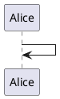


### 拡大

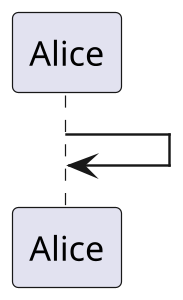


### 凡例

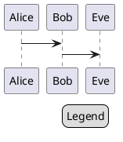


## 色

### 色の一覧

```plantuml

@startuml

colors

@enduml

```

#### 類似色

```plantuml

@startuml

colors aqua

@enduml

```

### 関数

| 名前                   | 説明                | 例                                | 結果      |
| ---------------------- | ------------------- | --------------------------------- | --------- |
| `%darken`              | 暗くする            | `%darken("red", 20)`              | `#CC0000` |
| `%is_dark`             | 暗い色か判定        | `%is_dark("#000000")`             | `true`    |
| `%is_light`            | 明るい色か判定      | `%is_light("#000000")`            | `false`   |
| `%lighten`             | 明るくする          | `%lighten("red", 20)`             | `#CC3333` |
| `%reverse_color`       | 色反転（RGB基準）   | `%reverse_color("#FF7700")`       | `#0088FF` |
| `%reverse_hsluv_color` | 色反転（HSLuv基準） | `%reverse_hsluv_color("#FF7700")` | `#602800` |

### 背景色指定

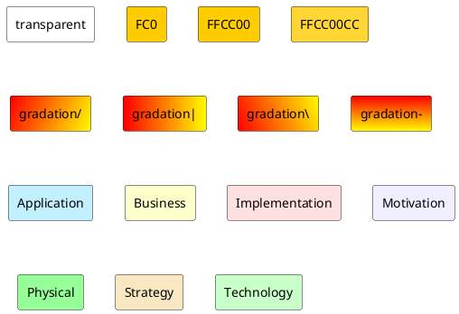

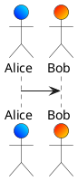

### フォント色

```plantuml

@startuml

' skinparam rectangleFontColor white /' 特定の色 '/
skinparam rectangleFontColor automatic /' 背景色に応じた色 '/

rectangle "000" #000
rectangle "FFF" #FFF

@enduml

```

```plantuml

@startuml

skinparam classFontColor automatic /' 背景色に応じた色 '/
skinparam classHeaderBackgroundColor #000

class classA {
  testMethodCode()
}

@enduml

```


# シーケンス図

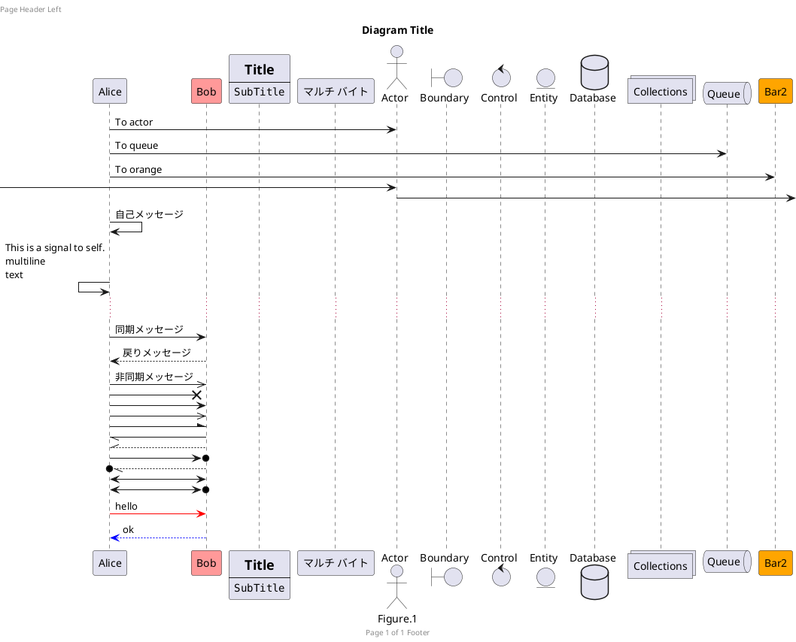


## メッセージ連番

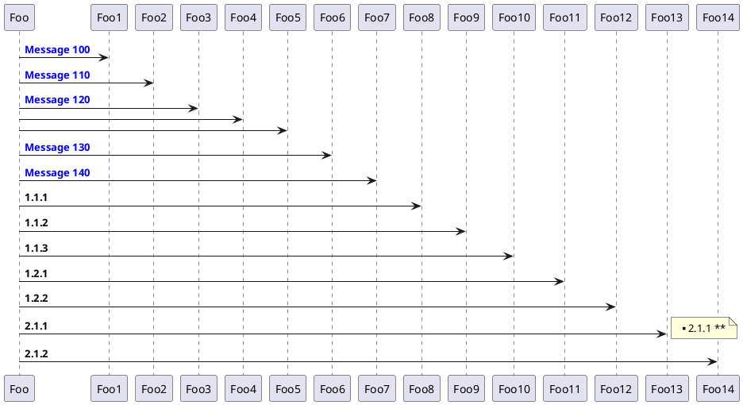


## テキスト位置

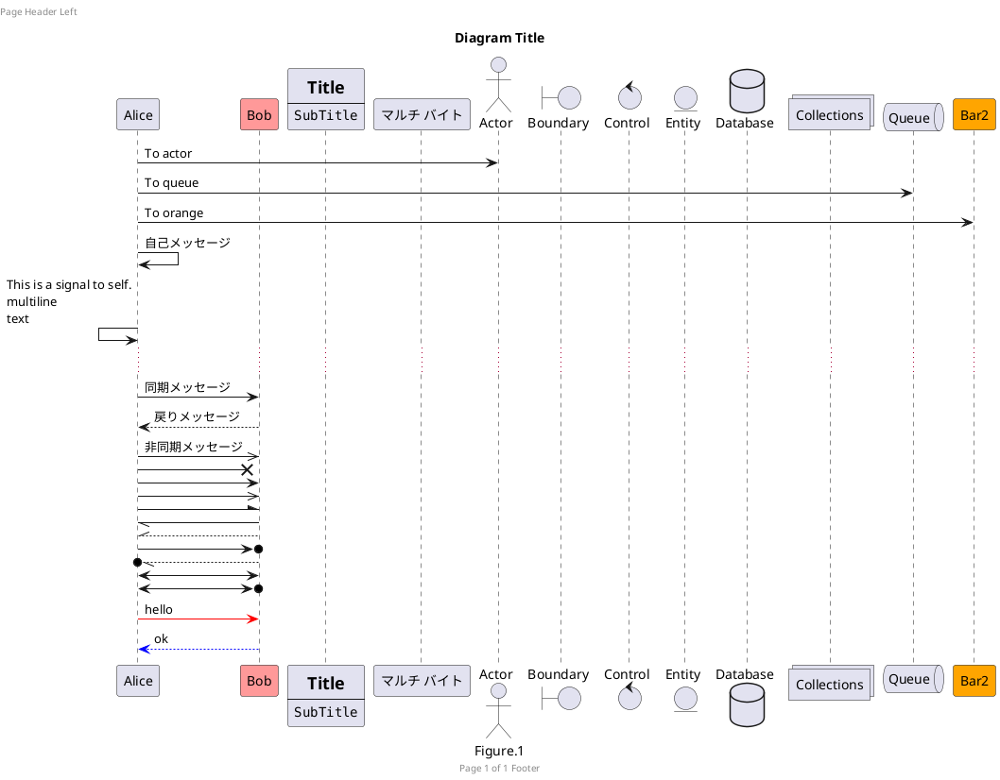


## ライフライン


### 分類子の生成／削除

- `++` 対象を活性化
- `--` 起点側を非活性化
- `**` 対象のインスタンスを生成
- `!!` 対象のインスタンスを破棄

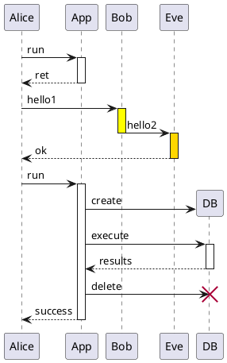


### 分類子の活性

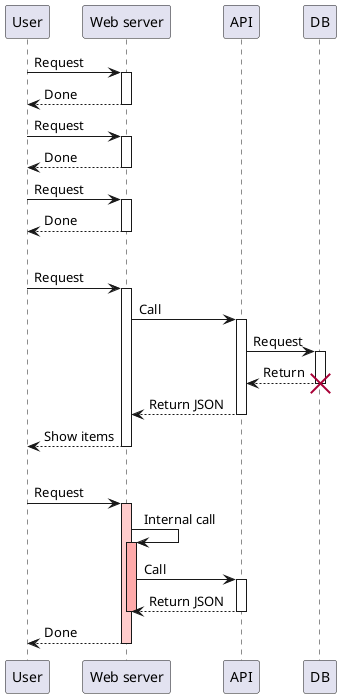


## グループ化

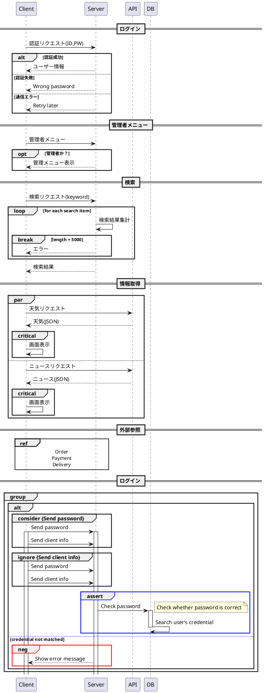


# ユースケース図

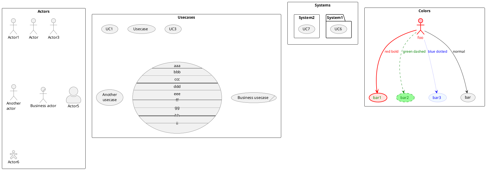

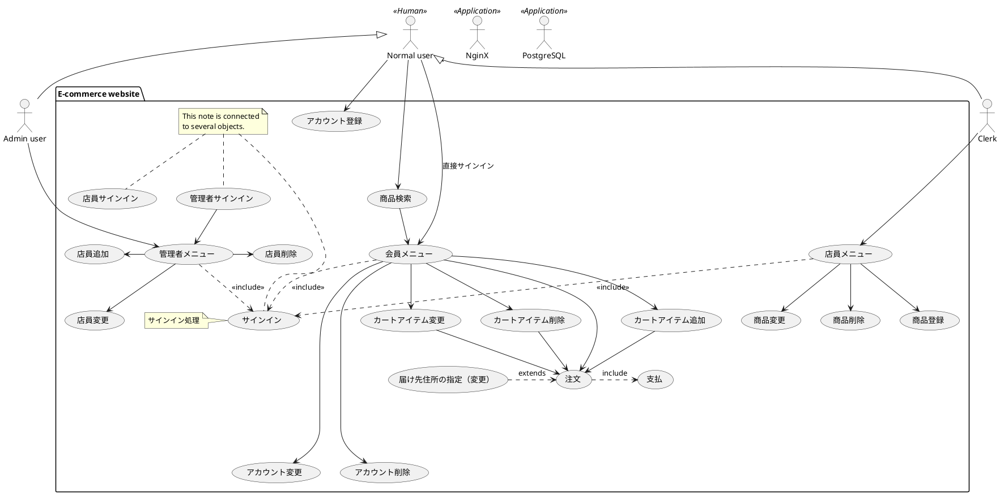


# クラス図

## 要素

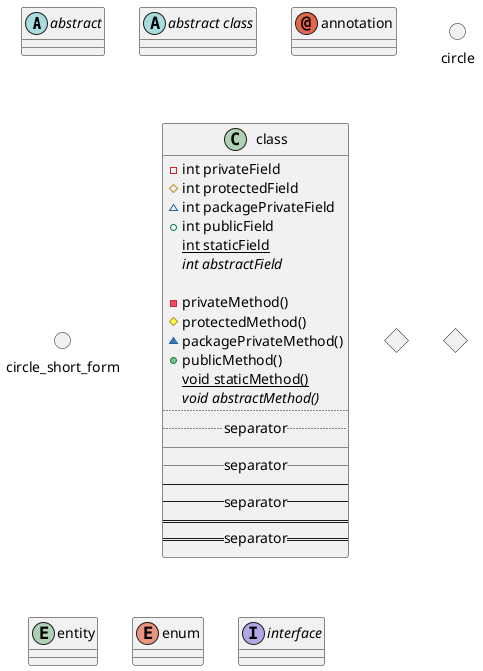

## 関係

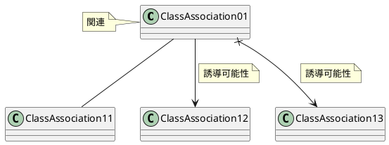

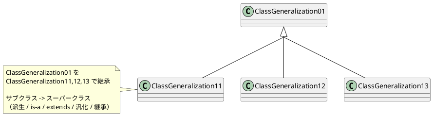

```plantuml

@startuml

class ClassRealization
interface InterfaceRealization

' InterfaceRealization ^.. ClassRealization
InterfaceRealization <|.. ClassRealization

note left of ClassRealization
    InterfaceRealization を
    ClassRealization で実現

    実装クラス -> インターフェース
    （実現 / realization / implements / 実装）
end note

@enduml

```

```plantuml

@startuml

ClassAggregation01 o-- ClassAggregation11

note left of ClassAggregation01
    ClassAggregation01 が全体、
    ClassAggregation11 が部分で、
    結びつきが弱い
    （集約）
end note

ClassComposition01 *-- ClassComposition11

note left of ClassComposition01
    ClassComposition01 が全体、 ClassComposition11 が部分で、
    結びつきが強く、 ClassComposition11 なしに成り立たない
    （合成 / コンポジション）
end note

@enduml

```

```plantuml

@startuml

ClassDependency01 ..> ClassDependency11

note left of ClassDependency01
    ClassDependency01 が ClassDependency11 に依存
    （ClassDependency01 が ClassDependency11 のフィールド／メソッドを利用している）
end note

@enduml

```

```plantuml

@startuml

Class01 ..# Class02
Class03 ..+ Class04

@enduml

```

## 多重度

```plantuml

@startuml

Class01 "1" -- "4..6" Class02 : 1 対 4～6
Class03 "1" -- "0..*" Class04 : 1 対 多
Class05"1..*" -- "*" Class06 : 1以上 対 多


' IE記法
' 最小(オプショナリティ) / 最大(カーディナリティ)

Class11 ||--o| Class12 : 1 対 0 or 1
Class13 ||--|| Class14 : 1 対 1

Class15 ||--o{ Class16 : 1 対 0以上
Class17 ||--|{ Class18 : 1 対 1以上

Class19 }o--|{ Class20 : 0以上 対 1以上

@enduml

```

## パッケージと名前空間

```plantuml

@startuml

package Package01 <<Node>> {
  class Class01
}

package Package02 <<Rectangle>> {
  class Class02
}

package Package03 <<Folder>> {
  class Class03
}

package Package04 <<Frame>> {
  class Class04
}

package Package05 <<Cloud>> {
  class Class05
}

package Package06 <<Database>> {
  class Class06
}

Package01 +-- Package02

' ''''''''''

class ABC
class XYZ
ABC --|> XYZ

namespace jp.example1 {
    class ABC
    class XYZ
    jp.example2.XYZ <|-- ABC
    XYZ <|-- ABC
}

namespace jp.example2 {
    class ABC
    class XYZ
    ABC --|> .XYZ
}

@enduml

```

## 外観

```plantuml

@startuml

' 空の属性・操作を省略
' hide empty members

' その他の省略
' hide empty fields, hide empty attributes
' hide empty methods
' hide fields, hide attributes
' hide circle
' hide stereotype
' hide members
' hide Class51
' hide <<Serializable>> members

' 孤立したクラスの省略
' hide @unlinked

' 削除
' remove Class51

' 孤立したクラスの削除
' remove @unlinked


' bold、dashed、dotted、hidden、plain
Class01 -- Class11 #line:red;line.bold;text:red : red;bold
Class02 -- Class12 #line:green;line.dashed;text:green : green;dashed
Class03 -- Class13 #line:blue;line.dotted;text:blue : blue;dotted
Class01 -[#red,bold]- Class11
Class02 -[#green,dashed,thickness=2]- Class12
Class03 -[#blue,dotted,thickness=4]- Class13

class Class04 #pink ##[bold]red
class Class14 << (C,#FFEE00) utility >> #pink;line:red;text:red
Class04 -- Class14

' 水平方向 left, right, up, down
Class31 -left- Class32
Class31 -      Class33

' bold、dashed、dotted、hidden、plain
Class34 -[hidden]>  Class35 /' 水平方向に揃える '/
Class31 -[hidden]-> Class34 /' 垂直方向に揃える '/
Class01 -[hidden]> Class02
Class02 -[hidden]> Class03

class "非 文 字" as Class07 <<Serializable>>
class Class08 as "non-letters in the class (or enum...)"
Class07 -- Class08

' 孤立したクラスの省略
' hide @unlinked
class Class09

@enduml

```

## 例

```plantuml

@startuml

' 空の属性・操作を省略
hide empty members


package Machine #CDE {
    class Vehicle
    class Car
    class Engine
    class Wagon
    class Wheel
    class FuelMeter
    class FuelTank
}


' クラス

Baggage : int depth
Baggage : int height
Baggage : int width

class Car {
    String maker
    String model
    int displacement
    int numberOfDoors

    reverse()
}

Driver : drive()
Driver : int id
Driver : Decimal height
Driver : Decimal weight

class Email {
    int id
    int driver_id
    int address
}

class Engine {
    int weight
}

class DriveLog #Aqua {
    DateTime date
    Location origin
    Location destination

    save()
}

class Location #Aquamarine {
    + String name
    + Decimal latitude
    + Decimal longitude
}

class Owner {
    String name
    bool buy()
    {field} 括弧を含む属性()
    {method} 括弧を含まない操作
}

class Vehicle {
    Decimal speed
    int numberOfPassengers
    String fuelType
    go(float acceleration)
    go(int maxSpeed)
    stop()
}

class Wheel {
    int radius
}


' インターフェース
Vehicle -() Driveable

interface Movable {
    goForward()
    goBack()
}


' リレーション

Vehicle <|-- Car
' note left on link, note right on link, note top on link, note bottom on link
note right on link : 派生

Movable <|.. Vehicle
note right on link : 実現

Driver "1..*" -> "0..*" Car : drives >
note right on link : 依存
(Driver, Car) .. DriveLog

Driver::id *-- Email::driver_id

Car *- Engine : has an >
note right on link : コンポジション（カスケード削除する）
Car *- Wheel : has 4 >
Car *- FuelMeter : has >
Car *- FuelTank : has >

Car o- Seat : has >
note right on link : 集約（カスケード削除しない）

Car <|-- Wagon
note on link : 派生

Car -- Owner : < owns

Car "1" *-- "many" Baggage : carries

FuelMeter ..> FuelTank
note right on link : 依存


' N 項関連
<> diamond
DriveLog . diamond
diamond - "from 0..*" Location
diamond - "to 0..* " Location


' Notes

' note left of, note right of, note top of, note bottom of
note right of Car
    <b>b</b> <color:royalBlue>color:royalBlue</color> <i>i</i> <s>s</s> <size:24>size:24</size> <u>u</u>
end note

' フィールド・メソッドの注釈は note left of, note right ofのみ
note right of Vehicle::"go(float acceleration)"
    Must set an acceleration
end note

note right of Vehicle::"go(int maxSpeed)"
    Must set a max speed
end note

note right of Vehicle::stop
    To stop
end note

note left of DriveLog
    関連クラス
end note

@enduml

```


# オブジェクト図

```plantuml

@startuml

object "カローラ : Car" as corolla {
    maker = トヨタ
    model = カローラ
    int   = 1200
    numberOfDoors = 4
}

object "センチュリー : Car" as century {
    maker = トヨタ
    model = センチュリー
    int   = 4968
    numberOfDoors = 4
}

object "太郎 : Driver" as taro {
    id = 1
    height = 180
    weight = 70
}


taro --> corolla
taro --> century


package マップテーブル（連想配列） {
    object Mirai {
        maker = トヨタ
        model = MIRAI
    }
    object プリウス {
        maker = トヨタ
        model = プリウス
    }

    map Car {
        corolla => カローラ
        century => センチュリー
        mirai *-> Mirai
        prius =>
    }
    プリウス --> Car::prius
}

@enduml

```


## PERT図

Program Evaluation and Review Technique

```plantuml

@startuml PERT

left to right direction
' Horizontal lines: -->, <--, <-->
' Vertical lines: ->, <-, <->
title PERT: Project Name

map Kick.Off {
}

map "ヒアリング" as task.1 {
    Start => End
}

map "要件定義" as task.2 {
    Start => End
}

map "プログラム設計" as task.3 {
    Start => End
}

map "実装" as task.4 {
    Start => End
}

map "テスト" as task.5 {
    Start => End
}

map "設計書作成" as task.6 {
    Start => End
}

map "運用設計" as task.7 {
    Start => End
}

map "手順書作成" as task.8 {
    Start => End
}

map "テスト仕様書作成" as task.9 {
    Start => End
}

map "デプロイ" as task.10 {
    Start => End
}


Kick.Off --> task.1 : Label 1
Kick.Off --> task.7 : Label 7
task.1 --> task.2
task.2 --> task.3
task.3 --> task.4
task.3 --> task.6
task.4 --> task.5
task.4 --> task.6
task.6 --> task.5
task.6 --> task.9
task.7 --> task.8
task.8 --> task.9
task.9 --> task.5
task.5 --> task.10

@enduml

```


# アクティビティ図

```plantuml

@startuml

start

repeat
    #CCFFFF:Sign in;
    :Check credential;

    backward :Wrong password;
    note right : username and / or password is incorrect
repeat while (Valid?) is (no) not (yes)

fork
    :Search product;
    :Add to cart;
    split
        :Order;
        :Payment;
    split again
        :Cancel order;
    end split
fork again
    :View profile;
    split
        :Change profile;
    split again
        :Change password;
    end split
fork again
    :View histories;
end fork

#CCFFFF:Sign out;

end


floating note left
    = 装飾
    ~**escape**
    **bold** <b>b</b>
    //italics// <i>i</i>
    ""monospaced""
    --stricken-out-- <s:green>s:green</s>
    __underlined__ <u>u</u> <u:red>u:red</u>
    ~~wave-underlined~~ <w:#0000FF>w:#0000FF</w>
    x<sub>2</sub><sup>3</sup>
    <color:red>color:red</color>
    <back:blue>back:blue</back>
    <size:18>size:18</size>
    

    = コード
    <code>
    def main():
        pass
    </code>

    = リスト
    * 1
    * 2
        ** 2-1
    == 番号リスト
    # a
    # b
    ## b-1

    = 水平線
    ----
    ====
    ....

    = リンク
    [[https://github.com/]]
    [[https://github.com/ya-androidapp ya-androidapp]]
    [[https://github.com/ya-androidapp?tab=repositories{tooltip} repositories]]

    = テーブル
    |= |= A |= B |= C |
    | 1 | <#aqua> A1 | B1 | C1 |
    <#palegreen>| 2 | A2 | B2 | C2 |

end note

@enduml


```


---

Copyright (c) 2022 YA-androidapp(https://github.com/YA-androidapp) All rights reserved.


