# PlantUML概要

| ダイアグラム                    | 内容                                                                                      |
| ------------------------------- | ----------------------------------------------------------------------------------------- |
| シーケンス図                    | 登場人物とシステム内のオブジェクト、通過するメッセージと発生順序を記述                    |
| ユースケース図                  | アクター（人／組織／別のシステム）とシステムのやり取りを記述                              |
| クラス図                        | クラスの定義とクラス間の関係を記述                                                        |
| オブジェクト図                  | クラス図の定義を具体化（インスタンス化）して記述                                          |
| アクティビティ図                | 「アクション（制御）」の遷移を記述                                                        |
| コンポーネント図                | コンポーネント、ポート、インターフェイス、コンポーネント間の関係を記述                    |
| 配置図                          | 物理的な構成を記述                                                                        |
| 状態遷移図（ステートマシン図）  | 「状態」の遷移を記述                                                                      |
| タイミング図                    | 時間軸と状態変化を記述                                                                    |
|                                 |                                                                                           |
| パッケージ図                    | クラスをグループ化して記述                                                                |
| コンポジット構造図              | 複数のクラスの定義とクラス間の関係を記述                                                  |
| コミュニケーション図            | クラスやオブジェクト間の応答と関係を記述                                                  |
| 相互作用概要図                  | *相互作用図* をアクティビティ図の構成要素にしたもの                                       |
|                                 |                                                                                           |
| JSON                            |                                                                                           |
| YAML                            |                                                                                           |
| ネットワーク図（nwdiag）        | ネットワーク機器の物理的な接続を記述                                                      |
| Salt                            | ワイヤフレームによる GUI 設計ツール                                                       |
| アーキテクチャ図                | システムの構造を記述                                                                      |
| Ditaa                           | アスキーアートを画像化するもの                                                            |
| ガントチャート                  | タスクごとのスケジュールを可視化するもの                                                  |
| マインドマップ                  | アイディアを可視化するもの                                                                |
| WBS（Work Breakdown Structure） | タスクを分割して階層構造を可視化するもの                                                  |
| AsciiMath                       | 数式を記述                                                                                |
| ER図                            | RDBの構造（エンティティ・アトリビュート・リレーション・カーディナリティ）を可視化するもの |

- *相互作用図* ... シーケンス図、タイミング図、コミュニケーション図、相互作用概観図


## 共通コマンド


### コメント

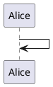


### 拡大

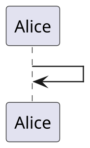


### 凡例

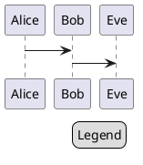


## 色

### 色の一覧

```plantuml

@startuml

colors

@enduml

```

#### 類似色

```plantuml

@startuml

colors aqua

@enduml

```

### 関数

| 名前                   | 説明                | 例                                | 結果      |
| ---------------------- | ------------------- | --------------------------------- | --------- |
| `%darken`              | 暗くする            | `%darken("red", 20)`              | `#CC0000` |
| `%is_dark`             | 暗い色か判定        | `%is_dark("#000000")`             | `true`    |
| `%is_light`            | 明るい色か判定      | `%is_light("#000000")`            | `false`   |
| `%lighten`             | 明るくする          | `%lighten("red", 20)`             | `#CC3333` |
| `%reverse_color`       | 色反転（RGB基準）   | `%reverse_color("#FF7700")`       | `#0088FF` |
| `%reverse_hsluv_color` | 色反転（HSLuv基準） | `%reverse_hsluv_color("#FF7700")` | `#602800` |

### 背景色指定

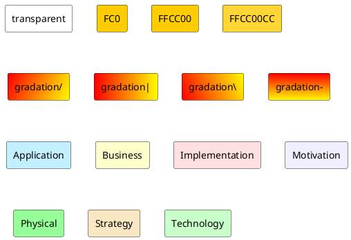

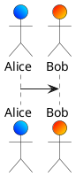

### フォント色

```plantuml

@startuml

' skinparam rectangleFontColor white /' 特定の色 '/
skinparam rectangleFontColor automatic /' 背景色に応じた色 '/

rectangle "000" #000
rectangle "FFF" #FFF

@enduml

```

```plantuml

@startuml

skinparam classFontColor automatic /' 背景色に応じた色 '/
skinparam classHeaderBackgroundColor #000

class classA {
  testMethodCode()
}

@enduml

```


# シーケンス図

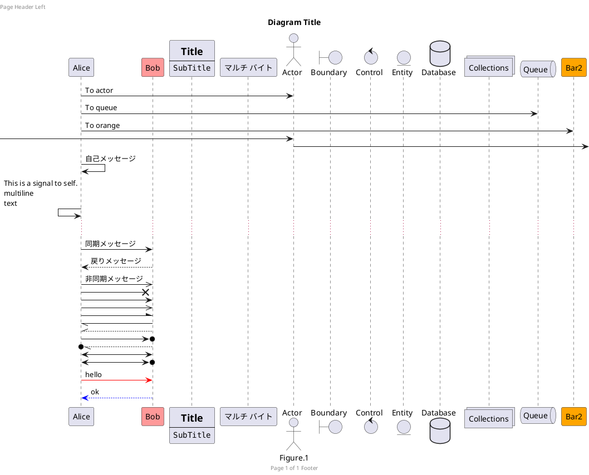


## メッセージ連番

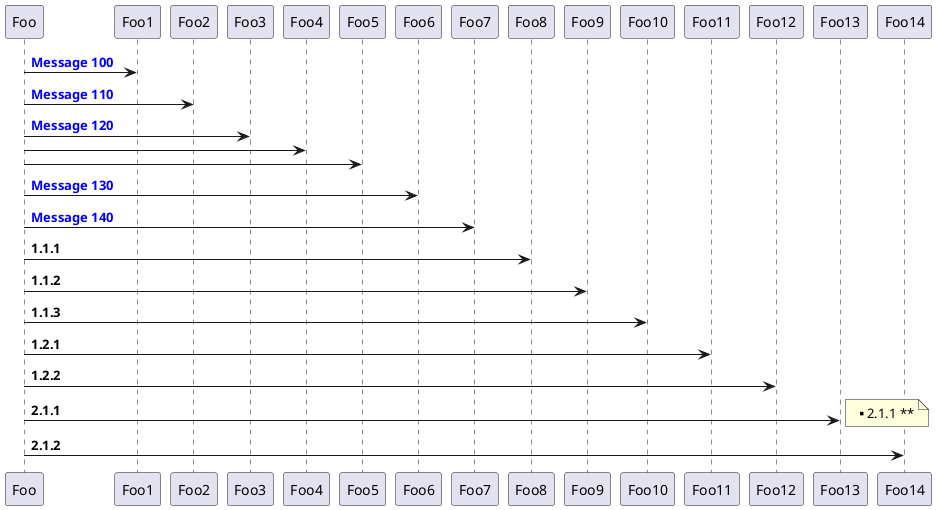


## テキスト位置

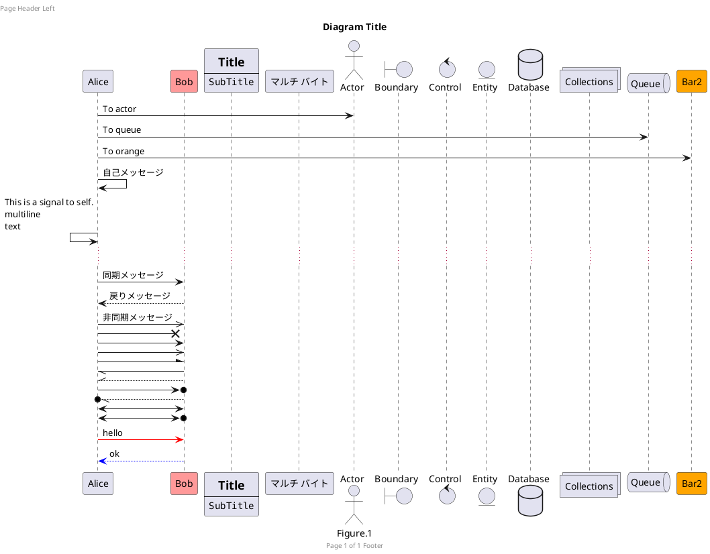


## ライフライン


### 分類子の生成／削除

- `++` 対象を活性化
- `--` 起点側を非活性化
- `**` 対象のインスタンスを生成
- `!!` 対象のインスタンスを破棄

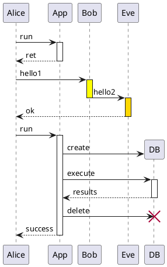


### 分類子の活性

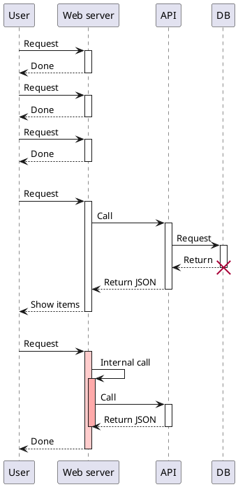


## グループ化

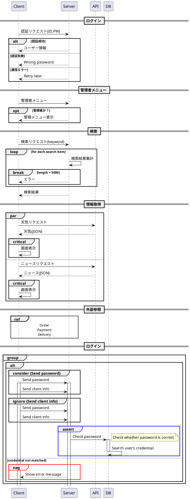


# ユースケース図

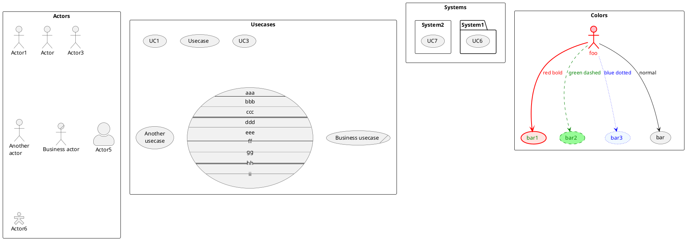

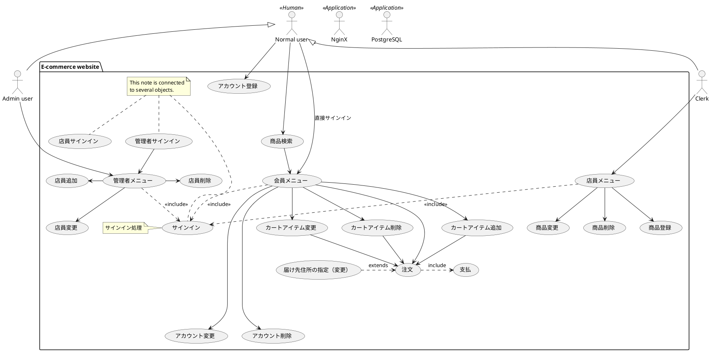


# クラス図

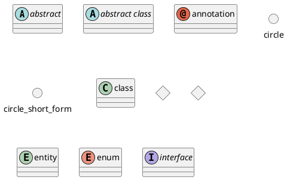

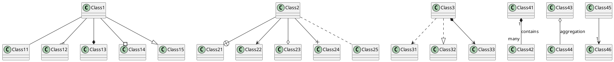

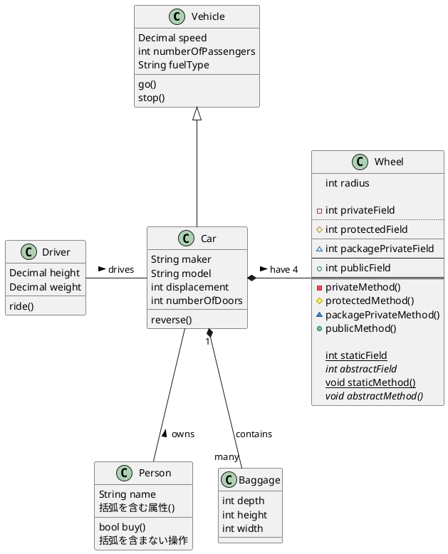

```plantuml

@startuml

@enduml


```

```plantuml

@startuml

@enduml


```

```plantuml

@startuml

@enduml


```

```plantuml

@startuml

@enduml


```

```plantuml

@startuml

@enduml


```


---

Copyright (c) 2022 YA-androidapp(https://github.com/YA-androidapp) All rights reserved.


