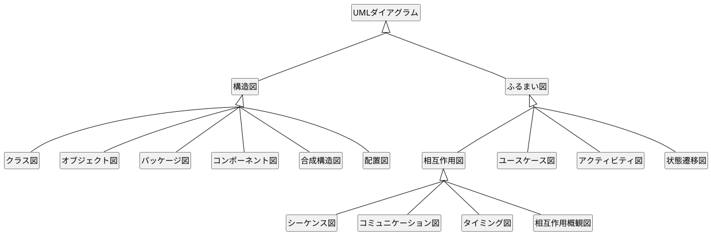

# PlantUML概要

| ダイアグラム                                                           | 内容                                                                                      |                                                                                                                                   |
| ---------------------------------------------------------------------- | ----------------------------------------------------------------------------------------- | --------------------------------------------------------------------------------------------------------------------------------- |
|                                                                        |                                                                                           |                                                                                                                                   |
| 構造図                                                                 |                                                                                           |                                                                                                                                   |
| &nbsp;&nbsp;&nbsp;&nbsp;〇 クラス図                                    | クラスの定義とクラス間の関係を記述                                                        |                |
| &nbsp;&nbsp;&nbsp;&nbsp;〇 オブジェクト図                              | クラス図の定義を具体化（インスタンス化）して記述                                          |               |
| &nbsp;&nbsp;&nbsp;&nbsp;● パッケージ図                                 | クラスをグループ化して記述                                                                |              |
| &nbsp;&nbsp;&nbsp;&nbsp;〇 コンポーネント図                            | コンポーネント、ポート、インターフェイス、コンポーネント間の関係を記述                    |            |
| &nbsp;&nbsp;&nbsp;&nbsp;● コンポジット構造図                           | 複数のクラスの定義とクラス間の関係を記述                                                  |  |
| &nbsp;&nbsp;&nbsp;&nbsp;〇 配置図                                      | 物理的な構成を記述                                                                        |           |
|                                                                        |                                                                                           |                                                                                                                                   |
| ふるまい図                                                             |                                                                                           |                                                                                                                                   |
| &nbsp;&nbsp;&nbsp;&nbsp;● 相互作用図                                   |                                                                                           |                                                                                                                                   |
| &nbsp;&nbsp;&nbsp;&nbsp;&nbsp;&nbsp;&nbsp;&nbsp;〇 シーケンス図        | 登場人物とシステム内のオブジェクト、通過するメッセージと発生順序を記述                    |             |
| &nbsp;&nbsp;&nbsp;&nbsp;&nbsp;&nbsp;&nbsp;&nbsp;● コミュニケーション図 | クラスやオブジェクト間の応答と関係を記述                                                  |        |
| &nbsp;&nbsp;&nbsp;&nbsp;&nbsp;&nbsp;&nbsp;&nbsp;〇 タイミング図        | 時間軸と状態変化を記述                                                                    |               |
| &nbsp;&nbsp;&nbsp;&nbsp;&nbsp;&nbsp;&nbsp;&nbsp;● 相互作用概要図       | *相互作用図* をアクティビティ図の構成要素にしたもの                                       |                                                                                                                                   |
| &nbsp;&nbsp;&nbsp;&nbsp;〇 ユースケース図                              | アクター（人／組織／別のシステム）とシステムのやり取りを記述                              |              |
| &nbsp;&nbsp;&nbsp;&nbsp;〇 アクティビティ図                            | 「アクション（制御）」の遷移を記述                                                        |             |
| &nbsp;&nbsp;&nbsp;&nbsp;〇 状態遷移図                                  | 「状態」の遷移を記述（ステート図 / ステートマシン図）                                     |                |
|                                                                        |                                                                                           |                                                                                                                                   |
| その他                                                                 |                                                                                           |                                                                                                                                   |
| &nbsp;&nbsp;&nbsp;&nbsp;△ Archimate（アーキテクチャ図）                | システムの構造を記述                                                                      |                                                                                                                                   |
| &nbsp;&nbsp;&nbsp;&nbsp;△ AsciiMath                                    | 数式を記述                                                                                |                                                                                                                                   |
| &nbsp;&nbsp;&nbsp;&nbsp;△ Ditaa                                        | アスキーアートを画像化するものDitaa (DIagrams Through Ascii Art)                          |                                                                                                                                   |
| &nbsp;&nbsp;&nbsp;&nbsp;△ JSON                                         |                                                                                           |                                                                                                                                   |
| &nbsp;&nbsp;&nbsp;&nbsp;△ nwdiag（ネットワーク図）                     | ネットワーク機器の物理的な接続を記述                                                      |                                                                                                                                   |
| &nbsp;&nbsp;&nbsp;&nbsp;△ Salt（Wireframe）                            | ワイヤフレームによる GUI 設計ツール                                                       |                                                                                                                                   |
| &nbsp;&nbsp;&nbsp;&nbsp;△ WBS                                          | タスクを分割して階層構造を可視化するもの（Work Breakdown Structure）                      |                                                                                                                                   |
| &nbsp;&nbsp;&nbsp;&nbsp;△ YAML                                         |                                                                                           |                                                                                                                                   |
| &nbsp;&nbsp;&nbsp;&nbsp;△ ガントチャート                               | タスクごとのスケジュールを可視化するもの                                                  |                                                                                                                                   |
| &nbsp;&nbsp;&nbsp;&nbsp;△ マインドマップ                               | アイディアを可視化するもの                                                                |                                                                                                                                   |
| &nbsp;&nbsp;&nbsp;&nbsp;▲ ER図                                         | RDBの構造（エンティティ・アトリビュート・リレーション・カーディナリティ）を可視化するもの |                                                                                                                                   |
|                                                                        |                                                                                           |                                                                                                                                   |

## UMLダイアグラムの関係

