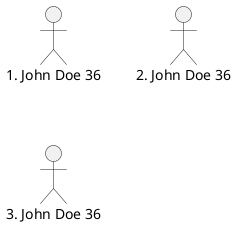

#### 変数

```plantuml

@startuml

' int
!$age  = 36

' bool(int型を利用)
'  false
!$flag = 0
'  true
!$flag = 1
!$flag = "0"
!$flag = "1"

' str
!$givenName = "John"
!$surname = "Doe"
!$fullName = $givenName + " " + $surname

:"1. $fullName $age":

' JSON
!$person = { "name": "John Doe", "age" : 36 }

:"2. $person.name $person.age":

' ?= 未定義の場合のみ変数に代入
!$age ?= 24
:"3. $fullName $age": /' 36のまま '/

@enduml

```
