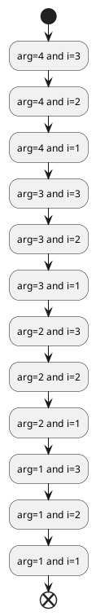

#### 制御構文

#####  条件分岐

```plantuml

@startuml

!if ($age == 36) && ($age >= 30)
:Lorem:
!elseif (%false() == %not(%true()))
:Ipsum:
!else
:Dolor:
!endif

@enduml

```

##### ループ・プロシージャ

```plantuml

@startuml

!procedure $proc1($arg)
  !while $arg!=0
    !$i=3
    !while $i!=0
      :arg=$arg and i=$i;
      !$i = $i - 1
    !endwhile
    !$arg = $arg - 1
  !endwhile
!endprocedure

start
$proc1(4)
end

@enduml

@startuml

!procedure $proc2($arg)
  !while $arg!=0
    [Component $arg]
    !$arg = $arg - 1
  !endwhile
!endprocedure

$proc2(4)

@enduml

```

##### 関数

```plantuml

@startuml

!function $double($a)
!return 2 * $a
!endfunction
' !function $double($a) !return 2 * $a

:$double(333): /' 666 '/

' 引数のデフォルト値
!function $double2($a=100) !return 2 * $a
:$double2(): /' 200 '/

' プロシージャや関数の引数をクォーテーション記号で囲まずに記述
!unquoted function $concat($str1="", $str2="") !return $str1 + $str2
:$concat(Foo,Bar): /' :$concat("Foo","Bar"): '/

' キーワード引数
:$concat($str2=Foo,$str1=Bar):

@enduml

```
