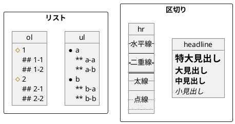
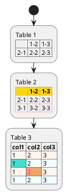
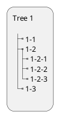
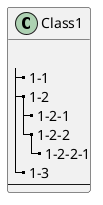
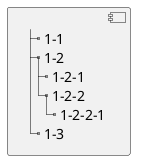

#### Creole

##### インライン

```plantuml

@startuml

rectangle {
    legend bottom right
        Creole

        # **bold**  ~**
        # //italics//  ~//
        # ""monospaced""  ~""
        # --stricken-out--  ~--
        # __underlined__ ~__
        # ~~wave-underlined~~  ~~
    end legend

    object エスケープ {
        # ~__underlined__
        # ~""monospaced""
    }
}

object HTML {
    * <b>~<b></b>
    * <i>~<i></i>
    * <s>~<s></s>
    * <s:#00FF00>~<s:#00FF00></s>
    * <s:green>~<s:green></s>
    * <u>~<u></u>
    * <u:#FF0000>~<u:#FF0000></u>
    * <u:red>~<u:red></u>
    * <font:monospaced>~<font:monospaced></font>
    * <w>~<w></w>
    * <w:#FFFF00>~<w:#FFFF00></w>
    * <w:yellow>~<w:yellow></w>
    * <plain>~<plain></plain>
    * <color:#0000FF>~<color:#0000FF></color>
    * <color:blue>~<color:blue></color>
    * <back:#FFA500>~<back:#FFA500></back>
    * <back:orange>~<back:orange></back>
    * <size:24>~<size:24></size>
    * <img:https://avatars.githubusercontent.com/u/9039417?v=4>
    * x<sup>~<sup></sup>
    * y<sub>~<sub></sub>
    * <code>print('Hello, world!!')</code>
}

rectangle リンク {
    ' クラス図のフィールドとメソッドでは三重の角括弧
    class Car {
        - Field1 [[[https://github.com/]]]
        Method1() [[[https://github.com/{ref}]]]
    }

    object link {
        [[https://github.com/ya-androidapp]] simple
        [[https://github.com/ya-androidapp?tab=repositories My repositories]] label
        [[https://github.com/ya-androidapp?tab=repositories{Repositories} Repos]] tooltip
    }
}

object char {
    # &#169; 実体参照
    # <U+3042><U+3044><U+3046><U+3048><U+304A> Unicode
    # 👺 <:bomb:> Twemoji
}

@enduml

```

###### Twemoji（絵文字）

* [Unicode block 26](https://www.plantuml.com/plantuml/svg/SoWkIImgAStDuKhDpS_AL30out98pKi12W00)
* [Unicode block 1F3](https://www.plantuml.com/plantuml/svg/SoWkIImgAStDuKhDpS_AL31qC-PoICrB0Oe00000)
* [Unicode block 1F4](https://www.plantuml.com/plantuml/svg/SoWkIImgAStDuKhDpS_AL31qC-5oICrB0Oe00000)
* [Unicode block 1F5](https://www.plantuml.com/plantuml/svg/SoWkIImgAStDuKhDpS_AL31qC-LoICrB0Oe00000)
* [Unicode block 1F6](https://www.plantuml.com/plantuml/svg/SoWkIImgAStDuKhDpS_AL31qC-DoICrB0Oe00000)
* [Unicode block 1F9](https://www.plantuml.com/plantuml/svg/SoWkIImgAStDuKhDpS_AL31qi-HoICrB0Oe00000)

##### ブロック

##### テーブル

##### ツリー

###### ツリー（クラス図）

###### ツリー（コンポーネント図・配置図）

