### スタイル

* FontName
* FontColor
* FontSize
* FontStyle
* BackGroundColor
* HyperLinkColor
* LineColor
* LineThickness
* LineStyle （実数または、;で区切られた2つの実数）
* Padding
* Margin
* RoundCorner
* DiagonalCorner
* WordWrap
* HorizontalAlignment （leftまたはright、center）

```plantuml

@startuml

skinparam useBetaStyle true

<style>
    sequenceDiagram {
        actor {
            BackGroundColor LightSteelBlue
            FontColor Blue
            LineColor Navy
        }
    }
</style>


actor Alice
actor Bob

@enduml

@startwbs

<style>
    wbsDiagram {
        FontColor #000040
        Linecolor #000040

        :depth(1) {
            FontColor DarkBlue
            LineColor DarkBlue
        }
        :depth(2) {
            FontColor Blue
            LineColor Blue
        }
        :depth(3) {
            FontColor DarkCyan
            LineColor DarkCyan
        }
    }
</style>

* 1
** 1-1
*** 1-1-1
** 1-2
*** 1-2-1
*** 1-2-2
**** 1-2-2-1

@endwbs

```

