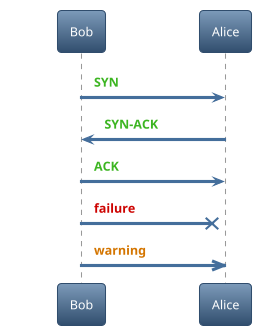

### テーマ

#### 利用可能なテーマ一覧

##### ギャラリー

[All the themes](https://the-lum.github.io/puml-themes-gallery/#all-the-themes)

##### コマンド

```plantuml

@startuml

help themes

@enduml

```


#### テーマを利用


