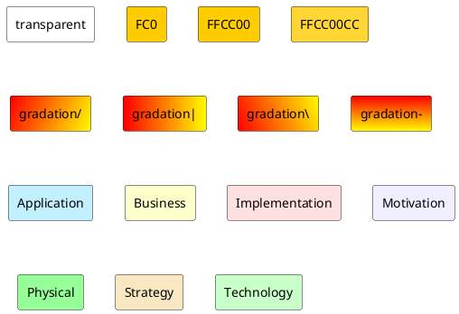
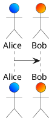

## 色

### 色の一覧

```plantuml
@startuml

colors

@enduml
```

#### 類似色

```plantuml
@startuml

colors aqua

@enduml
```

### 関数

| 名前                   | 説明                | 例                                | 結果      |
| ---------------------- | ------------------- | --------------------------------- | --------- |
| `%darken`              | 暗くする            | `%darken("red", 20)`              | `#CC0000` |
| `%is_dark`             | 暗い色か判定        | `%is_dark("#000000")`             | `true`    |
| `%is_light`            | 明るい色か判定      | `%is_light("#000000")`            | `false`   |
| `%lighten`             | 明るくする          | `%lighten("red", 20)`             | `#CC3333` |
| `%reverse_color`       | 色反転（RGB基準）   | `%reverse_color("#FF7700")`       | `#0088FF` |
| `%reverse_hsluv_color` | 色反転（HSLuv基準） | `%reverse_hsluv_color("#FF7700")` | `#602800` |

### 背景色指定





### フォント色

```plantuml
@startuml

' skinparam rectangleFontColor white /' 特定の色 '/
skinparam rectangleFontColor automatic /' 背景色に応じた色 '/

rectangle "000" #000
rectangle "FFF" #FFF

@enduml
```

```plantuml
@startuml

skinparam classFontColor automatic /' 背景色に応じた色 '/
skinparam classHeaderBackgroundColor #000

class classA {
  testMethodCode()
}

@enduml
```




