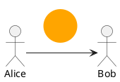

## 画像埋め込み

スプライト（モノクロで4、8、16段階のグレースケールの小さい画像）を埋め込む

```plantuml

@startuml

sprite $sprite1 {
    FFFFFFFFFFFFFFFFF
    F0123456789ABCDEF
    F1123456789ABCDEF
    F2223456789ABCDEF
    F3333456789ABCDEF
    F4444456789ABCDEF
    F5555556789ABCDEF
    F6666666789ABCDEF
    F7777777789ABCDEF
    F8888888889ABCDEF
    F9999999999ABCDEF
    FAAAAAAAAAAABCDEF
    FBBBBBBBBBBBBCDEF
    FDDDDDDDDDDDDDDEF
    FEEEEEEEEEEEEEEEF
    FFFFFFFFFFFFFFFFF
}

:Alice: -> :Bob: : <$sprite1>
:Bob: -> :Charlie: : <$sprite1,scale=2>
:Charlie: -> :Dave: : <$sprite1,color=Tomato>

@enduml

```



### SVGタグ



### アーキテクチャ図で使用できるアイコン

```plantuml

@startuml

listsprite

@enduml

```


### 画像ファイルをスプライトに変換

```bash
$ java -jar plantuml.jar -encodesprite 16z foo.png
# -encodesprite : 4、8、16、4z、8z、16z
```
