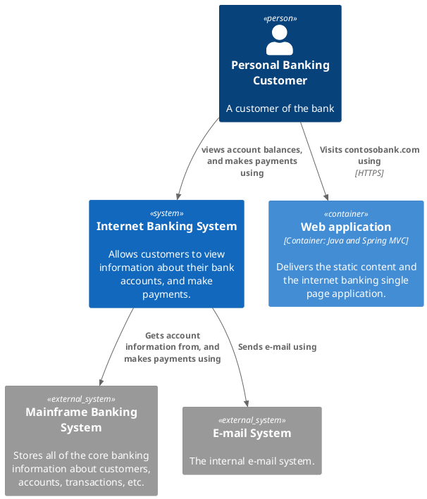

#### C4 model4

コンテキスト（context）、コンテナ（containers）、コンポーネント（components）、コード（code）

```plantuml

@startuml

!include <C4/C4_Context>
!include <C4/C4_Container>

Person(personAlias, "Personal Banking Customer", "A customer of the bank")

System(systemAlias, "Internet Banking System", "Allows customers to view information about their bank accounts, and make payments.")

Container(containerAlias, "Web application", "Container: Java and Spring MVC", "Delivers the static content and the internet banking single page application.")

System_Ext(mainframeSystemAlias, "Mainframe Banking System", "Stores all of the core banking information about customers, accounts, transactions, etc.")

System_Ext(emailSystemAlias, "E-mail System", "The internal e-mail system.")

Rel(personAlias, containerAlias, "Visits contosobank.com using", "HTTPS")
Rel(personAlias, systemAlias, "views account balances, and makes payments using")
Rel(systemAlias, mainframeSystemAlias, "Gets account information from, and makes payments using")
Rel(systemAlias, emailSystemAlias, "Sends e-mail using")
' Rel_U

@enduml

```
