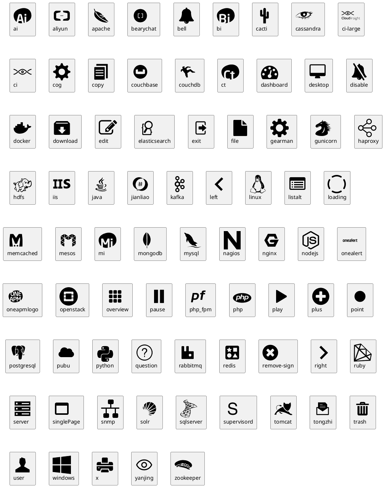

#### Cloudinsight

```plantuml

@startuml

skinparam monochrome true

!include <cloudinsight/ai>
!include <cloudinsight/aliyun>
!include <cloudinsight/apache>
!include <cloudinsight/bearychat>
!include <cloudinsight/bell>
!include <cloudinsight/bi>
!include <cloudinsight/cacti>
!include <cloudinsight/cassandra>
!include <cloudinsight/ci-large>
!include <cloudinsight/ci>
!include <cloudinsight/cog>
!include <cloudinsight/copy>
!include <cloudinsight/couchbase>
!include <cloudinsight/couchdb>
!include <cloudinsight/ct>
!include <cloudinsight/dashboard>
!include <cloudinsight/desktop>
!include <cloudinsight/disable>
!include <cloudinsight/docker>
!include <cloudinsight/download>
!include <cloudinsight/edit>
!include <cloudinsight/elasticsearch>
!include <cloudinsight/exit>
!include <cloudinsight/file>
!include <cloudinsight/gearman>
!include <cloudinsight/gunicorn>
!include <cloudinsight/haproxy>
!include <cloudinsight/hdfs>
!include <cloudinsight/iis>
!include <cloudinsight/java>
!include <cloudinsight/jianliao>
!include <cloudinsight/kafka>
!include <cloudinsight/left>
!include <cloudinsight/linux>
!include <cloudinsight/listalt>
!include <cloudinsight/loading>
!include <cloudinsight/memcached>
!include <cloudinsight/mesos>
!include <cloudinsight/mi>
!include <cloudinsight/mongodb>
!include <cloudinsight/mysql>
!include <cloudinsight/nagios>
!include <cloudinsight/nginx>
!include <cloudinsight/nodejs>
!include <cloudinsight/onealert>
!include <cloudinsight/oneapmlogo>
!include <cloudinsight/openstack>
!include <cloudinsight/overview>
!include <cloudinsight/pause>
!include <cloudinsight/php_fpm>
!include <cloudinsight/php>
!include <cloudinsight/play>
!include <cloudinsight/plus>
!include <cloudinsight/point>
!include <cloudinsight/postgresql>
!include <cloudinsight/pubu>
!include <cloudinsight/python>
!include <cloudinsight/question>
!include <cloudinsight/rabbitmq>
!include <cloudinsight/redis>
!include <cloudinsight/remove-sign>
!include <cloudinsight/right>
!include <cloudinsight/ruby>
!include <cloudinsight/server>
!include <cloudinsight/singlePage>
!include <cloudinsight/snmp>
!include <cloudinsight/solr>
!include <cloudinsight/sqlserver>
!include <cloudinsight/supervisord>
!include <cloudinsight/tomcat>
!include <cloudinsight/tongzhi>
!include <cloudinsight/trash>
!include <cloudinsight/user>
!include <cloudinsight/windows>
!include <cloudinsight/x>
!include <cloudinsight/yanjing>
!include <cloudinsight/zookeeper>


rectangle "<$ai>\nai"
rectangle "<$aliyun>\naliyun"
rectangle "<$apache>\napache"
rectangle "<$bearychat>\nbearychat"
rectangle "<$bell>\nbell"
rectangle "<$bi>\nbi"
rectangle "<$cacti>\ncacti"
rectangle "<$cassandra>\ncassandra"
rectangle "<$ci-large>\nci-large"
rectangle "<$ci>\nci"
rectangle "<$cog>\ncog"
rectangle "<$copy>\ncopy"
rectangle "<$couchbase>\ncouchbase"
rectangle "<$couchdb>\ncouchdb"
rectangle "<$ct>\nct"
rectangle "<$dashboard>\ndashboard"
rectangle "<$desktop>\ndesktop"
rectangle "<$disable>\ndisable"
rectangle "<$docker>\ndocker"
rectangle "<$download>\ndownload"
rectangle "<$edit>\nedit"
rectangle "<$elasticsearch>\nelasticsearch"
rectangle "<$exit>\nexit"
rectangle "<$file>\nfile"
rectangle "<$gearman>\ngearman"
rectangle "<$gunicorn>\ngunicorn"
rectangle "<$haproxy>\nhaproxy"
rectangle "<$hdfs>\nhdfs"
rectangle "<$iis>\niis"
rectangle "<$java>\njava"
rectangle "<$jianliao>\njianliao"
rectangle "<$kafka>\nkafka"
rectangle "<$left>\nleft"
rectangle "<$linux>\nlinux"
rectangle "<$listalt>\nlistalt"
rectangle "<$loading>\nloading"
rectangle "<$memcached>\nmemcached"
rectangle "<$mesos>\nmesos"
rectangle "<$mi>\nmi"
rectangle "<$mongodb>\nmongodb"
rectangle "<$mysql>\nmysql"
rectangle "<$nagios>\nnagios"
rectangle "<$nginx>\nnginx"
rectangle "<$nodejs>\nnodejs"
rectangle "<$onealert>\nonealert"
rectangle "<$oneapmlogo>\noneapmlogo"
rectangle "<$openstack>\nopenstack"
rectangle "<$overview>\noverview"
rectangle "<$pause>\npause"
rectangle "<$php_fpm>\nphp_fpm"
rectangle "<$php>\nphp"
rectangle "<$play>\nplay"
rectangle "<$plus>\nplus"
rectangle "<$point>\npoint"
rectangle "<$postgresql>\npostgresql"
rectangle "<$pubu>\npubu"
rectangle "<$python>\npython"
rectangle "<$question>\nquestion"
rectangle "<$rabbitmq>\nrabbitmq"
rectangle "<$redis>\nredis"
rectangle "<$remove-sign>\nremove-sign"
rectangle "<$right>\nright"
rectangle "<$ruby>\nruby"
rectangle "<$server>\nserver"
rectangle "<$singlePage>\nsinglePage"
rectangle "<$snmp>\nsnmp"
rectangle "<$solr>\nsolr"
rectangle "<$sqlserver>\nsqlserver"
rectangle "<$supervisord>\nsupervisord"
rectangle "<$tomcat>\ntomcat"
rectangle "<$tongzhi>\ntongzhi"
rectangle "<$trash>\ntrash"
rectangle "<$user>\nuser"
rectangle "<$windows>\nwindows"
rectangle "<$x>\nx"
rectangle "<$yanjing>\nyanjing"
rectangle "<$zookeeper>\nzookeeper"

@enduml

```
