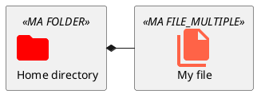

#### Google Material Icons

```plantuml

@startuml

!include <material/common>
!include <material/file_multiple>
!include <material/folder>


MA_FILE_MULTIPLE(Tomato, 1, files, rectangle, "My file")
MA_FOLDER(Red, 1, folder, rectangle, "Home directory")

folder *- files

@enduml

```
