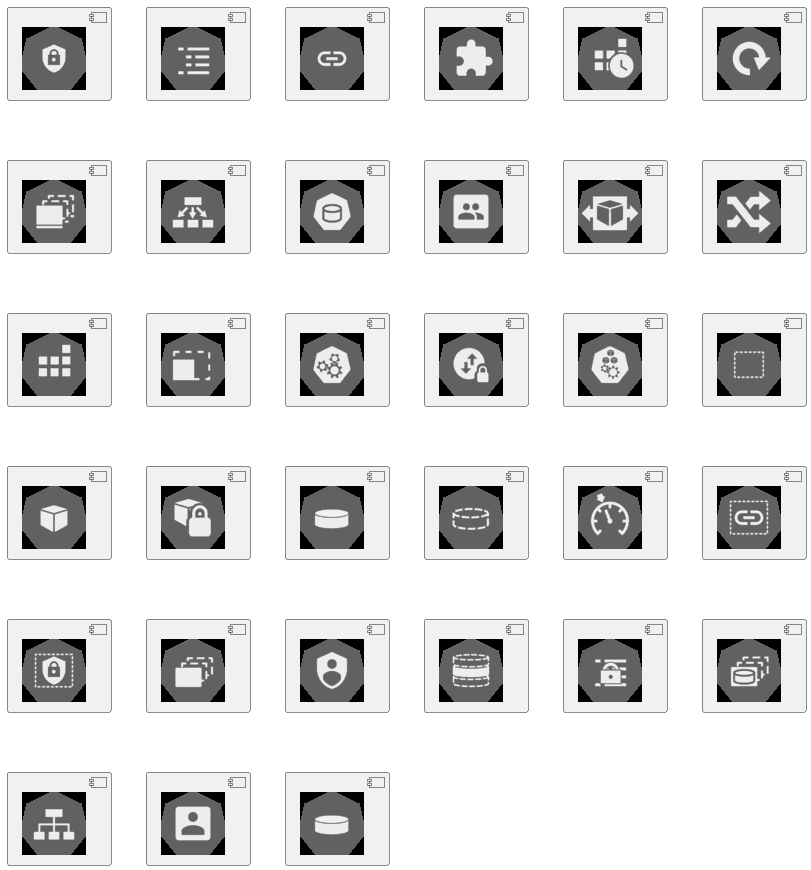

#### Kubernetes

```plantuml

@startuml

scale .5

!includeurl https://raw.githubusercontent.com/plantuml-stdlib/plantuml-kubernetes-sprites/master/resource/k8s-sprites-labeled-full.iuml
!includeurl https://raw.githubusercontent.com/plantuml-stdlib/plantuml-kubernetes-sprites/master/resource/k8s-sprites-unlabeled-full.iuml

listsprites

@enduml

```



