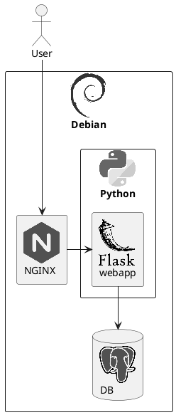

#### Logos

```plantuml

@startuml

!define SPRITESURL https://raw.githubusercontent.com/plantuml-stdlib/gilbarbara-plantuml-sprites/master/sprites

!includeurl SPRITESURL/100tb.puml
!includeurl SPRITESURL/500px.puml
!includeurl SPRITESURL/active-campaign-icon.puml
!includeurl SPRITESURL/active-campaign.puml
!includeurl SPRITESURL/adonisjs-icon.puml
!includeurl SPRITESURL/adonisjs.puml
!includeurl SPRITESURL/adroll.puml
!includeurl SPRITESURL/adyen.puml
!includeurl SPRITESURL/aerospike-icon.puml
!includeurl SPRITESURL/aerospike.puml
!includeurl SPRITESURL/airbnb.puml
!includeurl SPRITESURL/airbrake.puml
!includeurl SPRITESURL/airflow.puml
!includeurl SPRITESURL/airtable.puml
!includeurl SPRITESURL/akamai.puml
!includeurl SPRITESURL/akka.puml
!includeurl SPRITESURL/alfresco.puml
!includeurl SPRITESURL/algolia.puml
!includeurl SPRITESURL/alpinejs-icon.puml
!includeurl SPRITESURL/alpinejs.puml
!includeurl SPRITESURL/altair.puml
!includeurl SPRITESURL/amazon-chime.puml
!includeurl SPRITESURL/amazon-connect.puml
!includeurl SPRITESURL/amex.puml
!includeurl SPRITESURL/amp-icon.puml
!includeurl SPRITESURL/amp.puml
!includeurl SPRITESURL/ampersand.puml
!includeurl SPRITESURL/amplitude-icon.puml
!includeurl SPRITESURL/amplitude.puml
!includeurl SPRITESURL/android-icon.puml
!includeurl SPRITESURL/android.puml
!includeurl SPRITESURL/angellist.puml
!includeurl SPRITESURL/angular-icon.puml
!includeurl SPRITESURL/angular.puml
!includeurl SPRITESURL/ansible.puml
!includeurl SPRITESURL/ant-design.puml
!includeurl SPRITESURL/apache-camel.puml
!includeurl SPRITESURL/apache.puml
!includeurl SPRITESURL/apache_cloudstack.puml
!includeurl SPRITESURL/apiary.puml
!includeurl SPRITESURL/apollostack.puml
!includeurl SPRITESURL/apostrophe.puml
!includeurl SPRITESURL/appbaseio-icon.puml
!includeurl SPRITESURL/appbaseio.puml
!includeurl SPRITESURL/appcircle-icon.puml
!includeurl SPRITESURL/appcircle.puml
!includeurl SPRITESURL/appcode.puml
!includeurl SPRITESURL/appdynamics.puml
!includeurl SPRITESURL/appium.puml
!includeurl SPRITESURL/apple-app-store.puml
!includeurl SPRITESURL/apple-pay.puml
!includeurl SPRITESURL/apple.puml
!includeurl SPRITESURL/appsignal-icon.puml
!includeurl SPRITESURL/appsignal.puml
!includeurl SPRITESURL/apptentive.puml
!includeurl SPRITESURL/appveyor.puml
!includeurl SPRITESURL/arangodb.puml
!includeurl SPRITESURL/archlinux.puml
!includeurl SPRITESURL/arduino.puml
!includeurl SPRITESURL/argo-icon.puml
!includeurl SPRITESURL/argo.puml
!includeurl SPRITESURL/armory.puml
!includeurl SPRITESURL/asana.puml
!includeurl SPRITESURL/asciidoctor.puml
!includeurl SPRITESURL/astro.puml
!includeurl SPRITESURL/astronomer.puml
!includeurl SPRITESURL/atlassian.puml
!includeurl SPRITESURL/atom-icon.puml
!includeurl SPRITESURL/atom.puml
!includeurl SPRITESURL/atomic-icon.puml
!includeurl SPRITESURL/atomic.puml
!includeurl SPRITESURL/aurelia.puml
!includeurl SPRITESURL/aurora.puml
!includeurl SPRITESURL/auth0-icon.puml
!includeurl SPRITESURL/auth0.puml
!includeurl SPRITESURL/authy.puml
!includeurl SPRITESURL/autoit.puml
!includeurl SPRITESURL/autoprefixer.puml
!includeurl SPRITESURL/ava.puml
!includeurl SPRITESURL/awesome.puml
!includeurl SPRITESURL/aws-amplify.puml
!includeurl SPRITESURL/aws-api-gateway.puml
!includeurl SPRITESURL/aws-app-mesh.puml
!includeurl SPRITESURL/aws-appflow.puml
!includeurl SPRITESURL/aws-appsync.puml
!includeurl SPRITESURL/aws-athena.puml
!includeurl SPRITESURL/aws-aurora.puml
!includeurl SPRITESURL/aws-backup.puml
!includeurl SPRITESURL/aws-batch.puml
!includeurl SPRITESURL/aws-certificate-manager.puml
!includeurl SPRITESURL/aws-cloudformation.puml
!includeurl SPRITESURL/aws-cloudfront.puml
!includeurl SPRITESURL/aws-cloudsearch.puml
!includeurl SPRITESURL/aws-cloudtrail.puml
!includeurl SPRITESURL/aws-cloudwatch.puml
!includeurl SPRITESURL/aws-codebuild.puml
!includeurl SPRITESURL/aws-codecommit.puml
!includeurl SPRITESURL/aws-codedeploy.puml
!includeurl SPRITESURL/aws-codepipeline.puml
!includeurl SPRITESURL/aws-codestar.puml
!includeurl SPRITESURL/aws-cognito.puml
!includeurl SPRITESURL/aws-config.puml
!includeurl SPRITESURL/aws-documentdb.puml
!includeurl SPRITESURL/aws-dynamodb.puml
!includeurl SPRITESURL/aws-ec2.puml
!includeurl SPRITESURL/aws-ecs.puml
!includeurl SPRITESURL/aws-eks.puml
!includeurl SPRITESURL/aws-elastic-beanstalk.puml
!includeurl SPRITESURL/aws-elasticache.puml
!includeurl SPRITESURL/aws-elb.puml
!includeurl SPRITESURL/aws-eventbridge.puml
!includeurl SPRITESURL/aws-fargate.puml
!includeurl SPRITESURL/aws-glacier.puml
!includeurl SPRITESURL/aws-glue.puml
!includeurl SPRITESURL/aws-iam.puml
!includeurl SPRITESURL/aws-keyspaces.puml
!includeurl SPRITESURL/aws-kinesis.puml
!includeurl SPRITESURL/aws-kms.puml
!includeurl SPRITESURL/aws-lake-formation.puml
!includeurl SPRITESURL/aws-lambda.puml
!includeurl SPRITESURL/aws-lightsail.puml
!includeurl SPRITESURL/aws-mq.puml
!includeurl SPRITESURL/aws-msk.puml
!includeurl SPRITESURL/aws-neptune.puml
!includeurl SPRITESURL/aws-open-search.puml
!includeurl SPRITESURL/aws-opsworks.puml
!includeurl SPRITESURL/aws-quicksight.puml
!includeurl SPRITESURL/aws-rds.puml
!includeurl SPRITESURL/aws-redshift.puml
!includeurl SPRITESURL/aws-route53.puml
!includeurl SPRITESURL/aws-s3.puml
!includeurl SPRITESURL/aws-secrets-manager.puml
!includeurl SPRITESURL/aws-ses.puml
!includeurl SPRITESURL/aws-shield.puml
!includeurl SPRITESURL/aws-sns.puml
!includeurl SPRITESURL/aws-sqs.puml
!includeurl SPRITESURL/aws-step-functions.puml
!includeurl SPRITESURL/aws-systems-manager.puml
!includeurl SPRITESURL/aws-timestream.puml
!includeurl SPRITESURL/aws-vpc.puml
!includeurl SPRITESURL/aws-waf.puml
!includeurl SPRITESURL/aws-xray.puml
!includeurl SPRITESURL/aws.puml
!includeurl SPRITESURL/axios.puml
!includeurl SPRITESURL/babel.puml
!includeurl SPRITESURL/backbone-icon.puml
!includeurl SPRITESURL/backbone.puml
!includeurl SPRITESURL/backerkit.puml
!includeurl SPRITESURL/baker-street.puml
!includeurl SPRITESURL/balena.puml
!includeurl SPRITESURL/bamboo.puml
!includeurl SPRITESURL/basecamp.puml
!includeurl SPRITESURL/basekit.puml
!includeurl SPRITESURL/bash-icon.puml
!includeurl SPRITESURL/bash.puml
!includeurl SPRITESURL/batch.puml
!includeurl SPRITESURL/beats.puml
!includeurl SPRITESURL/behance.puml
!includeurl SPRITESURL/bem-2.puml
!includeurl SPRITESURL/bem.puml
!includeurl SPRITESURL/bigpanda.puml
!includeurl SPRITESURL/bing.puml
!includeurl SPRITESURL/bitbucket.puml
!includeurl SPRITESURL/bitcoin.puml
!includeurl SPRITESURL/bitnami.puml
!includeurl SPRITESURL/bitrise-icon.puml
!includeurl SPRITESURL/bitrise.puml
!includeurl SPRITESURL/blender.puml
!includeurl SPRITESURL/blitzjs-icon.puml
!includeurl SPRITESURL/blitzjs.puml
!includeurl SPRITESURL/blocs.puml
!includeurl SPRITESURL/blogger.puml
!includeurl SPRITESURL/blossom.puml
!includeurl SPRITESURL/blueprint.puml
!includeurl SPRITESURL/bluetooth.puml
!includeurl SPRITESURL/booqable.puml
!includeurl SPRITESURL/bootstrap.puml
!includeurl SPRITESURL/bosun.puml
!includeurl SPRITESURL/botanalytics.puml
!includeurl SPRITESURL/bourbon.puml
!includeurl SPRITESURL/bower.puml
!includeurl SPRITESURL/box.puml
!includeurl SPRITESURL/brackets.puml
!includeurl SPRITESURL/branch.puml
!includeurl SPRITESURL/brandfolder-icon.puml
!includeurl SPRITESURL/brandfolder.puml
!includeurl SPRITESURL/brave.puml
!includeurl SPRITESURL/braze.puml
!includeurl SPRITESURL/broccoli.puml
!includeurl SPRITESURL/brotli.puml
!includeurl SPRITESURL/browserify-icon.puml
!includeurl SPRITESURL/browserify.puml
!includeurl SPRITESURL/browserling.puml
!includeurl SPRITESURL/browserslist.puml
!includeurl SPRITESURL/browserstack.puml
!includeurl SPRITESURL/browsersync.puml
!includeurl SPRITESURL/brunch.puml
!includeurl SPRITESURL/buck.puml
!includeurl SPRITESURL/buddy.puml
!includeurl SPRITESURL/buffer.puml
!includeurl SPRITESURL/bugherd.puml
!includeurl SPRITESURL/bugsee.puml
!includeurl SPRITESURL/bugsnag-icon.puml
!includeurl SPRITESURL/bugsnag.puml
!includeurl SPRITESURL/buildkite-icon.puml
!includeurl SPRITESURL/buildkite.puml
!includeurl SPRITESURL/bulma.puml
!includeurl SPRITESURL/c-plusplus.puml
!includeurl SPRITESURL/c-sharp.puml
!includeurl SPRITESURL/c.puml
!includeurl SPRITESURL/cachet.puml
!includeurl SPRITESURL/caffe2.puml
!includeurl SPRITESURL/cakephp-icon.puml
!includeurl SPRITESURL/cakephp.puml
!includeurl SPRITESURL/campaignmonitor-icon.puml
!includeurl SPRITESURL/campaignmonitor.puml
!includeurl SPRITESURL/canjs.puml
!includeurl SPRITESURL/capacitorjs-icon.puml
!includeurl SPRITESURL/capacitorjs.puml
!includeurl SPRITESURL/capistrano.puml
!includeurl SPRITESURL/carbide.puml
!includeurl SPRITESURL/cassandra.puml
!includeurl SPRITESURL/centos-icon.puml
!includeurl SPRITESURL/centos.puml
!includeurl SPRITESURL/certbot.puml
!includeurl SPRITESURL/ceylon.puml
!includeurl SPRITESURL/chai.puml
!includeurl SPRITESURL/chalk.puml
!includeurl SPRITESURL/chargebee-icon.puml
!includeurl SPRITESURL/chargebee.puml
!includeurl SPRITESURL/chef.puml
!includeurl SPRITESURL/chevereto.puml
!includeurl SPRITESURL/chromatic-icon.puml
!includeurl SPRITESURL/chromatic.puml
!includeurl SPRITESURL/chrome.puml
!includeurl SPRITESURL/cinder.puml
!includeurl SPRITESURL/circleci.puml
!includeurl SPRITESURL/cirrus-ci.puml
!includeurl SPRITESURL/cirrus.puml
!includeurl SPRITESURL/clion.puml
!includeurl SPRITESURL/cljs.puml
!includeurl SPRITESURL/clojure.puml
!includeurl SPRITESURL/close.puml
!includeurl SPRITESURL/cloud9.puml
!includeurl SPRITESURL/cloudacademy-icon.puml
!includeurl SPRITESURL/cloudacademy.puml
!includeurl SPRITESURL/cloudcraft.puml
!includeurl SPRITESURL/cloudflare.puml
!includeurl SPRITESURL/cloudinary.puml
!includeurl SPRITESURL/cloudlinux.puml
!includeurl SPRITESURL/cobalt.puml
!includeurl SPRITESURL/cockpit.puml
!includeurl SPRITESURL/cocoapods.puml
!includeurl SPRITESURL/codacy.puml
!includeurl SPRITESURL/codebase.puml
!includeurl SPRITESURL/codebeat.puml
!includeurl SPRITESURL/codecademy.puml
!includeurl SPRITESURL/codeception.puml
!includeurl SPRITESURL/codeclimate.puml
!includeurl SPRITESURL/codecov.puml
!includeurl SPRITESURL/codefactor-icon.puml
!includeurl SPRITESURL/codefactor.puml
!includeurl SPRITESURL/codeigniter.puml
!includeurl SPRITESURL/codepen-icon.puml
!includeurl SPRITESURL/codepen.puml
!includeurl SPRITESURL/codepush.puml
!includeurl SPRITESURL/codersrank.puml
!includeurl SPRITESURL/coderwall.puml
!includeurl SPRITESURL/codesandbox.puml
!includeurl SPRITESURL/codeship.puml
!includeurl SPRITESURL/codio.puml
!includeurl SPRITESURL/codrops.puml
!includeurl SPRITESURL/coffeescript.puml
!includeurl SPRITESURL/commitizen.puml
!includeurl SPRITESURL/compass.puml
!includeurl SPRITESURL/componentkit.puml
!includeurl SPRITESURL/compose.puml
!includeurl SPRITESURL/composer.puml
!includeurl SPRITESURL/conan-io.puml
!includeurl SPRITESURL/concourse.puml
!includeurl SPRITESURL/concrete5.puml
!includeurl SPRITESURL/confluence.puml
!includeurl SPRITESURL/consul.puml
!includeurl SPRITESURL/contentful.puml
!includeurl SPRITESURL/convox.puml
!includeurl SPRITESURL/copyleft-pirate.puml
!includeurl SPRITESURL/copyleft.puml
!includeurl SPRITESURL/corda.puml
!includeurl SPRITESURL/cordova.puml
!includeurl SPRITESURL/coreos-icon.puml
!includeurl SPRITESURL/coreos.puml
!includeurl SPRITESURL/couchbase.puml
!includeurl SPRITESURL/couchdb-icon.puml
!includeurl SPRITESURL/couchdb.puml
!includeurl SPRITESURL/coursera.puml
!includeurl SPRITESURL/coveralls.puml
!includeurl SPRITESURL/cpanel.puml
!includeurl SPRITESURL/craftcms.puml
!includeurl SPRITESURL/crashlytics.puml
!includeurl SPRITESURL/crateio.puml
!includeurl SPRITESURL/create-react-app.puml
!includeurl SPRITESURL/createjs.puml
!includeurl SPRITESURL/cross-browser-testing.puml
!includeurl SPRITESURL/crucible.puml
!includeurl SPRITESURL/crystal.puml
!includeurl SPRITESURL/css-3.puml
!includeurl SPRITESURL/css-3_official.puml
!includeurl SPRITESURL/cssnext.puml
!includeurl SPRITESURL/cucumber.puml
!includeurl SPRITESURL/curl.puml
!includeurl SPRITESURL/customerio-icon.puml
!includeurl SPRITESURL/customerio.puml
!includeurl SPRITESURL/cyclejs.puml
!includeurl SPRITESURL/cypress.puml
!includeurl SPRITESURL/d3.puml
!includeurl SPRITESURL/dart.puml
!includeurl SPRITESURL/dashlane-icon.puml
!includeurl SPRITESURL/dashlane.puml
!includeurl SPRITESURL/database-labs.puml
!includeurl SPRITESURL/datadog.puml
!includeurl SPRITESURL/datocms-icon.puml
!includeurl SPRITESURL/datocms.puml
!includeurl SPRITESURL/dbt-icon.puml
!includeurl SPRITESURL/dbt.puml
!includeurl SPRITESURL/dcos-icon.puml
!includeurl SPRITESURL/dcos.puml
!includeurl SPRITESURL/debian.puml
!includeurl SPRITESURL/delighted-icon.puml
!includeurl SPRITESURL/delighted.puml
!includeurl SPRITESURL/deno.puml
!includeurl SPRITESURL/deployhq.puml
!includeurl SPRITESURL/derby.puml
!includeurl SPRITESURL/designernews.puml
!includeurl SPRITESURL/deviantart.puml
!includeurl SPRITESURL/dialogflow.puml
!includeurl SPRITESURL/digital-ocean.puml
!includeurl SPRITESURL/dimer.puml
!includeurl SPRITESURL/dinersclub.puml
!includeurl SPRITESURL/discord-icon.puml
!includeurl SPRITESURL/discord.puml
!includeurl SPRITESURL/discover.puml
!includeurl SPRITESURL/disqus.puml
!includeurl SPRITESURL/django-icon.puml
!includeurl SPRITESURL/django.puml
!includeurl SPRITESURL/dockbit.puml
!includeurl SPRITESURL/docker-icon.puml
!includeurl SPRITESURL/docker.puml
!includeurl SPRITESURL/doctrine.puml
!includeurl SPRITESURL/docusaurus.puml
!includeurl SPRITESURL/dojo-icon.puml
!includeurl SPRITESURL/dojo-toolkit.puml
!includeurl SPRITESURL/dojo.puml
!includeurl SPRITESURL/dotnet.puml
!includeurl SPRITESURL/dreamhost.puml
!includeurl SPRITESURL/dribbble-icon.puml
!includeurl SPRITESURL/dribbble.puml
!includeurl SPRITESURL/drift.puml
!includeurl SPRITESURL/drip.puml
!includeurl SPRITESURL/drizzle-icon.puml
!includeurl SPRITESURL/drizzle.puml
!includeurl SPRITESURL/drone-icon.puml
!includeurl SPRITESURL/drone.puml
!includeurl SPRITESURL/dropbox.puml
!includeurl SPRITESURL/dropmark.puml
!includeurl SPRITESURL/dropzone.puml
!includeurl SPRITESURL/drupal-icon.puml
!includeurl SPRITESURL/drupal.puml
!includeurl SPRITESURL/duckduckgo.puml
!includeurl SPRITESURL/dynatrace-icon.puml
!includeurl SPRITESURL/dynatrace.puml
!includeurl SPRITESURL/dyndns.puml
!includeurl SPRITESURL/ebanx.puml
!includeurl SPRITESURL/eclipse-icon.puml
!includeurl SPRITESURL/eclipse.puml
!includeurl SPRITESURL/editorconfig.puml
!includeurl SPRITESURL/egghead.puml
!includeurl SPRITESURL/elasticsearch.puml
!includeurl SPRITESURL/electron.puml
!includeurl SPRITESURL/element.puml
!includeurl SPRITESURL/elemental-ui.puml
!includeurl SPRITESURL/elementary.puml
!includeurl SPRITESURL/ello.puml
!includeurl SPRITESURL/elm.puml
!includeurl SPRITESURL/elo.puml
!includeurl SPRITESURL/emacs.puml
!includeurl SPRITESURL/embedly.puml
!includeurl SPRITESURL/ember-tomster.puml
!includeurl SPRITESURL/ember.puml
!includeurl SPRITESURL/emmet.puml
!includeurl SPRITESURL/engine-yard-icon.puml
!includeurl SPRITESURL/engine-yard.puml
!includeurl SPRITESURL/envato.puml
!includeurl SPRITESURL/envoy-icon.puml
!includeurl SPRITESURL/envoy.puml
!includeurl SPRITESURL/envoyer.puml
!includeurl SPRITESURL/enyo.puml
!includeurl SPRITESURL/erlang.puml
!includeurl SPRITESURL/es6.puml
!includeurl SPRITESURL/esbuild.puml
!includeurl SPRITESURL/esdoc.puml
!includeurl SPRITESURL/eslint-old.puml
!includeurl SPRITESURL/eslint.puml
!includeurl SPRITESURL/eta-lang.puml
!includeurl SPRITESURL/etcd.puml
!includeurl SPRITESURL/ethereum-color.puml
!includeurl SPRITESURL/ethereum.puml
!includeurl SPRITESURL/ethers.puml
!includeurl SPRITESURL/ethnio.puml
!includeurl SPRITESURL/eventbrite-icon.puml
!includeurl SPRITESURL/eventbrite.puml
!includeurl SPRITESURL/eventsentry.puml
!includeurl SPRITESURL/evergreen-icon.puml
!includeurl SPRITESURL/evergreen.puml
!includeurl SPRITESURL/expo-icon.puml
!includeurl SPRITESURL/expo.puml
!includeurl SPRITESURL/express.puml
!includeurl SPRITESURL/fabric.puml
!includeurl SPRITESURL/facebook.puml
!includeurl SPRITESURL/falcor.puml
!includeurl SPRITESURL/fastify-icon.puml
!includeurl SPRITESURL/fastify.puml
!includeurl SPRITESURL/fastlane.puml
!includeurl SPRITESURL/fastly.puml
!includeurl SPRITESURL/feathersjs.puml
!includeurl SPRITESURL/fedora.puml
!includeurl SPRITESURL/fetch.puml
!includeurl SPRITESURL/figma.puml
!includeurl SPRITESURL/firebase.puml
!includeurl SPRITESURL/firefox.puml
!includeurl SPRITESURL/flannel.puml
!includeurl SPRITESURL/flarum.puml
!includeurl SPRITESURL/flask.puml
!includeurl SPRITESURL/flat-ui.puml
!includeurl SPRITESURL/flattr-icon.puml
!includeurl SPRITESURL/flattr.puml
!includeurl SPRITESURL/fleep.puml
!includeurl SPRITESURL/flickr.puml
!includeurl SPRITESURL/flight.puml
!includeurl SPRITESURL/floodio.puml
!includeurl SPRITESURL/flow.puml
!includeurl SPRITESURL/flowxo.puml
!includeurl SPRITESURL/floydhub.puml
!includeurl SPRITESURL/flutter.puml
!includeurl SPRITESURL/flux.puml
!includeurl SPRITESURL/fluxxor.puml
!includeurl SPRITESURL/fly.puml
!includeurl SPRITESURL/fomo.puml
!includeurl SPRITESURL/font-awesome.puml
!includeurl SPRITESURL/forestadmin-icon.puml
!includeurl SPRITESURL/forestadmin.puml
!includeurl SPRITESURL/forever.puml
!includeurl SPRITESURL/formkeep.puml
!includeurl SPRITESURL/foundation.puml
!includeurl SPRITESURL/framer.puml
!includeurl SPRITESURL/framework7-icon.puml
!includeurl SPRITESURL/framework7.puml
!includeurl SPRITESURL/freebsd.puml
!includeurl SPRITESURL/freedcamp-icon.puml
!includeurl SPRITESURL/freedcamp.puml
!includeurl SPRITESURL/freedomdefined.puml
!includeurl SPRITESURL/frontapp.puml
!includeurl SPRITESURL/fsharp.puml
!includeurl SPRITESURL/fuchsia.puml
!includeurl SPRITESURL/galliumos.puml
!includeurl SPRITESURL/game-analytics-icon.puml
!includeurl SPRITESURL/game-analytics.puml
!includeurl SPRITESURL/ganache-icon.puml
!includeurl SPRITESURL/ganache.puml
!includeurl SPRITESURL/gatsby.puml
!includeurl SPRITESURL/geekbot.puml
!includeurl SPRITESURL/getyourguide.puml
!includeurl SPRITESURL/ghost.puml
!includeurl SPRITESURL/giantswarm.puml
!includeurl SPRITESURL/git-icon.puml
!includeurl SPRITESURL/git.puml
!includeurl SPRITESURL/gitboard.puml
!includeurl SPRITESURL/github-actions.puml
!includeurl SPRITESURL/github-copilot.puml
!includeurl SPRITESURL/github-icon.puml
!includeurl SPRITESURL/github-octocat.puml
!includeurl SPRITESURL/github.puml
!includeurl SPRITESURL/gitkraken.puml
!includeurl SPRITESURL/gitlab.puml
!includeurl SPRITESURL/gitter.puml
!includeurl SPRITESURL/gitup.puml
!includeurl SPRITESURL/glamorous.puml
!includeurl SPRITESURL/gleam.puml
!includeurl SPRITESURL/glimmerjs.puml
!includeurl SPRITESURL/glint.puml
!includeurl SPRITESURL/glitch-icon.puml
!includeurl SPRITESURL/glitch.puml
!includeurl SPRITESURL/gnome-icon.puml
!includeurl SPRITESURL/gnome.puml
!includeurl SPRITESURL/gnu-net.puml
!includeurl SPRITESURL/gnu.puml
!includeurl SPRITESURL/go.puml
!includeurl SPRITESURL/gocd.puml
!includeurl SPRITESURL/gohorse.puml
!includeurl SPRITESURL/google-360suite.puml
!includeurl SPRITESURL/google-admob.puml
!includeurl SPRITESURL/google-ads.puml
!includeurl SPRITESURL/google-adsense.puml
!includeurl SPRITESURL/google-analytics.puml
!includeurl SPRITESURL/google-calendar.puml
!includeurl SPRITESURL/google-cloud-functions.puml
!includeurl SPRITESURL/google-cloud-run.puml
!includeurl SPRITESURL/google-cloud.puml
!includeurl SPRITESURL/google-currents.puml
!includeurl SPRITESURL/google-data-studio.puml
!includeurl SPRITESURL/google-developers.puml
!includeurl SPRITESURL/google-drive.puml
!includeurl SPRITESURL/google-fit.puml
!includeurl SPRITESURL/google-gmail.puml
!includeurl SPRITESURL/google-gsuite.puml
!includeurl SPRITESURL/google-home.puml
!includeurl SPRITESURL/google-icon.puml
!includeurl SPRITESURL/google-keep.puml
!includeurl SPRITESURL/google-maps.puml
!includeurl SPRITESURL/google-marketing-platform.puml
!includeurl SPRITESURL/google-meet.puml
!includeurl SPRITESURL/google-one.puml
!includeurl SPRITESURL/google-optimize.puml
!includeurl SPRITESURL/google-pay-icon.puml
!includeurl SPRITESURL/google-pay.puml
!includeurl SPRITESURL/google-photos.puml
!includeurl SPRITESURL/google-play-icon.puml
!includeurl SPRITESURL/google-play.puml
!includeurl SPRITESURL/google-tag-manager.puml
!includeurl SPRITESURL/google.puml
!includeurl SPRITESURL/gopher.puml
!includeurl SPRITESURL/gradle.puml
!includeurl SPRITESURL/grafana.puml
!includeurl SPRITESURL/grails.puml
!includeurl SPRITESURL/graphene.puml
!includeurl SPRITESURL/graphql.puml
!includeurl SPRITESURL/grav.puml
!includeurl SPRITESURL/gravatar.puml
!includeurl SPRITESURL/graylog-icon.puml
!includeurl SPRITESURL/graylog.puml
!includeurl SPRITESURL/gridsome-icon.puml
!includeurl SPRITESURL/gridsome.puml
!includeurl SPRITESURL/grommet.puml
!includeurl SPRITESURL/groovehq.puml
!includeurl SPRITESURL/grove.puml
!includeurl SPRITESURL/grpc.puml
!includeurl SPRITESURL/grunt.puml
!includeurl SPRITESURL/gulp.puml
!includeurl SPRITESURL/gunicorn.puml
!includeurl SPRITESURL/gunjs.puml
!includeurl SPRITESURL/gusto.puml
!includeurl SPRITESURL/gwt.puml
!includeurl SPRITESURL/hack.puml
!includeurl SPRITESURL/hacker-one.puml
!includeurl SPRITESURL/hadoop.puml
!includeurl SPRITESURL/haiku-icon.puml
!includeurl SPRITESURL/haiku.puml
!includeurl SPRITESURL/haml.puml
!includeurl SPRITESURL/hanami.puml
!includeurl SPRITESURL/handlebars.puml
!includeurl SPRITESURL/hapi.puml
!includeurl SPRITESURL/hardhat-icon.puml
!includeurl SPRITESURL/hardhat.puml
!includeurl SPRITESURL/hashnode-icon.puml
!includeurl SPRITESURL/hashnode.puml
!includeurl SPRITESURL/haskell-icon.puml
!includeurl SPRITESURL/haskell.puml
!includeurl SPRITESURL/hasura.puml
!includeurl SPRITESURL/haxe.puml
!includeurl SPRITESURL/haxl.puml
!includeurl SPRITESURL/hbase.puml
!includeurl SPRITESURL/heap.puml
!includeurl SPRITESURL/helm.puml
!includeurl SPRITESURL/helpscout-icon.puml
!includeurl SPRITESURL/helpscout.puml
!includeurl SPRITESURL/hermes.puml
!includeurl SPRITESURL/heroku-icon.puml
!includeurl SPRITESURL/heroku-redis.puml
!includeurl SPRITESURL/heroku.puml
!includeurl SPRITESURL/hexo.puml
!includeurl SPRITESURL/hhvm.puml
!includeurl SPRITESURL/hibernate.puml
!includeurl SPRITESURL/highcharts.puml
!includeurl SPRITESURL/hipercard.puml
!includeurl SPRITESURL/hoa.puml
!includeurl SPRITESURL/homebrew.puml
!includeurl SPRITESURL/hoodie.puml
!includeurl SPRITESURL/hosted-graphite.puml
!includeurl SPRITESURL/hostgator-icon.puml
!includeurl SPRITESURL/hostgator.puml
!includeurl SPRITESURL/hotjar.puml
!includeurl SPRITESURL/houndci.puml
!includeurl SPRITESURL/html-5.puml
!includeurl SPRITESURL/html5-boilerplate.puml
!includeurl SPRITESURL/httpie-icon.puml
!includeurl SPRITESURL/httpie.puml
!includeurl SPRITESURL/hubspot.puml
!includeurl SPRITESURL/huggy.puml
!includeurl SPRITESURL/hugo.puml
!includeurl SPRITESURL/humongous.puml
!includeurl SPRITESURL/hyper.puml
!includeurl SPRITESURL/hyperapp.puml
!includeurl SPRITESURL/ibm.puml
!includeurl SPRITESURL/ieee.puml
!includeurl SPRITESURL/ifttt.puml
!includeurl SPRITESURL/imagemin.puml
!includeurl SPRITESURL/imba-icon.puml
!includeurl SPRITESURL/imba.puml
!includeurl SPRITESURL/immer-icon.puml
!includeurl SPRITESURL/immer.puml
!includeurl SPRITESURL/immutable.puml
!includeurl SPRITESURL/impala.puml
!includeurl SPRITESURL/importio.puml
!includeurl SPRITESURL/infer.puml
!includeurl SPRITESURL/inferno.puml
!includeurl SPRITESURL/influxdb.puml
!includeurl SPRITESURL/ink.puml
!includeurl SPRITESURL/insomnia.puml
!includeurl SPRITESURL/instagram-icon.puml
!includeurl SPRITESURL/instagram.puml
!includeurl SPRITESURL/intellij-idea.puml
!includeurl SPRITESURL/intercom-icon.puml
!includeurl SPRITESURL/intercom.puml
!includeurl SPRITESURL/internetexplorer.puml
!includeurl SPRITESURL/invision-icon.puml
!includeurl SPRITESURL/invision.puml
!includeurl SPRITESURL/ionic-icon.puml
!includeurl SPRITESURL/ionic.puml
!includeurl SPRITESURL/ios.puml
!includeurl SPRITESURL/iron-icon.puml
!includeurl SPRITESURL/iron.puml
!includeurl SPRITESURL/itsalive-icon.puml
!includeurl SPRITESURL/itsalive.puml
!includeurl SPRITESURL/jade.puml
!includeurl SPRITESURL/jamstack-icon.puml
!includeurl SPRITESURL/jamstack.puml
!includeurl SPRITESURL/jasmine.puml
!includeurl SPRITESURL/java.puml
!includeurl SPRITESURL/javascript.puml
!includeurl SPRITESURL/jcb.puml
!includeurl SPRITESURL/jekyll.puml
!includeurl SPRITESURL/jelastic-icon.puml
!includeurl SPRITESURL/jelastic.puml
!includeurl SPRITESURL/jenkins.puml
!includeurl SPRITESURL/jest.puml
!includeurl SPRITESURL/jetbrains.puml
!includeurl SPRITESURL/jfrog.puml
!includeurl SPRITESURL/jhipster-icon.puml
!includeurl SPRITESURL/jhipster.puml
!includeurl SPRITESURL/jira.puml
!includeurl SPRITESURL/joomla.puml
!includeurl SPRITESURL/jquery-mobile.puml
!includeurl SPRITESURL/jquery.puml
!includeurl SPRITESURL/jruby.puml
!includeurl SPRITESURL/jsbin.puml
!includeurl SPRITESURL/jsdelivr.puml
!includeurl SPRITESURL/jsdom.puml
!includeurl SPRITESURL/jsfiddle.puml
!includeurl SPRITESURL/json.puml
!includeurl SPRITESURL/jspm.puml
!includeurl SPRITESURL/jss.puml
!includeurl SPRITESURL/juju.puml
!includeurl SPRITESURL/julia.puml
!includeurl SPRITESURL/jupyter.puml
!includeurl SPRITESURL/jwt-icon.puml
!includeurl SPRITESURL/jwt.puml
!includeurl SPRITESURL/kafka-icon.puml
!includeurl SPRITESURL/kafka.puml
!includeurl SPRITESURL/kaios.puml
!includeurl SPRITESURL/kallithea.puml
!includeurl SPRITESURL/karma.puml
!includeurl SPRITESURL/kde.puml
!includeurl SPRITESURL/keen.puml
!includeurl SPRITESURL/kemal.puml
!includeurl SPRITESURL/keycdn-icon.puml
!includeurl SPRITESURL/keycdn.puml
!includeurl SPRITESURL/keystonejs.puml
!includeurl SPRITESURL/khan_academy-icon.puml
!includeurl SPRITESURL/khan_academy.puml
!includeurl SPRITESURL/kibana.puml
!includeurl SPRITESURL/kickstarter-icon.puml
!includeurl SPRITESURL/kickstarter.puml
!includeurl SPRITESURL/kinto-icon.puml
!includeurl SPRITESURL/kinto.puml
!includeurl SPRITESURL/kirby-icon.puml
!includeurl SPRITESURL/kirby.puml
!includeurl SPRITESURL/kissmetrics.puml
!includeurl SPRITESURL/kitematic.puml
!includeurl SPRITESURL/kloudless.puml
!includeurl SPRITESURL/knex.puml
!includeurl SPRITESURL/knockout.puml
!includeurl SPRITESURL/koa.puml
!includeurl SPRITESURL/kong-icon.puml
!includeurl SPRITESURL/kong.puml
!includeurl SPRITESURL/kops.puml
!includeurl SPRITESURL/koreio.puml
!includeurl SPRITESURL/kotlin.puml
!includeurl SPRITESURL/kraken.puml
!includeurl SPRITESURL/krakenjs.puml
!includeurl SPRITESURL/kubernetes.puml
!includeurl SPRITESURL/kustomer.puml
!includeurl SPRITESURL/laravel.puml
!includeurl SPRITESURL/lastfm.puml
!includeurl SPRITESURL/lateral.puml
!includeurl SPRITESURL/launchrock.puml
!includeurl SPRITESURL/leaflet.puml
!includeurl SPRITESURL/leankit-icon.puml
!includeurl SPRITESURL/leankit.puml
!includeurl SPRITESURL/lerna.puml
!includeurl SPRITESURL/less.puml
!includeurl SPRITESURL/lets-cloud.puml
!includeurl SPRITESURL/letsencrypt.puml
!includeurl SPRITESURL/leveldb.puml
!includeurl SPRITESURL/liftweb.puml
!includeurl SPRITESURL/lighthouse.puml
!includeurl SPRITESURL/lightstep-icon.puml
!includeurl SPRITESURL/lightstep.puml
!includeurl SPRITESURL/lighttpd.puml
!includeurl SPRITESURL/linkedin-icon.puml
!includeurl SPRITESURL/linkedin.puml
!includeurl SPRITESURL/linkerd.puml
!includeurl SPRITESURL/linode.puml
!includeurl SPRITESURL/linux-mint.puml
!includeurl SPRITESURL/linux-tux.puml
!includeurl SPRITESURL/lit-icon.puml
!includeurl SPRITESURL/lit.puml
!includeurl SPRITESURL/litmus.puml
!includeurl SPRITESURL/loader.puml
!includeurl SPRITESURL/lodash.puml
!includeurl SPRITESURL/logentries.puml
!includeurl SPRITESURL/logstash.puml
!includeurl SPRITESURL/lookback.puml
!includeurl SPRITESURL/looker-icon.puml
!includeurl SPRITESURL/looker.puml
!includeurl SPRITESURL/loom.puml
!includeurl SPRITESURL/loopback-icon.puml
!includeurl SPRITESURL/loopback.puml
!includeurl SPRITESURL/losant.puml
!includeurl SPRITESURL/lua.puml
!includeurl SPRITESURL/lucene.net.puml
!includeurl SPRITESURL/lucene.puml
!includeurl SPRITESURL/lumen.puml
!includeurl SPRITESURL/macOS.puml
!includeurl SPRITESURL/madge.puml
!includeurl SPRITESURL/maestro.puml
!includeurl SPRITESURL/mageia.puml
!includeurl SPRITESURL/magento.puml
!includeurl SPRITESURL/mailchimp-freddie.puml
!includeurl SPRITESURL/mailchimp.puml
!includeurl SPRITESURL/maildeveloper.puml
!includeurl SPRITESURL/mailgun-icon.puml
!includeurl SPRITESURL/mailgun.puml
!includeurl SPRITESURL/mailjet.puml
!includeurl SPRITESURL/malinajs.puml
!includeurl SPRITESURL/manjaro.puml
!includeurl SPRITESURL/manuscript.puml
!includeurl SPRITESURL/mapbox-icon.puml
!includeurl SPRITESURL/mapbox.puml
!includeurl SPRITESURL/maps-me.puml
!includeurl SPRITESURL/mapzen-icon.puml
!includeurl SPRITESURL/mapzen.puml
!includeurl SPRITESURL/mariadb-icon.puml
!includeurl SPRITESURL/mariadb.puml
!includeurl SPRITESURL/marionette.puml
!includeurl SPRITESURL/markdown.puml
!includeurl SPRITESURL/marko.puml
!includeurl SPRITESURL/marvel.puml
!includeurl SPRITESURL/mastercard.puml
!includeurl SPRITESURL/mastodon-icon.puml
!includeurl SPRITESURL/mastodon.puml
!includeurl SPRITESURL/material-ui.puml
!includeurl SPRITESURL/materializecss.puml
!includeurl SPRITESURL/matplotlib-icon.puml
!includeurl SPRITESURL/matplotlib.puml
!includeurl SPRITESURL/mattermost-icon.puml
!includeurl SPRITESURL/mattermost.puml
!includeurl SPRITESURL/maven.puml
!includeurl SPRITESURL/maxcdn.puml
!includeurl SPRITESURL/mdn.puml
!includeurl SPRITESURL/mdx.puml
!includeurl SPRITESURL/medium-icon.puml
!includeurl SPRITESURL/medium.puml
!includeurl SPRITESURL/memcached.puml
!includeurl SPRITESURL/memsql-icon.puml
!includeurl SPRITESURL/memsql.puml
!includeurl SPRITESURL/mention.puml
!includeurl SPRITESURL/mercurial.puml
!includeurl SPRITESURL/mesos.puml
!includeurl SPRITESURL/metabase.puml
!includeurl SPRITESURL/metamask-icon.puml
!includeurl SPRITESURL/metamask.puml
!includeurl SPRITESURL/meteor-icon.puml
!includeurl SPRITESURL/meteor.puml
!includeurl SPRITESURL/microcosm.puml
!includeurl SPRITESURL/microsoft-azure.puml
!includeurl SPRITESURL/microsoft-edge.puml
!includeurl SPRITESURL/microsoft-onedrive.puml
!includeurl SPRITESURL/microsoft-power-bi.puml
!includeurl SPRITESURL/microsoft-teams.puml
!includeurl SPRITESURL/microsoft-windows.puml
!includeurl SPRITESURL/microsoft.puml
!includeurl SPRITESURL/middleman.puml
!includeurl SPRITESURL/milligram.puml
!includeurl SPRITESURL/mio.puml
!includeurl SPRITESURL/mist.puml
!includeurl SPRITESURL/mithril.puml
!includeurl SPRITESURL/mixmax.puml
!includeurl SPRITESURL/mixpanel.puml
!includeurl SPRITESURL/mlab.puml
!includeurl SPRITESURL/mobx.puml
!includeurl SPRITESURL/mocha.puml
!includeurl SPRITESURL/mockflow.puml
!includeurl SPRITESURL/modernizr.puml
!includeurl SPRITESURL/modx-icon.puml
!includeurl SPRITESURL/modx.puml
!includeurl SPRITESURL/moltin-icon.puml
!includeurl SPRITESURL/moltin.puml
!includeurl SPRITESURL/momentjs.puml
!includeurl SPRITESURL/monday-icon.puml
!includeurl SPRITESURL/monday.puml
!includeurl SPRITESURL/monero.puml
!includeurl SPRITESURL/mongodb.puml
!includeurl SPRITESURL/mono.puml
!includeurl SPRITESURL/moon.puml
!includeurl SPRITESURL/mootools.puml
!includeurl SPRITESURL/morpheus-icon.puml
!includeurl SPRITESURL/morpheus.puml
!includeurl SPRITESURL/mozilla.puml
!includeurl SPRITESURL/mparticle-icon.puml
!includeurl SPRITESURL/mparticle.puml
!includeurl SPRITESURL/multipass.puml
!includeurl SPRITESURL/mysql-icon.puml
!includeurl SPRITESURL/mysql.puml
!includeurl SPRITESURL/namecheap.puml
!includeurl SPRITESURL/nanonets.puml
!includeurl SPRITESURL/nativescript.puml
!includeurl SPRITESURL/nats-icon.puml
!includeurl SPRITESURL/nats.puml
!includeurl SPRITESURL/neat.puml
!includeurl SPRITESURL/neo4j.puml
!includeurl SPRITESURL/neovim.puml
!includeurl SPRITESURL/nestjs.puml
!includeurl SPRITESURL/netbeans.puml
!includeurl SPRITESURL/netflix-icon.puml
!includeurl SPRITESURL/netflix.puml
!includeurl SPRITESURL/netlify.puml
!includeurl SPRITESURL/new-relic.puml
!includeurl SPRITESURL/nextjs-icon.puml
!includeurl SPRITESURL/nextjs.puml
!includeurl SPRITESURL/nginx.puml
!includeurl SPRITESURL/nightwatch.puml
!includeurl SPRITESURL/nodal.puml
!includeurl SPRITESURL/node-sass.puml
!includeurl SPRITESURL/nodebots.puml
!includeurl SPRITESURL/nodejs-icon.puml
!includeurl SPRITESURL/nodejs.puml
!includeurl SPRITESURL/nodemon.puml
!includeurl SPRITESURL/nodeos.puml
!includeurl SPRITESURL/nodewebkit.puml
!includeurl SPRITESURL/nomad.puml
!includeurl SPRITESURL/noysi.puml
!includeurl SPRITESURL/npm-icon.puml
!includeurl SPRITESURL/npm.puml
!includeurl SPRITESURL/nuclide.puml
!includeurl SPRITESURL/numpy.puml
!includeurl SPRITESURL/nuxt-icon.puml
!includeurl SPRITESURL/nuxt.puml
!includeurl SPRITESURL/nx.puml
!includeurl SPRITESURL/oauth.puml
!includeurl SPRITESURL/ocaml.puml
!includeurl SPRITESURL/octodns.puml
!includeurl SPRITESURL/octopus-deploy.puml
!includeurl SPRITESURL/olark.puml
!includeurl SPRITESURL/onesignal.puml
!includeurl SPRITESURL/open-graph.puml
!includeurl SPRITESURL/open-zeppelin-icon.puml
!includeurl SPRITESURL/open-zeppelin.puml
!includeurl SPRITESURL/openai-icon.puml
!includeurl SPRITESURL/openai.puml
!includeurl SPRITESURL/opencart.puml
!includeurl SPRITESURL/opencollective.puml
!includeurl SPRITESURL/opencv.puml
!includeurl SPRITESURL/openframeworks.puml
!includeurl SPRITESURL/opengl.puml
!includeurl SPRITESURL/openjs-foundation-icon.puml
!includeurl SPRITESURL/openjs-foundation.puml
!includeurl SPRITESURL/openlayers.puml
!includeurl SPRITESURL/openshift.puml
!includeurl SPRITESURL/opensource.puml
!includeurl SPRITESURL/openstack-icon.puml
!includeurl SPRITESURL/openstack.puml
!includeurl SPRITESURL/opentelemetry-icon.puml
!includeurl SPRITESURL/opentelemetry.puml
!includeurl SPRITESURL/opera.puml
!includeurl SPRITESURL/opsgenie.puml
!includeurl SPRITESURL/optimizely.puml
!includeurl SPRITESURL/oracle.puml
!includeurl SPRITESURL/oreilly.puml
!includeurl SPRITESURL/origami.puml
!includeurl SPRITESURL/origin.puml
!includeurl SPRITESURL/oshw.puml
!includeurl SPRITESURL/osquery.puml
!includeurl SPRITESURL/packer.puml
!includeurl SPRITESURL/pagekit.puml
!includeurl SPRITESURL/pagekite.puml
!includeurl SPRITESURL/pagerduty-icon.puml
!includeurl SPRITESURL/pagerduty.puml
!includeurl SPRITESURL/panda.puml
!includeurl SPRITESURL/parcel-icon.puml
!includeurl SPRITESURL/parcel.puml
!includeurl SPRITESURL/parse.puml
!includeurl SPRITESURL/parsehub.puml
!includeurl SPRITESURL/passbolt-icon.puml
!includeurl SPRITESURL/passbolt.puml
!includeurl SPRITESURL/passport.puml
!includeurl SPRITESURL/patreon.puml
!includeurl SPRITESURL/paypal.puml
!includeurl SPRITESURL/peer5.puml
!includeurl SPRITESURL/pepperoni.puml
!includeurl SPRITESURL/percona.puml
!includeurl SPRITESURL/percy-icon.puml
!includeurl SPRITESURL/percy.puml
!includeurl SPRITESURL/perf-rocks.puml
!includeurl SPRITESURL/perl.puml
!includeurl SPRITESURL/phalcon.puml
!includeurl SPRITESURL/phoenix.puml
!includeurl SPRITESURL/phonegap-bot.puml
!includeurl SPRITESURL/phonegap.puml
!includeurl SPRITESURL/php-alt.puml
!includeurl SPRITESURL/php.puml
!includeurl SPRITESURL/phpstorm.puml
!includeurl SPRITESURL/pinterest.puml
!includeurl SPRITESURL/pipedrive.puml
!includeurl SPRITESURL/pipefy.puml
!includeurl SPRITESURL/pivotal_tracker.puml
!includeurl SPRITESURL/pixijs.puml
!includeurl SPRITESURL/pkg.puml
!includeurl SPRITESURL/planless-icon.puml
!includeurl SPRITESURL/planless.puml
!includeurl SPRITESURL/plastic-scm.puml
!includeurl SPRITESURL/platformio.puml
!includeurl SPRITESURL/play.puml
!includeurl SPRITESURL/pm2.puml
!includeurl SPRITESURL/pnpm.puml
!includeurl SPRITESURL/poeditor.puml
!includeurl SPRITESURL/polymer.puml
!includeurl SPRITESURL/postcss.puml
!includeurl SPRITESURL/postgraphile.puml
!includeurl SPRITESURL/postgresql.puml
!includeurl SPRITESURL/postman-icon.puml
!includeurl SPRITESURL/postman.puml
!includeurl SPRITESURL/pouchdb.puml
!includeurl SPRITESURL/preact.puml
!includeurl SPRITESURL/precursor.puml
!includeurl SPRITESURL/prerender-icon.puml
!includeurl SPRITESURL/prerender.puml
!includeurl SPRITESURL/prestashop.puml
!includeurl SPRITESURL/presto.puml
!includeurl SPRITESURL/prettier.puml
!includeurl SPRITESURL/prisma.puml
!includeurl SPRITESURL/prismic-icon.puml
!includeurl SPRITESURL/prismic.puml
!includeurl SPRITESURL/processwire.puml
!includeurl SPRITESURL/productboard-icon.puml
!includeurl SPRITESURL/productboard.puml
!includeurl SPRITESURL/producthunt.puml
!includeurl SPRITESURL/progress.puml
!includeurl SPRITESURL/prometheus.puml
!includeurl SPRITESURL/promises.puml
!includeurl SPRITESURL/proofy.puml
!includeurl SPRITESURL/prospect.puml
!includeurl SPRITESURL/protactor.puml
!includeurl SPRITESURL/protoio.puml
!includeurl SPRITESURL/protonet.puml
!includeurl SPRITESURL/prott.puml
!includeurl SPRITESURL/pug.puml
!includeurl SPRITESURL/pumpkindb.puml
!includeurl SPRITESURL/puppet-icon.puml
!includeurl SPRITESURL/puppet.puml
!includeurl SPRITESURL/puppeteer.puml
!includeurl SPRITESURL/puppy-linux.puml
!includeurl SPRITESURL/purescript-icon.puml
!includeurl SPRITESURL/purescript.puml
!includeurl SPRITESURL/pushbullet.puml
!includeurl SPRITESURL/pusher-icon.puml
!includeurl SPRITESURL/pusher.puml
!includeurl SPRITESURL/pwa.puml
!includeurl SPRITESURL/pycharm.puml
!includeurl SPRITESURL/python.puml
!includeurl SPRITESURL/pytorch.puml
!includeurl SPRITESURL/pyup.puml
!includeurl SPRITESURL/q.puml
!includeurl SPRITESURL/qlik.puml
!includeurl SPRITESURL/qt.puml
!includeurl SPRITESURL/quarkus-icon.puml
!includeurl SPRITESURL/quarkus.puml
!includeurl SPRITESURL/quay.puml
!includeurl SPRITESURL/quobyte.puml
!includeurl SPRITESURL/quora.puml
!includeurl SPRITESURL/r-lang.puml
!includeurl SPRITESURL/rabbitmq-icon.puml
!includeurl SPRITESURL/rabbitmq.puml
!includeurl SPRITESURL/rackspace.puml
!includeurl SPRITESURL/rails.puml
!includeurl SPRITESURL/ramda.puml
!includeurl SPRITESURL/raml.puml
!includeurl SPRITESURL/rancher-icon.puml
!includeurl SPRITESURL/rancher.puml
!includeurl SPRITESURL/raphael.puml
!includeurl SPRITESURL/raspberry-pi.puml
!includeurl SPRITESURL/rax.puml
!includeurl SPRITESURL/react-router.puml
!includeurl SPRITESURL/react-spring.puml
!includeurl SPRITESURL/react-styleguidist.puml
!includeurl SPRITESURL/react.puml
!includeurl SPRITESURL/reactivex.puml
!includeurl SPRITESURL/realm.puml
!includeurl SPRITESURL/reapp.puml
!includeurl SPRITESURL/reasonml-icon.puml
!includeurl SPRITESURL/reasonml.puml
!includeurl SPRITESURL/reddit-icon.puml
!includeurl SPRITESURL/reddit.puml
!includeurl SPRITESURL/redhat-icon.puml
!includeurl SPRITESURL/redhat.puml
!includeurl SPRITESURL/redis.puml
!includeurl SPRITESURL/redsmin.puml
!includeurl SPRITESURL/redux-observable.puml
!includeurl SPRITESURL/redux-saga.puml
!includeurl SPRITESURL/redux.puml
!includeurl SPRITESURL/reindex.puml
!includeurl SPRITESURL/relay.puml
!includeurl SPRITESURL/release.puml
!includeurl SPRITESURL/remix-icon.puml
!includeurl SPRITESURL/remix.puml
!includeurl SPRITESURL/require.puml
!includeurl SPRITESURL/rescript-icon.puml
!includeurl SPRITESURL/rescript.puml
!includeurl SPRITESURL/rest-li.puml
!includeurl SPRITESURL/rethinkdb.puml
!includeurl SPRITESURL/retool-icon.puml
!includeurl SPRITESURL/retool.puml
!includeurl SPRITESURL/riak.puml
!includeurl SPRITESURL/riot.puml
!includeurl SPRITESURL/rocket-chat-icon.puml
!includeurl SPRITESURL/rocket-chat.puml
!includeurl SPRITESURL/rocksdb.puml
!includeurl SPRITESURL/rocky-linux-icon.puml
!includeurl SPRITESURL/rocky-linux.puml
!includeurl SPRITESURL/rollbar-icon.puml
!includeurl SPRITESURL/rollbar.puml
!includeurl SPRITESURL/rollupjs.puml
!includeurl SPRITESURL/rome-icon.puml
!includeurl SPRITESURL/rome.puml
!includeurl SPRITESURL/rsa.puml
!includeurl SPRITESURL/rsmq.puml
!includeurl SPRITESURL/rubocop.puml
!includeurl SPRITESURL/ruby.puml
!includeurl SPRITESURL/rubygems.puml
!includeurl SPRITESURL/rubymine.puml
!includeurl SPRITESURL/rum.puml
!includeurl SPRITESURL/runscope.puml
!includeurl SPRITESURL/rust.puml
!includeurl SPRITESURL/rxdb.puml
!includeurl SPRITESURL/safari.puml
!includeurl SPRITESURL/sagui.puml
!includeurl SPRITESURL/sails.puml
!includeurl SPRITESURL/salesforce.puml
!includeurl SPRITESURL/sameroom.puml
!includeurl SPRITESURL/samsung.puml
!includeurl SPRITESURL/sanity.puml
!includeurl SPRITESURL/sass-doc.puml
!includeurl SPRITESURL/sass.puml
!includeurl SPRITESURL/saucelabs.puml
!includeurl SPRITESURL/scala.puml
!includeurl SPRITESURL/scaledrone.puml
!includeurl SPRITESURL/scribd-icon.puml
!includeurl SPRITESURL/scribd.puml
!includeurl SPRITESURL/section-icon.puml
!includeurl SPRITESURL/section.puml
!includeurl SPRITESURL/segment-icon.puml
!includeurl SPRITESURL/segment.puml
!includeurl SPRITESURL/selenium.puml
!includeurl SPRITESURL/semantic-release.puml
!includeurl SPRITESURL/semantic-ui.puml
!includeurl SPRITESURL/semantic-web.puml
!includeurl SPRITESURL/semaphoreci.puml
!includeurl SPRITESURL/sencha.puml
!includeurl SPRITESURL/sendgrid-icon.puml
!includeurl SPRITESURL/sendgrid.puml
!includeurl SPRITESURL/seneca.puml
!includeurl SPRITESURL/sensu-icon.puml
!includeurl SPRITESURL/sensu.puml
!includeurl SPRITESURL/sentry-icon.puml
!includeurl SPRITESURL/sentry.puml
!includeurl SPRITESURL/sequelize.puml
!includeurl SPRITESURL/serverless.puml
!includeurl SPRITESURL/sherlock-icon.puml
!includeurl SPRITESURL/sherlock.puml
!includeurl SPRITESURL/shields.puml
!includeurl SPRITESURL/shipit.puml
!includeurl SPRITESURL/shippable.puml
!includeurl SPRITESURL/shogun.puml
!includeurl SPRITESURL/shopify.puml
!includeurl SPRITESURL/sidekick.puml
!includeurl SPRITESURL/sidekiq-icon.puml
!includeurl SPRITESURL/sidekiq.puml
!includeurl SPRITESURL/signal.puml
!includeurl SPRITESURL/sinatra.puml
!includeurl SPRITESURL/sitepoint.puml
!includeurl SPRITESURL/skaffolder.puml
!includeurl SPRITESURL/sketch.puml
!includeurl SPRITESURL/skylight.puml
!includeurl SPRITESURL/skype.puml
!includeurl SPRITESURL/slack-icon.puml
!includeurl SPRITESURL/slack.puml
!includeurl SPRITESURL/slides.puml
!includeurl SPRITESURL/slim.puml
!includeurl SPRITESURL/smartling.puml
!includeurl SPRITESURL/smashingmagazine.puml
!includeurl SPRITESURL/snap-svg.puml
!includeurl SPRITESURL/snowflake-icon.puml
!includeurl SPRITESURL/snowflake.puml
!includeurl SPRITESURL/snowpack.puml
!includeurl SPRITESURL/snupps.puml
!includeurl SPRITESURL/snyk.puml
!includeurl SPRITESURL/socket.io.puml
!includeurl SPRITESURL/solarwinds.puml
!includeurl SPRITESURL/solid.puml
!includeurl SPRITESURL/solidity.puml
!includeurl SPRITESURL/solidjs-icon.puml
!includeurl SPRITESURL/solidjs.puml
!includeurl SPRITESURL/solr.puml
!includeurl SPRITESURL/sonarqube.puml
!includeurl SPRITESURL/soundcloud.puml
!includeurl SPRITESURL/sourcegraph.puml
!includeurl SPRITESURL/sourcetrail.puml
!includeurl SPRITESURL/sourcetree.puml
!includeurl SPRITESURL/spark.puml
!includeurl SPRITESURL/sparkcentral.puml
!includeurl SPRITESURL/sparkpost.puml
!includeurl SPRITESURL/speakerdeck.puml
!includeurl SPRITESURL/speedcurve.puml
!includeurl SPRITESURL/spidermonkey-icon.puml
!includeurl SPRITESURL/spidermonkey.puml
!includeurl SPRITESURL/spinnaker.puml
!includeurl SPRITESURL/splunk.puml
!includeurl SPRITESURL/spotify-icon.puml
!includeurl SPRITESURL/spotify.puml
!includeurl SPRITESURL/spree.puml
!includeurl SPRITESURL/spring-icon.puml
!includeurl SPRITESURL/spring.puml
!includeurl SPRITESURL/sqlite.puml
!includeurl SPRITESURL/square.puml
!includeurl SPRITESURL/squarespace.puml
!includeurl SPRITESURL/stackbit-icon.puml
!includeurl SPRITESURL/stackbit.puml
!includeurl SPRITESURL/stackoverflow-icon.puml
!includeurl SPRITESURL/stackoverflow.puml
!includeurl SPRITESURL/stackshare.puml
!includeurl SPRITESURL/statuspage.puml
!includeurl SPRITESURL/stdlib-icon.puml
!includeurl SPRITESURL/stdlib.puml
!includeurl SPRITESURL/steam.puml
!includeurl SPRITESURL/stenciljs-icon.puml
!includeurl SPRITESURL/stenciljs.puml
!includeurl SPRITESURL/stetho.puml
!includeurl SPRITESURL/stickermule.puml
!includeurl SPRITESURL/stimulus.puml
!includeurl SPRITESURL/stitch.puml
!includeurl SPRITESURL/stoplight.puml
!includeurl SPRITESURL/storybook-icon.puml
!includeurl SPRITESURL/storybook.puml
!includeurl SPRITESURL/strapi-icon.puml
!includeurl SPRITESURL/strapi.puml
!includeurl SPRITESURL/strider.puml
!includeurl SPRITESURL/stripe.puml
!includeurl SPRITESURL/struts.puml
!includeurl SPRITESURL/styleci.puml
!includeurl SPRITESURL/stylefmt.puml
!includeurl SPRITESURL/stylelint.puml
!includeurl SPRITESURL/stylis.puml
!includeurl SPRITESURL/stylus.puml
!includeurl SPRITESURL/sublimetext-icon.puml
!includeurl SPRITESURL/sublimetext.puml
!includeurl SPRITESURL/subversion.puml
!includeurl SPRITESURL/sugarss.puml
!includeurl SPRITESURL/surge.puml
!includeurl SPRITESURL/survicate.puml
!includeurl SPRITESURL/suse.puml
!includeurl SPRITESURL/susy.puml
!includeurl SPRITESURL/svelte-icon.puml
!includeurl SPRITESURL/svelte.puml
!includeurl SPRITESURL/svg.puml
!includeurl SPRITESURL/svgator.puml
!includeurl SPRITESURL/swagger.puml
!includeurl SPRITESURL/swc.puml
!includeurl SPRITESURL/swift.puml
!includeurl SPRITESURL/swiftype.puml
!includeurl SPRITESURL/swr.puml
!includeurl SPRITESURL/symfony.puml
!includeurl SPRITESURL/sysdig-icon.puml
!includeurl SPRITESURL/sysdig.puml
!includeurl SPRITESURL/t3.puml
!includeurl SPRITESURL/tableau-icon.puml
!includeurl SPRITESURL/tableau.puml
!includeurl SPRITESURL/taiga.puml
!includeurl SPRITESURL/tailwindcss-icon.puml
!includeurl SPRITESURL/tailwindcss.puml
!includeurl SPRITESURL/tapcart-icon.puml
!includeurl SPRITESURL/tapcart.puml
!includeurl SPRITESURL/targetprocess.puml
!includeurl SPRITESURL/taskade-icon.puml
!includeurl SPRITESURL/taskade.puml
!includeurl SPRITESURL/tastejs.puml
!includeurl SPRITESURL/tauri.puml
!includeurl SPRITESURL/tealium.puml
!includeurl SPRITESURL/teamgrid.puml
!includeurl SPRITESURL/teamwork-icon.puml
!includeurl SPRITESURL/teamwork.puml
!includeurl SPRITESURL/telegram.puml
!includeurl SPRITESURL/tensorflow.puml
!includeurl SPRITESURL/terminal.puml
!includeurl SPRITESURL/terraform-icon.puml
!includeurl SPRITESURL/terraform.puml
!includeurl SPRITESURL/terser-icon.puml
!includeurl SPRITESURL/terser.puml
!includeurl SPRITESURL/testlodge.puml
!includeurl SPRITESURL/tidal-icon.puml
!includeurl SPRITESURL/tidal.puml
!includeurl SPRITESURL/tiktok-icon.puml
!includeurl SPRITESURL/tiktok.puml
!includeurl SPRITESURL/tnw.puml
!includeurl SPRITESURL/todoist-icon.puml
!includeurl SPRITESURL/todoist.puml
!includeurl SPRITESURL/todomvc.puml
!includeurl SPRITESURL/tomcat.puml
!includeurl SPRITESURL/toml.puml
!includeurl SPRITESURL/tor.puml
!includeurl SPRITESURL/torus.puml
!includeurl SPRITESURL/traackr.puml
!includeurl SPRITESURL/trac.puml
!includeurl SPRITESURL/travis-ci-monochrome.puml
!includeurl SPRITESURL/travis-ci.puml
!includeurl SPRITESURL/treasuredata-icon.puml
!includeurl SPRITESURL/treasuredata.puml
!includeurl SPRITESURL/treehouse.puml
!includeurl SPRITESURL/trello.puml
!includeurl SPRITESURL/truffle-icon.puml
!includeurl SPRITESURL/truffle.puml
!includeurl SPRITESURL/tsu.puml
!includeurl SPRITESURL/tsuru.puml
!includeurl SPRITESURL/tumblr-icon.puml
!includeurl SPRITESURL/tumblr.puml
!includeurl SPRITESURL/tunein.puml
!includeurl SPRITESURL/tuple.puml
!includeurl SPRITESURL/turborepo-icon.puml
!includeurl SPRITESURL/turborepo.puml
!includeurl SPRITESURL/turret.puml
!includeurl SPRITESURL/twilio-icon.puml
!includeurl SPRITESURL/twilio.puml
!includeurl SPRITESURL/twitch.puml
!includeurl SPRITESURL/twitter.puml
!includeurl SPRITESURL/typeform-icon.puml
!includeurl SPRITESURL/typeform.puml
!includeurl SPRITESURL/typescript-icon.puml
!includeurl SPRITESURL/typescript.puml
!includeurl SPRITESURL/typo3-icon.puml
!includeurl SPRITESURL/typo3.puml
!includeurl SPRITESURL/ubuntu.puml
!includeurl SPRITESURL/udacity-icon.puml
!includeurl SPRITESURL/udacity.puml
!includeurl SPRITESURL/udemy-icon.puml
!includeurl SPRITESURL/udemy.puml
!includeurl SPRITESURL/uikit.puml
!includeurl SPRITESURL/umu.puml
!includeurl SPRITESURL/unbounce-icon.puml
!includeurl SPRITESURL/unbounce.puml
!includeurl SPRITESURL/undertow.puml
!includeurl SPRITESURL/unionpay.puml
!includeurl SPRITESURL/unitjs.puml
!includeurl SPRITESURL/unito-icon.puml
!includeurl SPRITESURL/unito.puml
!includeurl SPRITESURL/unity.puml
!includeurl SPRITESURL/upcase.puml
!includeurl SPRITESURL/upwork.puml
!includeurl SPRITESURL/user-testing-icon.puml
!includeurl SPRITESURL/user-testing.puml
!includeurl SPRITESURL/uservoice-icon.puml
!includeurl SPRITESURL/uservoice.puml
!includeurl SPRITESURL/uwsgi.puml
!includeurl SPRITESURL/v8-ignition.puml
!includeurl SPRITESURL/v8-turbofan.puml
!includeurl SPRITESURL/v8.puml
!includeurl SPRITESURL/vaadin.puml
!includeurl SPRITESURL/vaddy.puml
!includeurl SPRITESURL/vagrant-icon.puml
!includeurl SPRITESURL/vagrant.puml
!includeurl SPRITESURL/vault-icon.puml
!includeurl SPRITESURL/vault.puml
!includeurl SPRITESURL/vector-timber.puml
!includeurl SPRITESURL/vercel-icon.puml
!includeurl SPRITESURL/vercel.puml
!includeurl SPRITESURL/vernemq.puml
!includeurl SPRITESURL/vim.puml
!includeurl SPRITESURL/vimeo-icon.puml
!includeurl SPRITESURL/vimeo.puml
!includeurl SPRITESURL/visa.puml
!includeurl SPRITESURL/visaelectron.puml
!includeurl SPRITESURL/visual-studio-code.puml
!includeurl SPRITESURL/visual-studio.puml
!includeurl SPRITESURL/vitejs.puml
!includeurl SPRITESURL/vivaldi-icon.puml
!includeurl SPRITESURL/vivaldi.puml
!includeurl SPRITESURL/vlang.puml
!includeurl SPRITESURL/void.puml
!includeurl SPRITESURL/vue.puml
!includeurl SPRITESURL/vuetifyjs.puml
!includeurl SPRITESURL/vulkan.puml
!includeurl SPRITESURL/vultr.puml
!includeurl SPRITESURL/vwo.puml
!includeurl SPRITESURL/w3c.puml
!includeurl SPRITESURL/waffle-icon.puml
!includeurl SPRITESURL/waffle.puml
!includeurl SPRITESURL/wagtail.puml
!includeurl SPRITESURL/wakatime.puml
!includeurl SPRITESURL/watchman.puml
!includeurl SPRITESURL/wearos.puml
!includeurl SPRITESURL/weave.puml
!includeurl SPRITESURL/web-fundamentals.puml
!includeurl SPRITESURL/web.dev-icon.puml
!includeurl SPRITESURL/web.dev.puml
!includeurl SPRITESURL/web3js.puml
!includeurl SPRITESURL/webassembly.puml
!includeurl SPRITESURL/webcomponents.puml
!includeurl SPRITESURL/webdriverio.puml
!includeurl SPRITESURL/webflow.puml
!includeurl SPRITESURL/webhint-icon.puml
!includeurl SPRITESURL/webhint.puml
!includeurl SPRITESURL/webhooks.puml
!includeurl SPRITESURL/webix-icon.puml
!includeurl SPRITESURL/webix.puml
!includeurl SPRITESURL/webmin.puml
!includeurl SPRITESURL/webpack.puml
!includeurl SPRITESURL/webplatform.puml
!includeurl SPRITESURL/webrtc.puml
!includeurl SPRITESURL/websocket.puml
!includeurl SPRITESURL/webstorm.puml
!includeurl SPRITESURL/webtask.puml
!includeurl SPRITESURL/webtorrent.puml
!includeurl SPRITESURL/weebly.puml
!includeurl SPRITESURL/whalar.puml
!includeurl SPRITESURL/whatsapp.puml
!includeurl SPRITESURL/whatwg.puml
!includeurl SPRITESURL/wicket-icon.puml
!includeurl SPRITESURL/wicket.puml
!includeurl SPRITESURL/wifi.puml
!includeurl SPRITESURL/wildfly.puml
!includeurl SPRITESURL/wire.puml
!includeurl SPRITESURL/wix.puml
!includeurl SPRITESURL/wmr.puml
!includeurl SPRITESURL/woocommerce-icon.puml
!includeurl SPRITESURL/woocommerce.puml
!includeurl SPRITESURL/woopra.puml
!includeurl SPRITESURL/wordpress-icon.puml
!includeurl SPRITESURL/wordpress.puml
!includeurl SPRITESURL/workboard.puml
!includeurl SPRITESURL/workplace.puml
!includeurl SPRITESURL/wpengine.puml
!includeurl SPRITESURL/wufoo.puml
!includeurl SPRITESURL/xamarin.puml
!includeurl SPRITESURL/xampp.puml
!includeurl SPRITESURL/xcart.puml
!includeurl SPRITESURL/xero.puml
!includeurl SPRITESURL/xplenty.puml
!includeurl SPRITESURL/xstate.puml
!includeurl SPRITESURL/xtend.puml
!includeurl SPRITESURL/xwiki-icon.puml
!includeurl SPRITESURL/xwiki.puml
!includeurl SPRITESURL/yahoo.puml
!includeurl SPRITESURL/yaml.puml
!includeurl SPRITESURL/yammer.puml
!includeurl SPRITESURL/yandex-ru.puml
!includeurl SPRITESURL/yarn.puml
!includeurl SPRITESURL/ycombinator.puml
!includeurl SPRITESURL/yeoman.puml
!includeurl SPRITESURL/yii.puml
!includeurl SPRITESURL/youtrack.puml
!includeurl SPRITESURL/youtube-icon.puml
!includeurl SPRITESURL/youtube.puml
!includeurl SPRITESURL/zapier-icon.puml
!includeurl SPRITESURL/zapier.puml
!includeurl SPRITESURL/zend-framework.puml
!includeurl SPRITESURL/zendesk-icon.puml
!includeurl SPRITESURL/zendesk.puml
!includeurl SPRITESURL/zenhub-icon.puml
!includeurl SPRITESURL/zenhub.puml
!includeurl SPRITESURL/zeplin.puml
!includeurl SPRITESURL/zoho.puml
!includeurl SPRITESURL/zorin-os.puml
!includeurl SPRITESURL/zube.puml
!includeurl SPRITESURL/zulip-icon.puml
!includeurl SPRITESURL/zulip.puml
!includeurl SPRITESURL/zwave.puml


listsprites

@enduml

```



