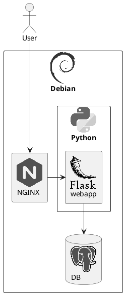

#### Logos

```plantuml

@startuml

!include <logos/debian>
!include <logos/flask>
!include <logos/nginx>
!include <logos/postgresql>
!include <logos/python>

skinparam monochrome true


actor User as users

rectangle "<$debian>\nDebian" as debian {
    rectangle "<$python>\nPython" as py {
        rectangle "<$flask>\nwebapp" as webapp
    }

    rectangle "<$nginx>\nNGINX" as httpd

    database "<$postgresql>\nDB" as db

    httpd -> webapp
    webapp --> db
}

users --> httpd

@enduml

```
