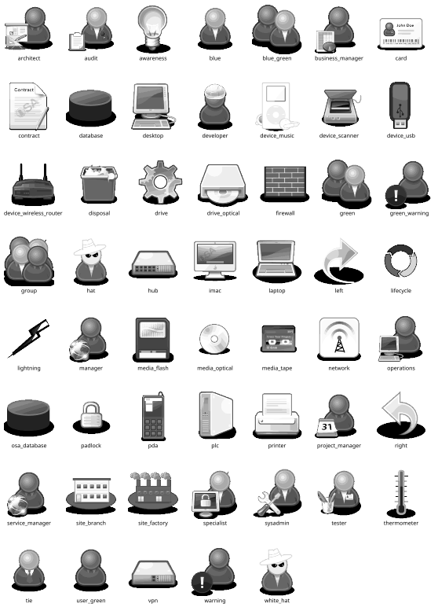

#### Open Security Architecture

```plantuml

@startuml

scale .5

!include <osa/arrow/green/left/left>
!include <osa/arrow/yellow/right/right>
!include <osa/awareness/awareness>
!include <osa/contract/contract>
!include <osa/database/database>
!include <osa/desktop/desktop>
!include <osa/desktop/imac/imac>
!include <osa/device_music/device_music>
!include <osa/device_scanner/device_scanner>
!include <osa/device_usb/device_usb>
!include <osa/device_wireless_router/device_wireless_router>
!include <osa/disposal/disposal>
!include <osa/drive_optical/drive_optical>
!include <osa/firewall/firewall>
!include <osa/hub/hub>
!include <osa/ics/drive/drive>
!include <osa/ics/plc/plc>
!include <osa/ics/thermometer/thermometer>
!include <osa/id/card/card>
!include <osa/laptop/laptop>
!include <osa/lifecycle/lifecycle>
!include <osa/lightning/lightning>
!include <osa/media_flash/media_flash>
!include <osa/media_optical/media_optical>
!include <osa/media_tape/media_tape>
!include <osa/mobile/pda/pda>
!include <osa/padlock/padlock>
!include <osa/printer/printer>
!include <osa/site_branch/site_branch>
!include <osa/site_factory/site_factory>
!include <osa/user/audit/audit>
!include <osa/user/blue/blue>
!include <osa/user/blue/security/specialist/specialist>
!include <osa/user/blue/sysadmin/sysadmin>
!include <osa/user/blue/tester/tester>
!include <osa/user/blue/tie/tie>
!include <osa/user/green/architect/architect>
!include <osa/user/green/business/manager/manager>
!include <osa/user/green/developer/developer>
!include <osa/user/green/green>
!include <osa/user/green/operations/operations>
!include <osa/user/green/project/manager/manager>
!include <osa/user/green/service/manager/manager>
!include <osa/user/green/warning/warning>
!include <osa/user/large/group/group>
!include <osa/user/white/hat/hat>
!include <osa/users/blue/green/green>
!include <osa/vpn/vpn>
!include <osa/wireless/network/network>
' !include <osa/user/black/hat/hat>
' !include <osa/user/black/hat>


listsprites

@enduml

```

