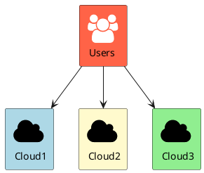

#### Tupadr3

including Devicons and Font Awesome

```plantuml

@startuml

!include <tupadr3/common>
!include <tupadr3/font-awesome/cloud>
!include <tupadr3/font-awesome/users>


FA_CLOUD(cloud1, Cloud1) #ADD8E6
FA_CLOUD(cloud2, Cloud2) #FFFACD
FA_CLOUD(cloud3, Cloud3) #90EE90
FA_USERS(users, Users, rectangle, #White) #Tomato

users --> cloud1
users --> cloud2
users --> cloud3

cloud1 -[hidden]> cloud2
cloud2 -[hidden]> cloud3

@enduml

```
