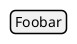
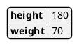
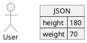

# JSON

```plantuml

@startjson

"Foobar"

@endjson

@startjson

123

@endjson

@startjson

true

@endjson

@startjson

#highlight "6" /' 13 '/

[ 1, 1, 2, 3, 5, 8, 13, 21, 34, 55, 89 ]

@endjson

@startjson

#highlight "key2"

{
    "key1": "val1",
    "key2": "val2",
    "key3": "val3"
}

@endjson

@startjson

{
    "null": null,
    "true": true,
    "false": false,
    "JSON_Number": [-1, -1.1, 1E5, "<color:green>TBC"],
    "JSON_String": [
        "😀",
        "\u3042\u3044\u3046 (\\u3042\\u3044\\u3046)",
        {
            "escape": {
                "quotation mark character (U+0022)":       "a\"b",
                "reverse solidus character (U+005C)":      "a\\b",
                "solidus character (U+002F)":              "a\/b",
                "backspace character (U+0008)":            "a\bb",
                "form feed character (U+000C)":            "a\fb",
                "line feed character (U+000A)":            "a\nb",
                "carriage return character (U+000D)":      "a\rb",
                "character tabulation character (U+0009)": "a\tb"
            }
        }
    ],
    "JSON_Object": {
        "{}": {},
        "k_int": 123,
        "k_str": "abc",
        "k_obj": {"k": "v"}
    },
    "JSON_Array" : [ /' 配列型 '/
        [],
        [true, false],
        [-1, 1],
        ["a", "b", "c"],
        ["mix", null, true, 1, {"k": "v"}]
    ]
}

@endjson

@startjson

#highlight "glossary" / "GlossDiv" / "title"

' https://json.org/example.html
{
    "glossary": {
        "title": "example glossary",
        "GlossDiv": {
            "title": "S",
            "GlossList": {
                "GlossEntry": {
                    "ID": "SGML",
                    "SortAs": "SGML",
                    "GlossTerm": "Standard Generalized Markup Language",
                    "Acronym": "SGML",
                    "Abbrev": "ISO 8879:1986",
                    "GlossDef": {
                        "para": "A meta-markup language, used to create markup languages such as DocBook.",
                        "GlossSeeAlso": ["GML", "XML"]
                    },
                    "GlossSee": "markup"
                }
            }
        }
    }
}

@endjson

@startjson

#highlight "menu" / "popup" / "menuitem" / "2"
#highlight "menu" / "popup" / "menuitem" / "2" / "value"
#highlight "menu" / "popup" / "menuitem" / "2" / "onclick"

' https://json.org/example.html
{"menu": {
  "id": "file",
  "value": "File",
  "popup": {
    "menuitem": [
      {"value": "New", "onclick": "CreateNewDoc()"},
      {"value": "Open", "onclick": "OpenDoc()"},
      {"value": "Close", "onclick": "CloseDoc()"}
    ]
  }
}}

@endjson

```

### クラス図・オブジェクト図でJSONを表示

```plantuml

@startjson

{
   "height": 180,
   "weight": 70
}

@endjson

@startuml

class Person

object personObj

json JSON {
   "height": 180,
   "weight": 70
}

@enduml

```

### 配置図・ユースケース図・コンポーネント図でJSONを表示

```plantuml

@startuml

allowmixing


actor User

json JSON {
   "height": 180,
   "weight": 70
}
@enduml

@startuml

allowmixing

database {
  json "store.json" as J {
    "id": 1,
    "height": 180,
    "weight": 70
  }
}

@enduml

```
