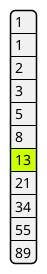

## YAML

```plantuml

@startyaml

#highlight "6" /' 13 '/

' 配列
- 1
- 1
- 2
- 3
- 5
- 8
- 13
- 21
- 34
- 55
- 89

@endyaml

@startyaml

#highlight "key2"

' ハッシュ
key1: val1
key2: val2
key3: val3

@endyaml

@startyaml

' データ型

# YAMLのコメント

decimal:
  - 123
  - 1,234,567,890
octal: 0644
hexa:  0xFF
float: 0.05
bool:
  - true
  - yes
  - on
  - false
  - no
  - off
null:
  - ~
  - null
date: 2005-01-01
stamp: 2005-01-01 00:00:00 +09:00
str:
  - 'true'
  - "2005"

@endyaml

```
