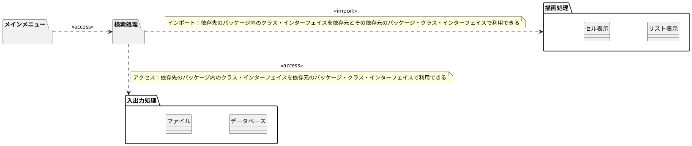
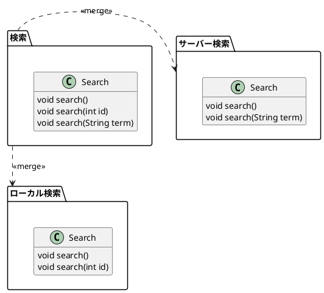

## パッケージ図

```plantuml

@startuml

hide circle


package メインメニュー {}

package 検索処理 {}

package 描画処理 {
    class リスト表示
    class セル表示
}

package 入出力処理 {
    class データベース
    class ファイル
}

メインメニュー -[dashed]> 検索処理 : <<access>>

検索処理 -[dashed]> 描画処理 : <<import>>

note on link : インポート：依存先のパッケージ内のクラス・インターフェイスを依存元とその依存元のパッケージ・クラス・インターフェイスで利用できる

検索処理 -[dashed]-> 入出力処理 : <<access>>

note on link : アクセス：依存先のパッケージ内のクラス・インターフェイスを依存元のパッケージ・クラス・インターフェイスで利用できる

@enduml

```

```plantuml

@startuml

hide empty members


namespace サーバー検索 {
    class Search {
        void search()
        void search(String term)
    }
}

namespace ローカル検索 {
    class Search {
        void search()
        void search(int id)
    }
}

namespace 検索 {
    class Search {
        void search()
        void search(int id)
        void search(String term)
    }
}

検索 -[dashed]> サーバー検索 : <<merge>>
検索 -[dashed]-> ローカル検索 : <<merge>>

@enduml

```
