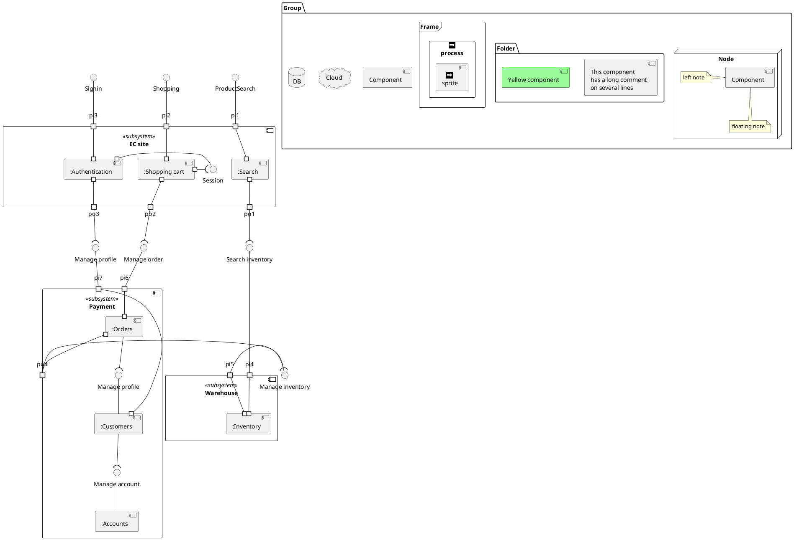
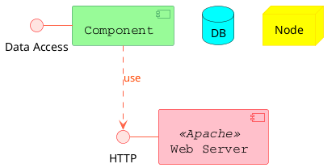

## コンポーネント図

```plantuml

@startuml

skinparam interface {
    Shadowing false
    BorderColor<<hidden>> transparent
    BackgroundColor<<hidden>> transparent
    FontColor<<hidden>> transparent
}
hide <<hidden>> stereotype


component "EC site" <<subsystem>> as ECsite {
    portin pi1
    portin pi2
    portin pi3

    portout po1
    portout po2
    portout po3

    component ":Search" as c1
    component ":Shopping cart" as c2
    component ":Authentication" as c3
    () Session as d1
}

component Warehouse <<subsystem>> {
    portin pi4
    portin pi5

    component ":Inventory" as c4
}

component Payment <<subsystem>> {
    portin pi6
    portin pi7

    portout po4

    component ":Orders" as c5
    component ":Customers" as c6
    component ":Accounts" as c7

    () "Manage profile" as d6
    () "Manage account" as d7
}


() "Search inventory" as d2
() "Manage order" as d3
() "Manage profile" as d4
() "Manage inventory" as d5
interface ProductSearch as i1
interface Shopping as i2
interface Signin as i3


c1 #-down- po1
c2 #-down- po2
c2 #-right-( d1
c3 #-down- po3
c4 #-- pi5
c5 --( d6
c5 #-- po4
c6 --( d7
d1 -right-# c3
d2 -- pi4
d3 -- pi6
d4 -- pi7
d5 - pi5
d6 -- c6
d7 -- c7
i1 -- pi1
i2 -- pi2
i3 -- pi3
pi1 -down-# c1
pi2 -down-# c2
pi3 -down-# c3
pi4 --# c4
pi6 --# c5
pi7 --# c6
po1 --( d2
po2 --( d3
po3 -( d4
po4 -( d5


package "Group" {

    component Component $tagComponent

    node "Node" {
        [Component] as c11

        note left of c11 : left note

        note as n
            floating note
        end note
        c11 .. n
    }

    folder "Folder" {
        component c12 [
            This component
            has a long comment
            on several lines
        ]

        component [Yellow component] #PaleGreen
    }

    frame "Frame" {
        sprite $rightarrow [16x16/16] {
            FFFFFFFFFFFFFFFF
            FFFFFFFFFFFFFFFF
            FFFFFFFFFFFFFFFF
            FFFFFFFFFFFFFFFF
            FFFFFFFFFF0FFFFF
            FFFFFFFFFF00FFFF
            FF00000000000FFF
            FF000000000000FF
            FF00000000000FFF
            FFFFFFFFFF00FFFF
            FFFFFFFFFF0FFFFF
            FFFFFFFFFFFFFFFF
            FFFFFFFFFFFFFFFF
            FFFFFFFFFFFFFFFF
            FFFFFFFFFFFFFFFF
            FFFFFFFFFFFFFFFF
        }

        rectangle "process" <<$rightarrow>> {
            [sprite] <<$rightarrow>>
        }
    }

    cloud "Cloud" {
    }

    database "DB" {
    }

}

@enduml

```

```plantuml

@startuml

skinparam component {
    ArrowColor Tomato
    ArrowFontColor OrangeRed
    ArrowFontName Impact
    BackgroundColor PaleGreen
    BackgroundColor<<Apache>> Pink
    BorderColor SeaGreen
    BorderColor<<Apache>> Red
    FontName Courier
    FontSize 16
}

skinparam databaseBackgroundColor Aqua

skinparam interface {
    backgroundColor #MistyRose
    borderColor #Red
}

skinparam node {
    borderColor Gold
    backgroundColor Yellow
    backgroundColor<<shared_node>> Magenta
}

Component "Web Server" as WS << Apache >>
component "Component" as C1

database DB

() "Data Access" as DA

node Node

DA - C1
C1 ..> () HTTP : use
HTTP - WS

@enduml

```
