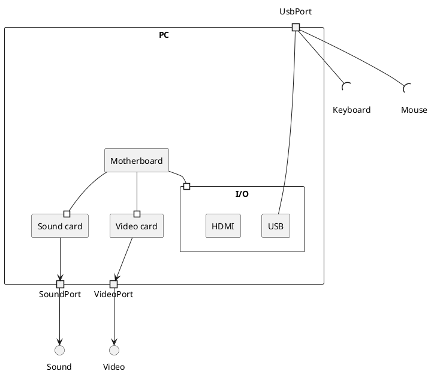
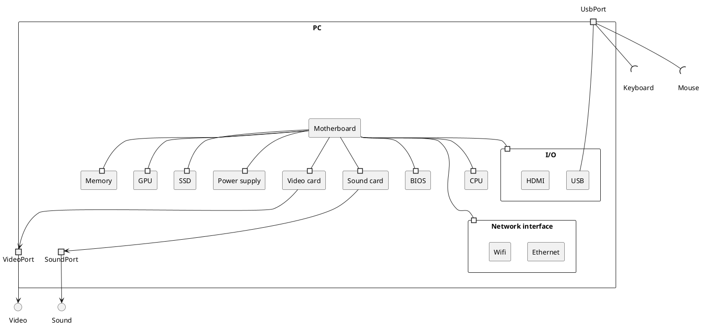
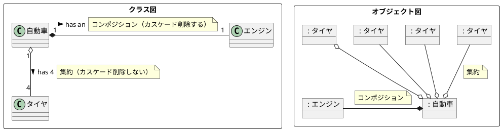

## 合成構造図





### クラス図・オブジェクト図と合成構造図の違い



```plantuml

@startuml

skinparam interface {
    Shadowing false
    BorderColor<<hidden>> transparent
    BackgroundColor<<hidden>> transparent
    ' FontColor<<hidden>> transparent
}

hide <<hidden>> stereotype


rectangle 合成構造図 {

    skinparam componentStyle rectangle


    component 自動車 as scCar{
        component " : エンジン" as partEngine
        note right of partEngine : パート　→オブジェクトを示す

        component " : タイヤ[4]" as partWheel

        () iRequired
        note top of iProvided : 提供側インターフェイス

        () iRequired <<hidden>>
        note top of iRequired : 要求側インターフェイス

        iProvided -right- partEngine
        iRequired )-up- partEngine
    }
    note top of scCar : 構造化分類子（structured-classifiers）　→クラスを示す

}

@enduml

```
