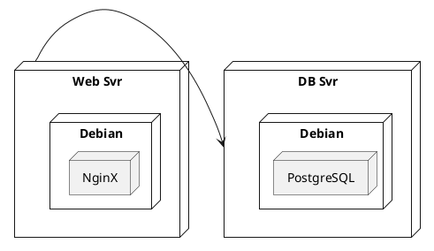

## 配置図

```plantuml

@startuml

node "Web Svr" as web {
  node Debian as d1 {
    node NginX as n {
    }
  }
}

node "DB Svr" as db {
  node Debian as d2 {
    node PostgreSQL as p {
    }
  }
}

web -right-> db

@enduml

```

```plantuml

@startuml

<style>
componentDiagram {
    BackGroundColor WhiteSmoke
    LineThickness 1
    LineColor Silver
}

document {
    BackGroundColor white
}

' ''''''''''

actor {
  BackGroundColor #ff9999/#ffff99
  LineThickness 2
  LineColor #Red
}

' agent {
'   BackGroundColor #fdcecc
' }

artifact {
  BackGroundColor #fbd0cc
}

' boundary {
'   BackGroundColor #f9d2cc
' }

card {
  BackGroundColor #f7d4cc
}

' circle {
'   BackGroundColor #f5d6cc
' }

cloud {
  BackGroundColor #f3d8cc
}

' collections {
'   BackGroundColor #f1dacc
' }

component {
  BackGroundColor #efdccc
}

' control {
'   BackGroundColor #eddecc
' }

database {
  BackGroundColor #ebe0cc
}

' entity {
'   BackGroundColor #e9e2cc
' }

file {
  BackGroundColor #e7e4cc
}

folder {
  BackGroundColor #e6e6cc
}

frame {
  BackGroundColor #e4e7cc
}

hexagon {
  BackGroundColor #e2e9cc
}

' interface {
'   BackGroundColor #e0ebcc
' }

' label {
'   BackGroundColor #deedcc
' }

node {
  BackGroundColor #dcefcc
}

package {
  BackGroundColor #daf1cc
}

' person {
'   BackGroundColor #d8f3cc
' }

queue {
  BackGroundColor #d6f5cc
}

rectangle {
  BackGroundColor #d4f7cc
}

stack {
  BackGroundColor #d2f9cc
}

storage {
  BackGroundColor #d0fbcc
}

' usecase {
'   BackGroundColor #cefdcc
' }
</style>

package 要素 {
    ' :アクタ―:
    actor アクター
    actor/ "アクター/"
    agent エージェント
    boundary 境界
    circle 円
    collections コレクション
    control コントロール
    entity エンティティ
    ' () インターフェイス
    interface インターフェイス
    label ラベル
    person 人型
    ' (ユースケース)
    usecase ユースケース [
        説明文
        ----
        <b>b</b><i>i</i>
        ====
        <color:red>red</color>
        ....
        <u>u</u>
    ]
    usecase/ "ユースケース/"

    cloud co #AliceBlue;line:Navy;line.dotted;text:MediumBlue [
        cloud description
    ]

    file fi #Linen;line:LightSlateGray;line.dashed;text:LightSlateGray {
        [c1]
        [c2]
    }

    frame fr {
        node no #LightSkyBlue;line:DarkSlateBlue;line.dotted;text:DarkSlateBlue
    }
}

package 入れ子にできる要素 {
    artifact アーティファクト {
        card カード {
            cloud クラウド {
                ' [コンポーネント]
                component コンポーネント {
                    database データベース {
                        file ファイル {
                            folder フォルダ {
                                frame フレーム {
                                    hexagon 六角形 {
                                        node ノード {
                                            package パッケージ {
                                                queue キュー {
                                                    rectangle 四角形 {
                                                        stack スタック {
                                                            storage ストレージ {
                                                            }
                                                        }
                                                    }
                                                }
                                            }
                                        }
                                    }
                                }
                            }
                        }
                    }
                }
            }
        }
    }
}

package リンク {
    actor actor1
    actor actor2
    actor actor3
    actor actor4
    actor actor5
    actor1 -- actor2 : --
    actor1 .. actor3 : ..
    actor1 ~~ actor4 : ~~
    actor1 == actor5 : ==

    node node1
    node node2
    node node3
    node node4
    node node5
    node node6
    node node7
    node node8
    node node9
    node node10
    node node11
    node node12
    node node13
    node node14
    node node15

    node1 --(0 node2
    node1 --* node3
    node1 --# node4
    node1 --^ node5
    node1 --+ node6
    node1 --> node7
    node1 -->> node8
    node1 --0 node9
    node1 --o node10

    node11 -(0- node12
    node11 -(0)- node13
    node11 -0- node14
    node11 -0)- node15

    node node21
    node node22
    node node23
    node node24
    node node25
    node node26
    node node27
    node node28
    node node29
    node node30
    node node31
    node node32
    node node33
    node node34
    node node35
    node node36

    node21 --> node22         : ∅
    node21 -[bold]-> node23   : [bold]
    node21 -[dashed]-> node24 : [dashed]
    node21 -[dotted]-> node25 : [dotted]
    node21 -[hidden]-> node26 : [hidden]
    node21 -[plain]-> node27  : [plain]

    node21 -[#red]-> node28   : [#red]
    node21 -[#green]-> node29 : [#green]
    node21 -[#blue]-> node30  : [#blue]

    node21 -[thickness=1]-> node31              : [thickness=1]
    node21 -[#red,dashed,thickness=2]-> node32  : [#red,dashed,thickness=2]
    node21 -[#blue,dotted,thickness=8]-> node33 : [#blue,dotted,thickness=8]

    node21 --> node34 #line:red;line.bold;text:red  : red bold
    node21 --> node35 #green;line.dashed;text:green : green dashed
    node21 --> node36 #blue;line.dotted;text:blue   : blue dotted
}

@enduml

```
