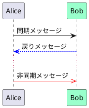
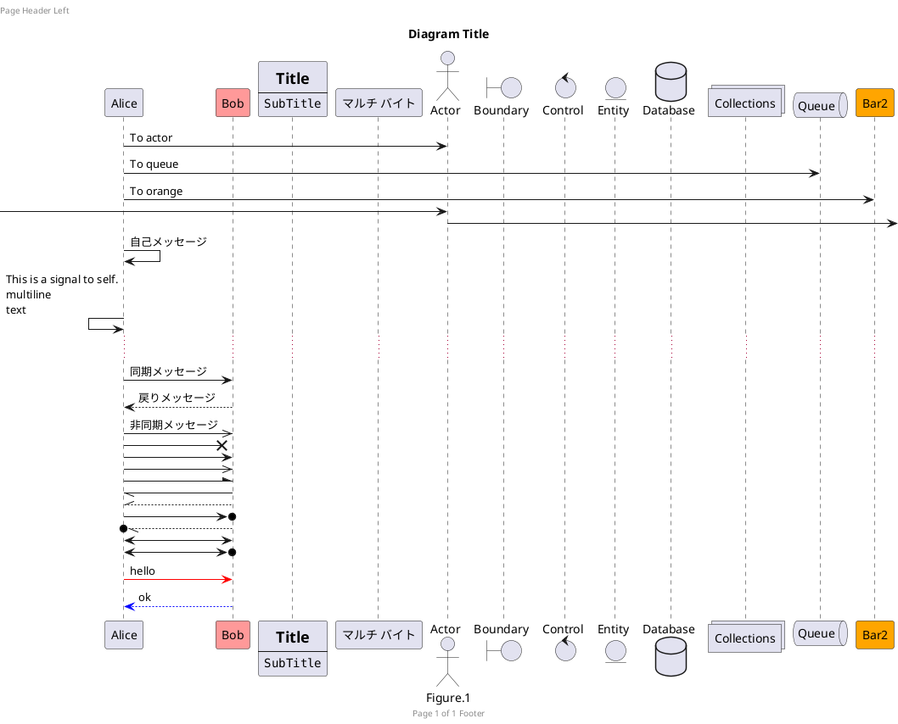

### シーケンス図

```plantuml

@startuml

participant Alice as Foo
participant Bob as Bar #99FFCC

Foo -> Bar : 同期メッセージ
Foo <-[#0000FF]- Bar : 戻りメッセージ

' 処理の遅延
...

Foo -[#red]>> Bar : 非同期メッセージ

@enduml

```

```plantuml

@startuml

'header Page Header
left header Page Header Left

footer Page %page% of %lastpage% Footer

title Diagram Title

caption Figure.1

participant Alice as Foo
participant Bob as Bar #FF9999    /' 背景色 '/
participant Bar2 order 99 #orange /' 順番変更 '/
participant Multiline [           /' 複数行 '/
    =Title
    ----
    ""SubTitle""
]
participant "マルチ バイト"

actor       Actor       as Foo1
boundary    Boundary    as Foo2
control     Control     as Foo3
entity      Entity      as Foo4
database    Database    as Foo5
collections Collections as Foo6
queue       Queue       as Foo7

Foo -> Foo1 : To actor
Foo -> Foo7 : To queue
Foo -> Bar2 : To orange
[-> Foo1
Foo1 ->]

Foo -> Foo : 自己メッセージ
Foo <- Foo : This is a signal to self.\nmultiline\ntext

' 処理の遅延
...

Foo -> Bar  : 同期メッセージ
Foo <-- Bar : 戻りメッセージ
Foo ->> Bar : 非同期メッセージ

Foo ->x Bar
Foo -> Bar
Foo ->> Bar
Foo -\ Bar
Foo \\- Bar
Foo //-- Bar
Foo ->o Bar
Foo o\\-- Bar
Foo <-> Bar
Foo <->o Bar
Foo -[#red]> Bar : hello
Bar -[#0000FF]-> Foo : ok

@enduml

```
