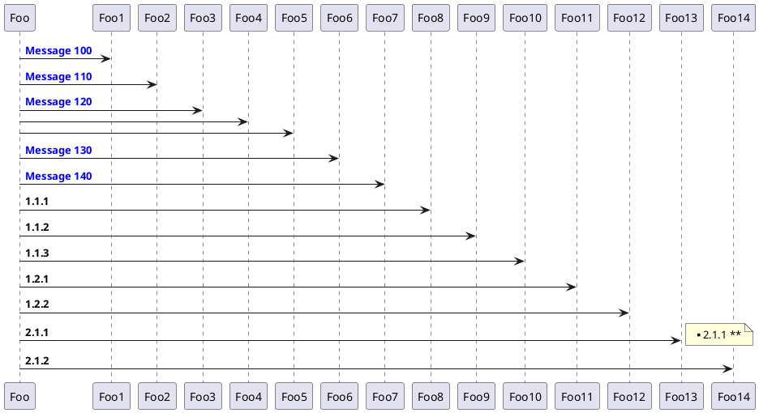

#### メッセージ連番

```plantuml

@startuml

autonumber 100 10 "<font color=blue><b>Message 000</b></font>"
Foo -> Foo1
Foo -> Foo2
Foo -> Foo3
autonumber stop
Foo -> Foo4
Foo -> Foo5
autonumber resume
Foo -> Foo6
Foo -> Foo7

autonumber 1.1.1
Foo -> Foo8
Foo -> Foo9
Foo -> Foo10
autonumber inc B
Foo -> Foo11
Foo -> Foo12
autonumber inc A
Foo -> Foo13
note right
  ** %autonumber% **
end note
Foo -> Foo14

@enduml

```
