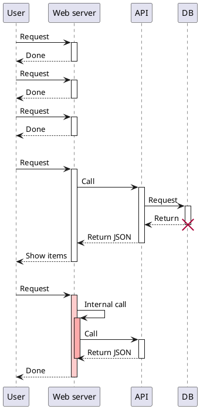

##### 分類子の活性

```plantuml

@startuml
participant User

User -> "Web server": Request
activate "Web server"
"Web server" --> User: Done
deactivate "Web server"

User -> "Web server": Request
activate "Web server"
return Done

autoactivate on
User -> "Web server": Request
return Done

autoactivate off

|||

User -> "Web server": Request
activate "Web server"

"Web server" -> API: Call
activate API

API -> DB: Request
activate DB
DB --> API: Return
destroy DB

API --> "Web server": Return JSON
deactivate API

"Web server" --> User: Show items
deactivate "Web server"

|||

User -> "Web server": Request
activate "Web server" #FCC

"Web server" -> "Web server": Internal call
activate "Web server" #FAA

"Web server" -> API: Call
activate API

API --> "Web server": Return JSON
deactivate API
deactivate "Web server"
"Web server" --> User: Done
deactivate "Web server"

@enduml

```
