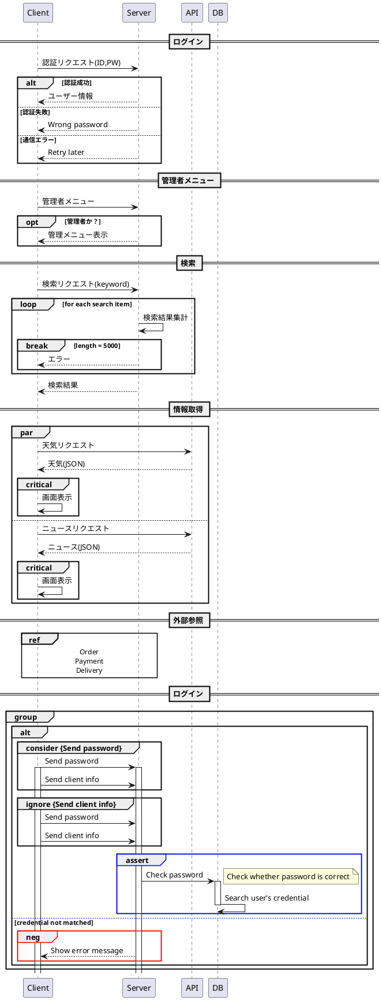

#### グループ化

```plantuml

@startuml

== ログイン ==

Client -> Server: 認証リクエスト(ID,PW)

' 条件分岐（if, else if. else）
alt 認証成功
    Server --> Client: ユーザー情報
else 認証失敗
    Server --> Client: Wrong password
else 通信エラー
    Server --> Client: Retry later
end

== 管理者メニュー ==

Client -> Server: 管理者メニュー

' 条件分岐（ifのみ）
opt 管理者か？
    Server --> Client : 管理メニュー表示
end

== 検索 ==

Client -> Server: 検索リクエスト(keyword)

' ループ
' loop                    /' 無限ループ '/
' loop 1, 100             /' 開始, 終了 '/
loop for each search item /' Foreach '/
    Server -> Server : 検索結果集計

    break length = 5000
        Server --> Client : エラー
    end
end

Server --> Client : 検索結果

== 情報取得 ==

' 並列処理
par
    Client -> API : 天気リクエスト
    API --> Client : 天気(JSON)
    critical
        Client -> Client : 画面表示
    end
else
    Client -> API : ニュースリクエスト
    API --> Client : ニュース(JSON)
    critical
        Client -> Client : 画面表示
    end
end

== 外部参照 ==

ref over Client, Server
    Order
    Payment
    Delivery
end ref

== ログイン ==

group

    alt
        ' 必須の処理
        group consider {Send password}
            Client -> Server : Send password
            activate Client
            activate Server
            Client -> Server : Send client info
        end
        ' 必須ではない処理
        group ignore {Send client info}
            Client -> Server : Send password
            Client -> Server : Send client info
        end

        ' 妥当な処理
        skinparam sequenceGroupBorderColor blue
        group assert
            Server -> DB : Check password
            note right : Check whether password is correct
            activate DB
            DB -> DB: Search user's credential
            deactivate DB
        end

    else credential not matched
        ' 不正な処理
        skinparam sequenceGroupBorderColor red
        group neg
            Server --> Client : Show error message
        end
    end

end

@enduml

```