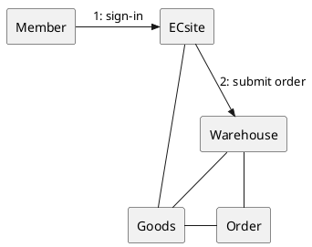

### コミュニケーション図（コラボレーション図）

```plantuml

@startuml

rectangle Member
rectangle ECsite
rectangle Warehouse
rectangle Goods
rectangle Order

Member ->> ECsite : 1: sign-in
ECsite -->> Warehouse : 2: submit order
ECsite -- Goods
Warehouse -- Goods
Warehouse -- Order
Goods -right- Order

@enduml

```
