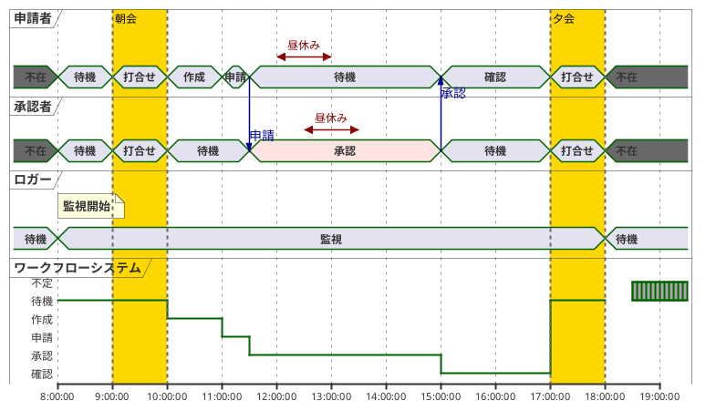
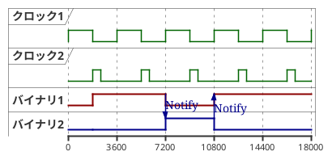

### タイミング図

```plantuml

@startuml

' 汎用値ライフライン
concise "申請者" as Applicant
concise "承認者" as Approver
concise "ロガー" as Logger

' 状態ライフライン
robust "ワークフローシステム" as Workflow

' ''''''''''


scale 3600 as 60 pixels

highlight 9:00:00 to 10:00:00 #Gold;line:DimGray : 朝会
highlight 17:00:00 to 18:00:00 #Gold;line:DimGray : 夕会


' 初期状態
Applicant is 不在 #DimGray
Approver is 不在 #DimGray
Logger is 待機


' 時系列順の定義
' @2022/08/30
@8:00:00
Logger is 監視
note top of Logger : 監視開始

@18:00:00
Applicant is 不在 #DimGray
Approver is 不在 #DimGray
Logger is 待機


' インスタンス指向の定義
@Applicant
8:00:00 is 待機
9:00:00 is 打合せ
10:00:00 is 作成
11:00:00 is 申請
11:30:00 is 待機
15:00:00 is 確認
17:00:00 is 打合せ
Applicant@12:00:00 <-> @13:00:00 : 昼休み

@Approver
8:00:00 is 待機
9:00:00 is 打合せ
10:00:00 is 待機
11:30:00 is 承認 #MistyRose
15:00:00 is 待機
17:00:00 is 打合せ
Approver@12:30:00 <-> @13:30:00 : 昼休み


' メッセージ
Applicant@11:30:00 -> Approver@11:30:00 : 申請
Approver@15:00:00 -> Applicant@15:00:00 : 承認


@Workflow
Workflow has 不定,待機,作成,申請,承認,確認 /' 順序を定義 '/
8:00:00 is 待機
10:00:00 is 作成
11:00:00 is 申請
11:30:00 is 承認
15:00:00 is 確認
17:00:00 is 待機
18:00:00 is {hidden}              /' 非表示 '/
18:30:00 is {待機,不定} #DarkGray /' 不定状態 '/

@enduml

```

```plantuml

@startuml

<style>
timingDiagram {
  .red {
    LineColor DarkRed
  }
  .blue {
    LineColor DarkBlue
    LineThickness 2
  }
}
</style>


' クロック信号（矩形波）
clock "クロック1" as Clock1 with period 3600
clock "クロック2" as Clock2 with period 3600 pulse 600 offset 1800

' バイナリ信号（2値）
binary "バイナリ1" as Binary1 <<red>>
binary "バイナリ2" as Binary2 <<blue>>

' ''''''''''


scale 3600 as 60 pixels


' 時系列順の定義
@0

@1800
Binary1 is high
Binary2 is low

@7200
Binary1 -> Binary2 : Notify
Binary1 is low
Binary2 is high

@10800
Binary2 -> Binary1 : Notify
Binary1 is high
Binary2 is low

@14400

@enduml

```
