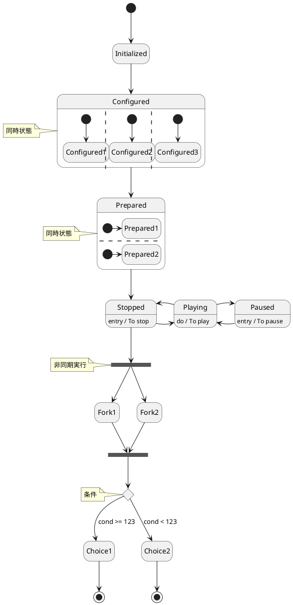
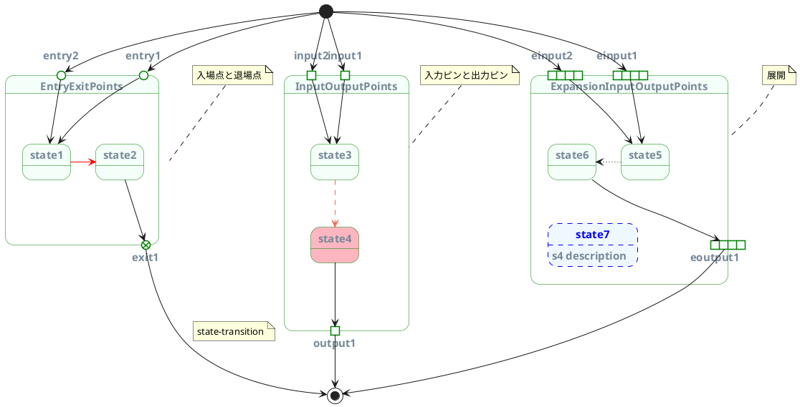

## 状態遷移図

```plantuml

@startuml

hide empty description


state c <<choice>>
state end_state <<end>>
state fork_state <<fork>>
state join_state <<join>>
state Playing : do / To play
state Paused : entry / To pause
state Stopped : entry / To stop

state Configured {
    [*] -down-> Configured1
    ||
    [*] -down-> Configured2
    ||
    [*] -down-> Configured3
}

state Prepared {
    [*] -right-> Prepared1
    --
    [*] -right-> Prepared2
}


' 条件
join_state --> c
c --> Choice1 : cond >= 123
c --> Choice2 : cond < 123
Choice1 --> [*]
Choice2 --> end_state


' 非同期実行
Stopped --> fork_state
fork_state --> Fork1
fork_state --> Fork2
Fork1 --> join_state
Fork2 --> join_state


' Note
note left of Configured : 同時状態
note left of Prepared : 同時状態
note left of fork_state : 非同期実行
note left of c : 条件


' 遷移
[*] --> Initialized
Initialized --> Configured
Configured --> Prepared
Prepared --> Stopped

Stopped -right-> Playing
Playing -left-> Stopped
Paused -left-> Playing
Playing -right-> Paused

@enduml

```

```plantuml

@startuml

skinparam State {
    BackgroundColor MintCream
    BorderColor Green
    FontColor LightSlateGray
    FontName Sanserif
    FontSize 15
    FontStyle bold
}


state EntryExitPoints {
    state entry1 <<entryPoint>>
    state entry2 <<entryPoint>>
    state exit1 <<exitPoint>>
    state state1
    state state2
    entry1 --> state1
    entry2 -> state1
    state1 -[#red]> state2
    state2 --> exit1
}

note top of EntryExitPoints : 入場点と退場点

[*] --> entry1
[*] --> entry2
exit1 --> [*]
note on link
    state-transition
end note


state InputOutputPoints {
    state input1 <<inputPin>>
    state input2 <<inputPin>>
    state output1 <<outputPin>>
    state state3
    state state4 #LightPink
    input1 --> state3
    input2 -> state3
    state3 -down[#Tomato,dashed]-> state4
    state4 --> output1
}

note top of InputOutputPoints : 入力ピンと出力ピン

[*] --> input1
[*] --> input2
output1 --> [*]


state ExpansionInputOutputPoints {
    state einput1 <<expansionInput>>
    state einput2 <<expansionInput>>
    state eoutput1 <<expansionOutput>>
    state state5
    state state6
    state state7 #aliceblue;line:blue;line.dashed;text:blue : s4 description
    einput1 --> state5
    einput2 -> state5
    state5 -left[dotted]-> state6
    state6 --> eoutput1
    state6 -[hidden]-> state7
}

note top of ExpansionInputOutputPoints : 展開

[*] --> einput1
[*] --> einput2
eoutput1 --> [*]

@enduml

```
