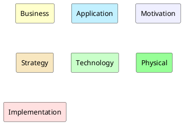
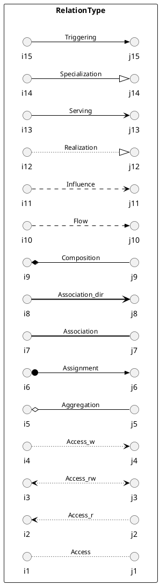
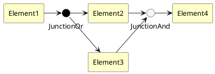
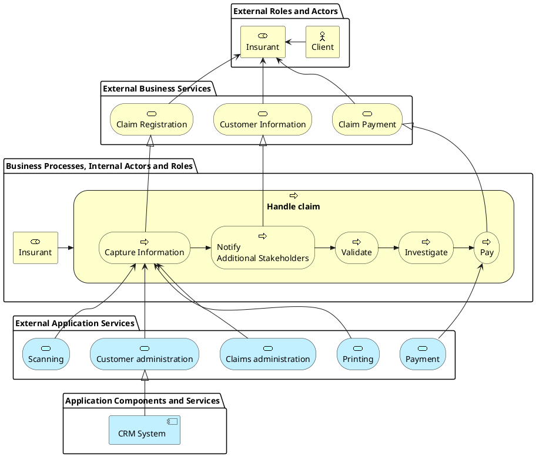

## Archimate（アーキテクチャ図）

### アーキテクチャの要素

```plantuml

@startuml

archimate #Business Business
archimate #Application Application
archimate #Motivation Motivation
archimate #Strategy Strategy
archimate #Technology Technology
archimate #Physical Physical
archimate #Implementation Implementation

@enduml

```

### リレーション

```plantuml

@startuml

rectangle RelationType {
    left to right direction
    skinparam nodesep 4

    !include <archimate/Archimate>


    Rel_Triggering(i15, j15, Triggering)
    Rel_Specialization(i14, j14, Specialization)
    Rel_Serving(i13, j13, Serving)
    Rel_Realization(i12, j12, Realization)
    Rel_Influence(i11, j11, Influence)
    Rel_Flow(i10, j10, Flow)
    Rel_Composition(i9, j9, Composition)
    Rel_Association_dir(i8, j8, Association_dir)
    Rel_Association(i7, j7, Association)
    Rel_Assignment(i6, j6, Assignment)
    Rel_Aggregation(i5, j5, Aggregation)
    Rel_Access_w(i4, j4, Access_w)
    Rel_Access_rw(i3, j3, Access_rw)
    Rel_Access_r(i2, j2, Access_r)
    Rel_Access(i1, j1, Access)
}

@enduml

@startuml

!include <archimate/Archimate>
left to right direction
skinparam nodesep 5

<style>
    interface {
        shadowing 0
        backgroundcolor transparent
        linecolor transparent
        FontColor transparent
    }
</style>


rectangle Other {
    () i14
    () j14
}


rectangle Dynamic {
    () i10
    () j10
    () i15
    () j15
}

rectangle Dependency {
    () i13
    () j13
    () i4
    () j4
    () i11
    () j11
    () i7
    () j7
}

rectangle Structural {
    () i9
    () j9
    () i5
    () j5
    () i6
    () j6
    () i12
    () j12
}

Rel_Triggering(i15, j15, Triggering)
Rel_Specialization(i14, j14, Specialization)
Rel_Serving(i13, j13, Serving)
Rel_Realization(i12, j12, Realization)
Rel_Influence(i11, j11, Influence)
Rel_Flow(i10, j10, Flow)
Rel_Composition(i9, j9, Composition)
Rel_Association_dir(i7, j7, \nAssociation_dir)
Rel_Association(i7, j7, Association)
Rel_Assignment(i6, j6, Assignment)
Rel_Aggregation(i5, j5, Aggregation)
Rel_Access_w(i4, j4, Access_w)
Rel_Access_rw(i4, j4, Access_rw)
Rel_Access_r(i4, j4, Access_r)
Rel_Access(i4, j4, Access)

@enduml

```

### ジャンクション

```plantuml

@startuml

!define Junction_Or circle #black
!define Junction_And circle #whitesmoke


Junction_And JunctionAnd
Junction_Or JunctionOr

archimate #Business Element1
archimate #Business Element2
archimate #Business Element3
archimate #Business Element4

Element1 -right-> JunctionOr
JunctionOr -right-> Element2
JunctionOr -down-> Element3
Element2 -right-> JunctionAnd
Element3 -up-> JunctionAnd
JunctionAnd -right-> Element4

@enduml

```

### 例

```plantuml

@startuml

skinparam rectangle<<behavior>> {
	roundCorner 50
}

sprite $actor jar:archimate/actor
sprite $bRole jar:archimate/business-role
sprite $bProcess jar:archimate/business-process
sprite $bService jar:archimate/business-service
sprite $aService jar:archimate/application-service
sprite $aComponent jar:archimate/application-component

folder "External Roles and Actors" {
    rectangle "Insurant" as ISR <<$bRole>> #Business
    rectangle "Client" as CLI <<$actor>> #Business
    ISR <- CLI
}

folder "External Business Services" {
    rectangle "Claim Registration" as CLR <<$bService>><<behavior>> #Business
    rectangle "Customer Information" as CSI <<$bService>><<behavior>> #Business
    rectangle "Claim Payment" as CLP <<$bService>><<behavior>> #Business
    ISR <-- CLR
    ISR <-- CSI
    ISR <-- CLP
    CLR -right[hidden]-> CSI
    CSI -right[hidden]> CLP
}

folder "Business Processes, Internal Actors and Roles" {
    rectangle "Handle claim"  as HCL <<$bProcess>><<behavior>> #Business {
        rectangle "Capture Information"  as CIN <<$bProcess>><<behavior>> #Business
        rectangle "Notify\nAdditional Stakeholders" as NAS <<$bProcess>><<behavior>> #Business
        rectangle "Validate" as VAL <<$bProcess>><<behavior>> #Business
        rectangle "Investigate" as INV <<$bProcess>><<behavior>> #Business
        rectangle "Pay" as PAY <<$bProcess>><<behavior>> #Business
    }

    rectangle "Insurant" as ISR2 <<$bRole>> #Business

    CLR <|-- CIN
    CSI <|-- NAS
    CLP <|-- PAY
    CIN -right->> NAS
    NAS -right->> VAL
    VAL -right->> INV
    INV -right->> PAY
    HCL <<- ISR2
}

folder "External Application Services" {
    rectangle "Scanning" as SCA <<$aService>><<behavior>> #Application
    rectangle "Customer administration" as CUA <<$aService>><<behavior>> #Application
    rectangle "Claims administration" as CLA <<$aService>><<behavior>> #Application
    rectangle "Printing" AS PRT <<$aService>><<behavior>> #Application
    rectangle "Payment" as PAY2 <<$aService>><<behavior>> #Application

    CIN <-- SCA
    CIN <-- CUA
    CIN <-- CLA
    CIN <-- PRT
    PAY <-- PAY2
    SCA -right[hidden]-> CUA
    CUA -right[hidden]-> CLA
    CLA -right[hidden]-> PRT
    PRT -right[hidden]-> PAY2
}

folder "Application Components and Services" {
    component "CRM System" AS CRM #Application

    CUA <|-- CRM
}

@enduml

```
