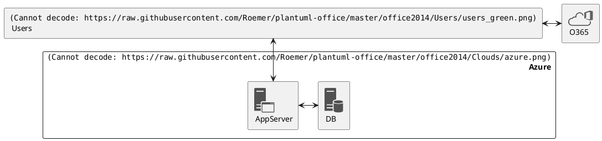

### Office

```plantuml

@startuml

!include <tupadr3/common>

!include <office/Servers/database_server>
!include <office/Servers/application_server>
!include <office/Clouds/azure>
!include <office/Clouds/office_365_cloud>


rectangle "<img:https://raw.githubusercontent.com/Roemer/plantuml-office/master/office2014/Users/users_green.png>\r Users" as users

' OFF_AZURE(azure,Azure)
rectangle "<img:https://raw.githubusercontent.com/Roemer/plantuml-office/master/office2014/Clouds/azure.png>\r Azure" {
    OFF_APPLICATION_SERVER(app,AppServer)
    OFF_DATABASE_SERVER(db,DB)
    app <-> db
}

OFF_OFFICE_365_CLOUD(o365,O365)

users <--> app
users <-> o365

@enduml

```
