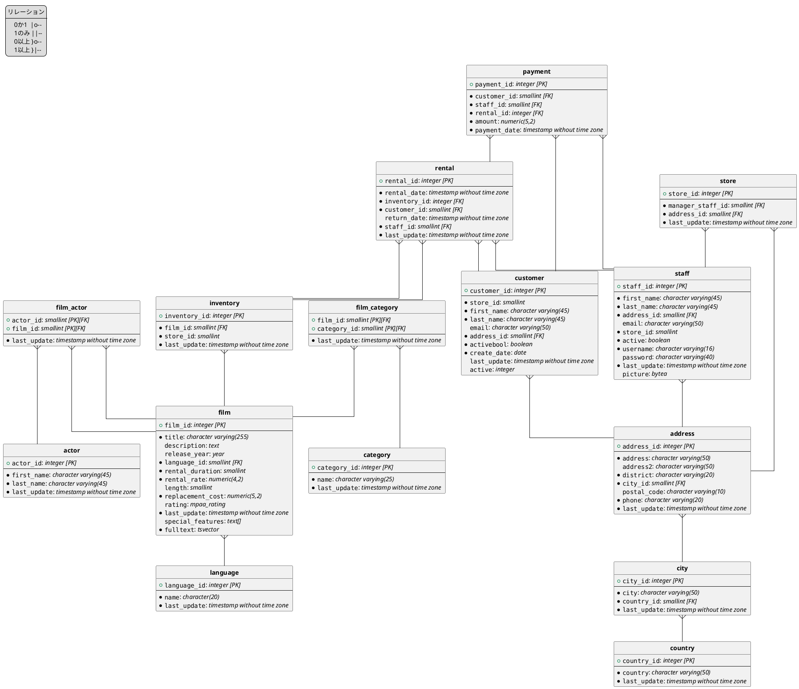

## ER図

クラス図と同じ文法で、classの代わりにentityを使う

```plantuml

@startuml

hide circle
skinparam linetype ortho

entity "**actor**" {
  + ""actor_id"": //integer [PK]//
  --
  *""first_name"": //character varying(45) //
  *""last_name"": //character varying(45) //
  *""last_update"": //timestamp without time zone //
}

entity "**address**" {
  + ""address_id"": //integer [PK]//
  --
  *""address"": //character varying(50) //
  ""address2"": //character varying(50) //
  *""district"": //character varying(20) //
  *""city_id"": //smallint [FK]//
  ""postal_code"": //character varying(10) //
  *""phone"": //character varying(20) //
  *""last_update"": //timestamp without time zone //
}

entity "**category**" {
  + ""category_id"": //integer [PK]//
  --
  *""name"": //character varying(25) //
  *""last_update"": //timestamp without time zone //
}

entity "**city**" {
  + ""city_id"": //integer [PK]//
  --
  *""city"": //character varying(50) //
  *""country_id"": //smallint [FK]//
  *""last_update"": //timestamp without time zone //
}

entity "**country**" {
  + ""country_id"": //integer [PK]//
  --
  *""country"": //character varying(50) //
  *""last_update"": //timestamp without time zone //
}

entity "**customer**" {
  + ""customer_id"": //integer [PK]//
  --
  *""store_id"": //smallint //
  *""first_name"": //character varying(45) //
  *""last_name"": //character varying(45) //
  ""email"": //character varying(50) //
  *""address_id"": //smallint [FK]//
  *""activebool"": //boolean //
  *""create_date"": //date //
  ""last_update"": //timestamp without time zone //
  ""active"": //integer //
}

entity "**film**" {
  + ""film_id"": //integer [PK]//
  --
  *""title"": //character varying(255) //
  ""description"": //text //
  ""release_year"": //year //
  *""language_id"": //smallint [FK]//
  *""rental_duration"": //smallint //
  *""rental_rate"": //numeric(4,2) //
  ""length"": //smallint //
  *""replacement_cost"": //numeric(5,2) //
  ""rating"": //mpaa_rating //
  *""last_update"": //timestamp without time zone //
  ""special_features"": //text[] //
  *""fulltext"": //tsvector //
}

entity "**film_actor**" {
  + ""actor_id"": //smallint [PK][FK]//
  + ""film_id"": //smallint [PK][FK]//
  --
  *""last_update"": //timestamp without time zone //
}

entity "**film_category**" {
  + ""film_id"": //smallint [PK][FK]//
  + ""category_id"": //smallint [PK][FK]//
  --
  *""last_update"": //timestamp without time zone //
}

entity "**inventory**" {
  + ""inventory_id"": //integer [PK]//
  --
  *""film_id"": //smallint [FK]//
  *""store_id"": //smallint //
  *""last_update"": //timestamp without time zone //
}

entity "**language**" {
  + ""language_id"": //integer [PK]//
  --
  *""name"": //character(20) //
  *""last_update"": //timestamp without time zone //
}

entity "**payment**" {
  + ""payment_id"": //integer [PK]//
  --
  *""customer_id"": //smallint [FK]//
  *""staff_id"": //smallint [FK]//
  *""rental_id"": //integer [FK]//
  *""amount"": //numeric(5,2) //
  *""payment_date"": //timestamp without time zone //
}

entity "**rental**" {
  + ""rental_id"": //integer [PK]//
  --
  *""rental_date"": //timestamp without time zone //
  *""inventory_id"": //integer [FK]//
  *""customer_id"": //smallint [FK]//
  ""return_date"": //timestamp without time zone //
  *""staff_id"": //smallint [FK]//
  *""last_update"": //timestamp without time zone //
}

entity "**staff**" {
  + ""staff_id"": //integer [PK]//
  --
  *""first_name"": //character varying(45) //
  *""last_name"": //character varying(45) //
  *""address_id"": //smallint [FK]//
  ""email"": //character varying(50) //
  *""store_id"": //smallint //
  *""active"": //boolean //
  *""username"": //character varying(16) //
  ""password"": //character varying(40) //
  *""last_update"": //timestamp without time zone //
  ""picture"": //bytea //
}

entity "**store**" {
  + ""store_id"": //integer [PK]//
  --
  *""manager_staff_id"": //smallint [FK]//
  *""address_id"": //smallint [FK]//
  *""last_update"": //timestamp without time zone //
}

legend top left
    リレーション
    ----
        0か1  |o--
        1のみ ||--
        0以上 }o--
        1以上 }|--
end legend

"**address**"   }--  "**city**"

"**city**"   }--  "**country**"

"**customer**"   }--  "**address**"

"**film**"   }--  "**language**"

"**film_actor**"   }--  "**actor**"

"**film_actor**"   }--  "**film**"

"**film_actor**"   }--  "**film**"

"**film_category**"   }--  "**category**"

"**film_category**"   }--  "**film**"

"**inventory**"   }--  "**film**"

"**payment**"   }--  "**customer**"

"**payment**"   }--  "**rental**"

"**payment**"   }--  "**staff**"

"**rental**"   }--  "**customer**"

"**rental**"   }--  "**inventory**"

"**rental**"   }--  "**inventory**"

"**rental**"   }--  "**staff**"

"**staff**"   }--  "**address**"

"**store**"   }--  "**address**"

"**store**"   }--  "**staff**"

@enduml

```
