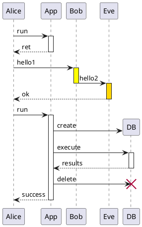

### 分類子の生成／削除

- `++` 対象を活性化
- `--` 起点側を非活性化
- `**` 対象のインスタンスを生成
- `!!` 対象のインスタンスを破棄

```plantuml

@startuml

Alice -> App ++ : run
App --> Alice -- : ret

Alice ->  Bob ++   #yellow : hello1
Bob   ->  Eve --++ #gold   : hello2
Eve   --> Alice --         : ok

Alice -> App ++ : run

App -> DB ** : create

App -> DB : execute
activate DB
DB --> App : results
deactivate DB

App -> DB !! : delete

return success

@enduml

```
