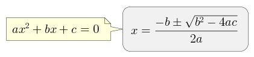
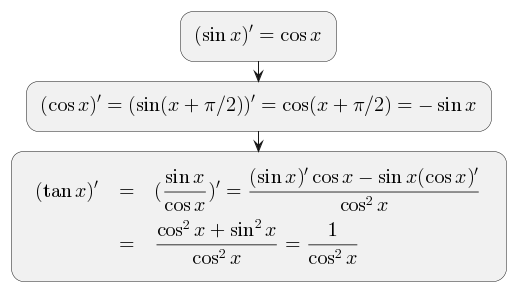

## 数式

### AsciiMath

```plantuml

@startuml

:<math>x = (-b +- sqrt(b^2 – 4ac))/(2a)</math>;

note left
<math>ax^2 + bx + c = 0</math>
end note

@enduml

```

### JLaTeXMath

```plantuml

@startuml

:<latex>( \sin x )^{\prime} = \cos x </latex>;

:<latex>( \cos x )^{\prime} = ( \sin (x+\pi /2)  )^{\prime} = \cos (x+\pi/2) = - \sin x</latex>;

:<latex>\begin{eqnarray}  ( \tan x )^{\prime} &=& ( \frac{\sin x}{\cos x}  )^{\prime}  = \frac{ (\sin x)^{\prime} \cos x - \sin x ( \cos x )^{\prime}}{\cos^{2} x} \\ &=& \frac{  \cos^{2} x + \sin^{2} x }{\cos^{2} x} = \frac{ 1 }{\cos^{2} x} \end{eqnarray}</latex>;

@enduml

```
