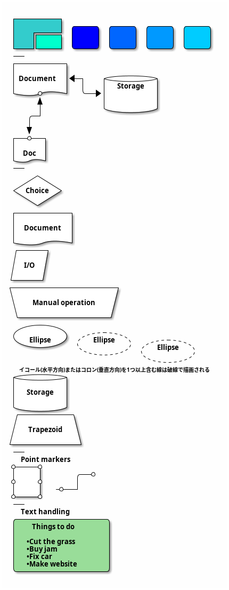

## Ditaa

```plantuml

@startditaa

+--------+
| c3CC   | /----\ /----\ /----\ /----\
|   +----+ |c00F| |c06F| |c09F| |c0CF|
|   |c0FC| |    | |    | |    | |    |
+---+----+ \----/ \----/ \----/ \----/

---

+---------+
|{d}      |
|Document |<-+   +---------+
|         |  |   | Storage |
+----*----+  \-->|{s}      |
     ^           |         |
     |           +---------+
   /-+
   |
   v
+--*--+
|{d}  |
| Doc |
+-----+

---

+--------+
|{c}     |
| Choice |
|        |
+--------+

+----------+
|{d}       |
| Document |
|          |
+----------+

+-----+
|{io} |
| I/O |
|     |
+-----+

+------------------+
|{mo}              |
| Manual operation |
|                  |
+------------------+

+---------+
|{o}      | +=--------+
| Ellipse | | Ellipse | +---------+
+---------+ | {o}     | : Ellipse |
            +---------+ | {o}     |
                        +---------+

イコール(水平方向)またはコロン(垂直方向)を1つ以上含む線は破線で描画される

+---------+
|{s}      |
| Storage |
|         |
+---------+

+-----------+
|{tr}       |
| Trapezoid |
|           |
+-----------+

---

Point markers

*----*
|    |      /--*
*    *      |
|    |  -*--+
*----*

---

Text handling

/-----------------\
| Things to do    |
| cGRE            |
| o Cut the grass |
| o Buy jam       |
| o Fix car       |
| o Make website  |
\-----------------/


@endditaa

```
