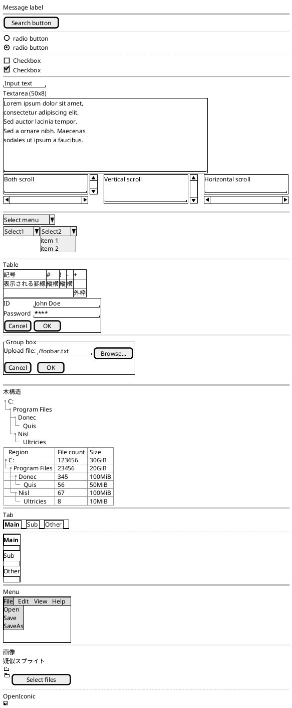
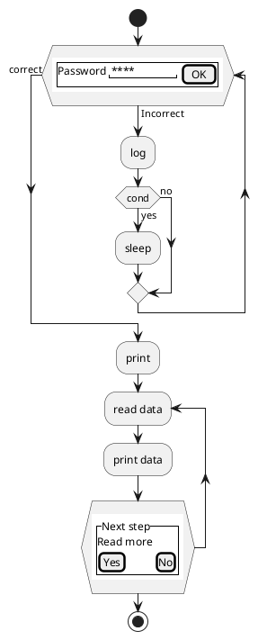

## Salt（Wireframe）

```plantuml

@startsalt

{
    Message label

    ==

    [Search button]

    --

    ()  radio button

    (X) radio button

    ..

    []  Checkbox

    [X] Checkbox

    ~~

    "Input text"

    Textarea (50x8)
    {+
        Lorem ipsum dolor sit amet,
        consectetur adipiscing elit.
        Sed auctor lacinia tempor.
        Sed a ornare nibh. Maecenas
        sodales ut ipsum a faucibus.
        .
        .
        "                                                  "
    }

    {
        {S
            Both scroll
            "                    "
        } |
        {SI
            Vertical scroll
            .
            "                    "
        } |
        {S-
            Horizontal scroll
            "                    "
        }
    }

    ==

    ^Select menu^

    {
        ^Select1^ |
        ^Select2^^item 1^^item 2^
    }

    .
    .

    ==

    Table

    {#
        記号          |#   |! |- |+
        表示される罫線|縦横|縦|横|.
        .             | * | * | * | 外枠
    }
    ' . 空白セル
    ' * 左のセルと結合

    {+
        ID       | "John Doe        "
        Password | "********        "
        [Cancel] | [  OK  ]
    }

    ==

    {^"Group box"
        Upload file:  | { "~/foobar.txt " | [Browse...] }

        [Cancel] | [  OK  ]
    }

    ==

    木構造

    {T
        + C:
        ++ Program Files
        +++ Donec
        ++++ Quis
        +++ Nisl
        ++++ Ultricies
    }

    {
        {T#
            +Region          | File count | Size
            + C:             | 123456     | 30GiB
            ++ Program Files | 23456      | 20GiB
            +++ Donec        | 345        | 100MiB
            ++++ Quis        | 56         | 50MiB
            +++ Nisl         | 67         | 100MiB
            ++++ Ultricies   | 8         |  10MiB
        }
    }

    ==

    Tab

    {+
        {/ <b>Main | Sub | Other }
    }

    ..

    {+
        {/ <b>Main
        Sub
        Other }
    }

    ==

    Menu

    {+
        {* File | Edit | View | Help
            File | Open | Save | SaveAs
            ' Edit | Cut | Copy | Paste
            ' View | Option
            ' Help | About
        }
        .
        .
        .
        .
    }

    ==

    画像

    疑似スプライト

    {
        <<folder
        ............
        .XXXXX......
        .X...X......
        .XXXXXXXXXX.
        .X........X.
        .X........X.
        .X........X.
        .X........X.
        .XXXXXXXXXX.
        ............
        >>

        { <<folder>> | [ Select files ] }
    }

    ..

    OpenIconic

    <&image>

}

@endsalt

```

###アクティビティ図でSaltを表示

```plantuml

@startuml

start

while (\n{{\nsalt\n{+\nPassword | "****     " | [ OK ]}\n}}\n) is (Incorrect)
  :log;
  if (cond) then (yes)
    :sleep;
  else (no)
  endif
endwhile (correct)

:print;

repeat :read data;
  :print data;
repeat while (\n{{\nsalt\n{^"Next step"\n Read more \n[Yes]|[No]\n}\n}}\n)

stop

@enduml

@startuml

(*) --> "
{{
    salt
    {+
        <b>Main menu
        ^Select2^^item 1^^item 2^
        .
        .
        [Next]
    }
}}
" as mainmenu

mainmenu -->[Navigate] "
{{
    salt
    {+
        ()  Option1
        (X) Option2
        [Next]
    }
}}
" as screen1

screen1 -> "
{{
    salt
    {+
        [Cancel]
    }
}}
" as screen2

screen1 --> "Some Test"

if "Some Test" then
  -->[true] "Some Activity"
  -right-> (*)
else
  ->[false] "Something else"
  --> (*)
endif

@enduml

```
