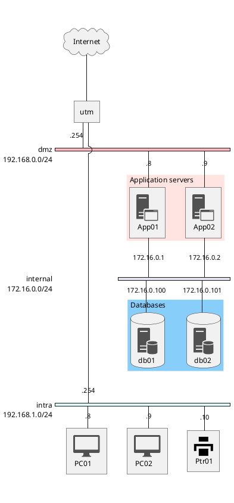

### nwdiag

```plantuml

@startuml

!include <office/Devices/device_mac_client>
!include <office/Servers/application_server>
!include <office/Servers/database_server>


nwdiag {
    inet [shape = cloud, description = "Internet"];
    inet -- utm;

    network dmz{
        color = "LightPink";
        address = "192.168.0.0/24"

        utm [address = ".254"];

        group App {
            color = "MistyRose";
            description = "Application servers";

            app01 [address = ".8", description = "<$application_server>\n App01"];
            app02 [address = ".9", description = "<$application_server>\n App02"];
        }
    }
    network internal {
        address = "172.16.0.0/24";

        app01 [address = "172.16.0.1"];
        app02 [address = "172.16.0.2"];
        db01 [address = "172.16.0.100", description = "<$database_server>\n db01", shape = "database"];
        db02 [address = "172.16.0.101", description = "<$database_server>\n db02", shape = "database"];

        group DB {
            color = "LightSkyBlue";
            description = "Databases";

            db01;
            db02;
        }
    }

    network intra {
        color = "LightCyan"
        address = "192.168.1.0/24"

        utm [address = ".254"];

        pc01 [address = ".8", description = "<$device_mac_client>\n PC01"];
        pc02 [address = ".9", description = "<$device_mac_client>\n PC02"];
        ptr01 [address = ".10", description = "<&print*4>\n Ptr01"];
    }
}

@enduml

```

```plantuml

@startuml

nwdiag {
    network Shapes {
        ' 配置図と同じ形状

        Actor       [shape = actor]
        Agent       [shape = agent]
        Artifact    [shape = artifact]
        Boundary    [shape = boundary]
        Card        [shape = card]
        Cloud       [shape = cloud]
        Collections [shape = collections]
        Component   [shape = component]
        Control     [shape = control]
        Database    [shape = database]
        Entity      [shape = entity]
        File        [shape = file]
        Folder      [shape = folder]
        Frame       [shape = frame]
        Hexagon     [shape = hexagon]
        Interface   [shape = interface]
        Label       [shape = label]
        Node        [shape = node]
        Package     [shape = package]
        Person      [shape = person]
        Queue       [shape = queue]
        Stack       [shape = stack]
        Rectangle   [shape = rectangle]
        Storage     [shape = storage]
        Usecase     [shape = usecase]
    }
}

@enduml

```
