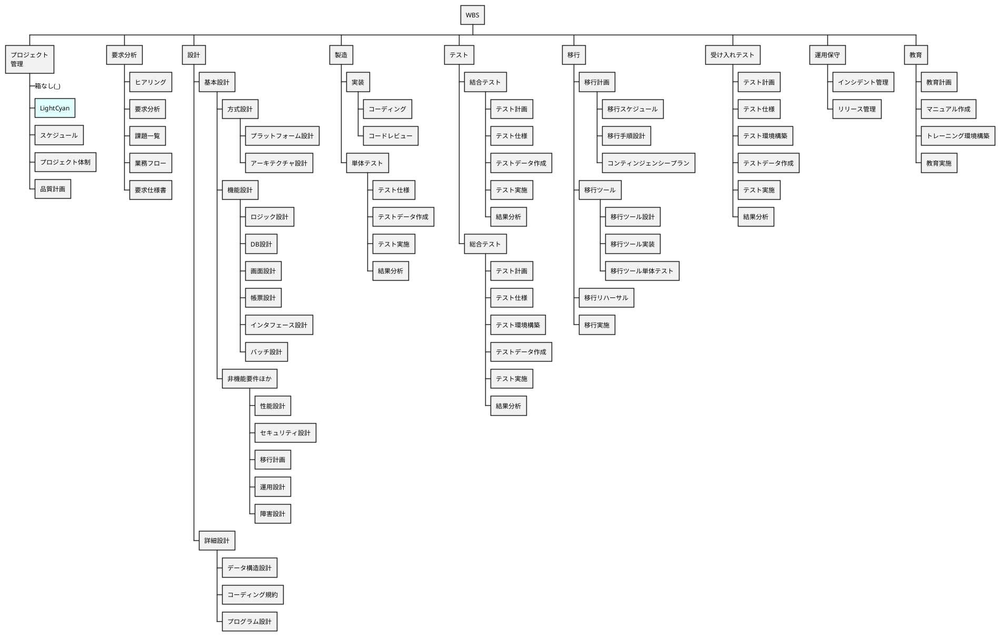
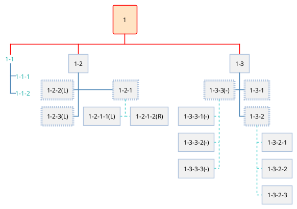

## WBS

```plantuml

@startwbs

* WBS
**:プロジェクト
管理;
***_ 箱なし(_)
***[#LightCyan] LightCyan
*** スケジュール
*** プロジェクト体制
*** 品質計画
** 要求分析
*** ヒアリング
*** 要求分析
*** 課題一覧
*** 業務フロー
*** 要求仕様書
** 設計
*** 基本設計
**** 方式設計
***** プラットフォーム設計
***** アーキテクチャ設計
**** 機能設計
***** ロジック設計
***** DB設計
***** 画面設計
***** 帳票設計
***** インタフェース設計
***** バッチ設計
**** 非機能要件ほか
***** 性能設計
***** セキュリティ設計
***** 移行計画
***** 運用設計
***** 障害設計
*** 詳細設計
**** データ構造設計
**** コーディング規約
**** プログラム設計
** 製造
*** 実装
**** コーディング
**** コードレビュー
*** 単体テスト
**** テスト仕様
**** テストデータ作成
**** テスト実施
**** 結果分析
** テスト
*** 結合テスト
**** テスト計画
**** テスト仕様
**** テストデータ作成
**** テスト実施
**** 結果分析
*** 総合テスト
**** テスト計画
**** テスト仕様
**** テスト環境構築
**** テストデータ作成
**** テスト実施
**** 結果分析
** 移行
*** 移行計画
**** 移行スケジュール
**** 移行手順設計
**** コンティンジェンシープラン
*** 移行ツール
**** 移行ツール設計
**** 移行ツール実装
**** 移行ツール単体テスト
*** 移行リハーサル
*** 移行実施
** 受け入れテスト
*** テスト計画
*** テスト仕様
*** テスト環境構築
*** テストデータ作成
*** テスト実施
*** 結果分析
** 運用保守
*** インシデント管理
*** リリース管理
** 教育
*** 教育計画
*** マニュアル作成
*** トレーニング環境構築
*** 教育実施

@endwbs

```

```plantuml

@startwbs

<style>
wbsDiagram {
    Linecolor LightSteelBlue

    arrow {
      LineColor SteelBlue
    }

    boxless {
      FontColor LightSeaGreen
    }

    :depth(0) {
        BackgroundColor Bisque
        LineColor red
        Margin 10
        MaximumWidth 100
        Padding 20
        RoundCorner 5
    }

    arrow {
      :depth(2) {
        LineColor MediumTurquoise
        LineStyle 4
        LineThickness 1.5
      }
    }
    node {
      :depth(2) {
        LineStyle 2
        LineThickness 4
      }
    }
}
</style>

* 1
**_ 1-1
***_ 1-1-1
***_ 1-1-2
** 1-2
*** 1-2-1
****< 1-2-1-1(L)
****> 1-2-1-2(R)
***< 1-2-2(L)
***< 1-2-3(L)
** 1-3
+++ 1-3-1
+++ 1-3-2
++++ 1-3-2-1
++++ 1-3-2-2
++++ 1-3-2-3
++- 1-3-3(-)
+++- 1-3-3-1(-)
+++- 1-3-3-2(-)
---- 1-3-3-3(-)

@endwbs

```
