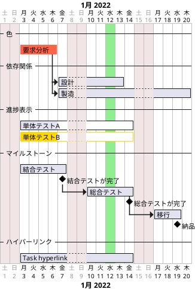

## ガントチャート

### 期間と休業日

```plantuml

@startgantt

-- 日単位 --

[Task 1 (1日)] lasts 1 day
[Task 2 (2日)] lasts 2 days
[Task 3 (3日)] lasts 3 days
[Task 4 (4日)] lasts 4 days
[Task 5 (5日)] lasts 5 days
[Task 6 (5日)] lasts 6 days

-- 週単位 --

[Task 11 (1週間)] lasts 1 week
[Task 12 (1週間と1日)] lasts 1 week and 1 day
[Task 13 (1週間と2日)] lasts 1 week and 2 day
[Task 14 (2週間)] lasts 2 weeks

@endgantt

@startuml

language ja

project starts the 2022/01/01

saturday are closed
sunday are closed

-- 日単位（土日は休業日） --

[Task 1 (1日)] lasts 1 day
[Task 2 (2日)] lasts 2 days
[Task 3 (3日)] lasts 3 days
[Task 4 (4日)] lasts 4 days
[Task 5 (5日)] lasts 5 days
[Task 6 (5日)] lasts 6 days

-- 週単位（土日は休業日） --

[Task 11 (1週間)] lasts 1 week
[Task 12 (1週間と1日)] lasts 1 week and 1 day
[Task 13 (1週間と2日)] lasts 1 week and 2 day
[Task 14 (2週間)] lasts 2 weeks

-- 期日・期間指定 --

[要求分析] lasts 10 days
[要求分析] starts 2022-01-04

[設計] lasts 2 weeks
[設計] starts 2022-01-10

[製造] starts 2022-01-14 and ends 2022-01-25

[テスト] starts 2022-01-22 and lasts 10 days

-- 個別の休業日 --

2022/03/01 is closed
[個別の休業日前後] starts 2022-02-28 and lasts 2 days

2022-04-01 to 2022-04-30 is closed
2022-04-02 is open

[休業期間中の営業日] starts 2022-04-02 and lasts 1 day

[5/1] starts 2022-05-01 and lasts 1 day

@enduml

```

### 例



### 倍率

- printscale
- ganttscale
- projectscale

- daily
- weekly
- monthly
- quarterly
- yearly

```plantuml

@startgantt

saturday are closed
sunday are closed

Project starts the 1st of january 2022

[task1] lasts 10 weeks
[task1] links to [[http://plantuml.com]]

@endgantt

@startuml

printscale weekly

saturday are closed
sunday are closed

Project starts the 1st of january 2022

[task1] lasts 10 weeks
[task1] links to [[http://plantuml.com]]

@enduml

@startuml

printscale weekly zoom 2

saturday are closed
sunday are closed

Project starts the 1st of january 2022

[task1] lasts 10 weeks
[task1] links to [[http://plantuml.com]]

@enduml

```
