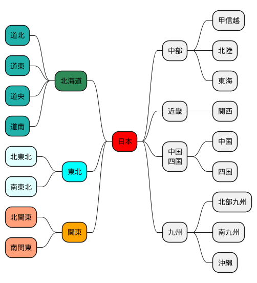

## マインドマップ

```plantuml

@startmindmap

*[#Red] 日本
--[#SeaGreen] 北海道
---[#LightSeaGreen] 道北
---[#LightSeaGreen] 道東
---[#LightSeaGreen] 道央
---[#LightSeaGreen] 道南
--[#Cyan] 東北
---[#LightCyan] 北東北
---[#LightCyan] 南東北
--[#Orange] 関東
---[#LightSalmon] 北関東
---[#LightSalmon] 南関東
++ 中部
+++ 甲信越
+++ 北陸
+++ 東海
++ 近畿
+++ 関西
**:中国
四国;
+++ 中国
+++ 四国
++ 九州
+++ 北部九州
+++ 南九州
+++ 沖縄

@endmindmap

```
