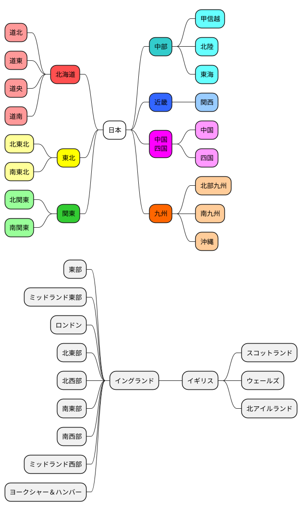

## マインドマップ

```plantuml

@startmindmap

*[#fefefe] 日本
--[#ff5050] 北海道
---[#ff9999] 道北
---[#ff9999] 道東
---[#ff9999] 道央
---[#ff9999] 道南
--[#ffff00] 東北
---[#ffff99] 北東北
---[#ffff99] 南東北
--[#33cc33] 関東
---[#99ff99] 北関東
---[#99ff99] 南関東
++[#33cccc] 中部
+++[#66ffff] 甲信越
+++[#66ffff] 北陸
+++[#66ffff] 東海
++[#3366ff] 近畿
+++[#99ccff] 関西
**[#ff00ff]:中国
四国;
+++[#ff99ff] 中国
+++[#ff99ff] 四国
++[#ff6600] 九州
+++[#ffcc99] 北部九州
+++[#ffcc99] 南九州
+++[#ffcc99] 沖縄

' マルチルート
* イギリス
-- イングランド
--- 東部
--- ミッドランド東部
--- ロンドン
--- 北東部
--- 北西部
--- 南東部
--- 南西部
--- ミッドランド西部
--- ヨークシャー＆ハンバー
** スコットランド
** ウェールズ
** 北アイルランド

@endmindmap

@startmindmap

<style>
mindmapDiagram {
    ' <<gold>>
    .gold {
      BackgroundColor gold
    }

    node {
        BackgroundColor DimGrey
    }

    :depth(0) {
      BackGroundColor #e6f0ff
    }

    :depth(1) {
      BackGroundColor #99c2ff
    }

    :depth(2) {
      BackGroundColor #4d94ff
    }

    :depth(3) {
      BackGroundColor #1a75ff
    }

    boxless {
        FontColor red
    }
}
</style>

* 臺灣

left side

** <&lightbulb> 直轄市 /' OpenIconicアイコン '/
*** 台北市 <<gold>>
*** 高雄市
*** 新北市
*** 台中市
*** 台南市
*** 桃園市
**_ 市
*** 基隆市
*** 新竹市
*** 嘉義市

right side

** 県
*** 新竹県
*** 苗栗県
*** 彰化県
*** 南投県
*** 雲林県
*** 嘉義県
*** 屏東県
*** 宜蘭県
*** 花蓮県
*** 台東県
*** 澎湖県
*** 金門県
*** 連江県

@endmindmap

```
