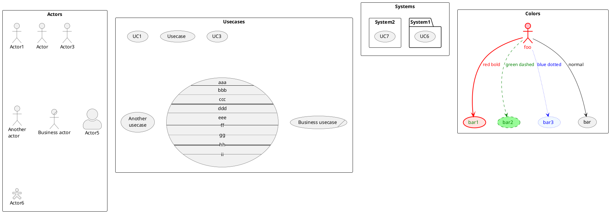
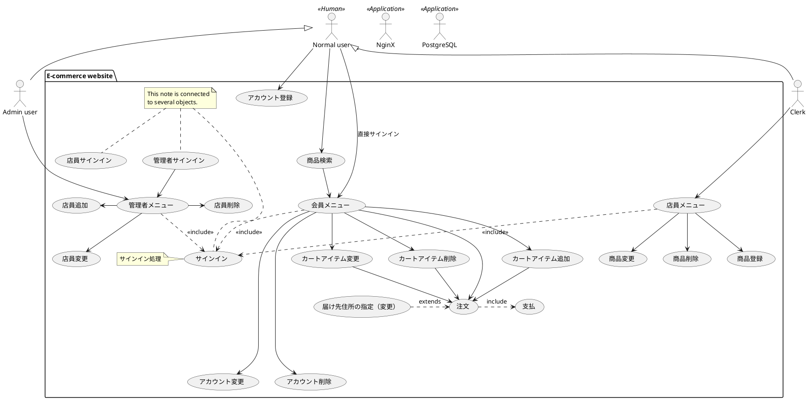

# ユースケース図

```plantuml

@startuml

rectangle Actors {
    ' 棒人間
    :Actor1:
    :Actor: as Actor2
    actor Actor3
    actor :Another\nactor: as Actor4

    actor :Business actor:/ as BAct

    ' Awesome man
    skinparam actorStyle awesome
    :Actor5:

    ' Hollow man
    skinparam actorStyle hollow
    :Actor6:
}

rectangle Usecases {
    (UC1)
    (Usecase) as (UC2)
    usecase UC3
    usecase (Another\nusecase) as UC4

    usecase UC5 as "
    aaa
    --
    bbb
    ..
    ccc
    ==
    ddd
    ___
    eee
    -- ff --
    .. gg ..
    == hh ==
    __ ii __
    "

    usecase (Business usecase)/ as BUC
}
' -- (ダッシュ)
' .. (ピリオド)
' == (イコール)
' __ (アンダースコア)
' これらのペアで囲んで、その間に

rectangle Systems {
    package System1 {
        (UC6)
    }

    skinparam packageStyle rect
    package System2 {
        (UC7)
    }
}

rectangle Colors {
    skinparam actorStyle none

    actor foo #pink;line:red;line.bold;text:red
    usecase bar1 #mistyrose;line:red;line.bold;text:green
    usecase bar2 #palegreen;line:green;line.dashed;text:green
    usecase bar3 #aliceblue;line:blue;line.dotted;text:blue

    foo --> (bar) : normal
    foo --> (bar1) #line:red;line.bold;text:red  : red bold
    foo --> (bar2) #green;line.dashed;text:green : green dashed
    foo --> (bar3) #blue;line.dotted;text:blue   : blue dotted
}

@enduml

```

```plantuml

@startuml


' 作図方向
' top to bottom direction /' 既定値 '/
' left to right direction


actor "Admin user" as Admin
actor "Clerk" as Clerk
actor "Normal user" as User <<Human>>

actor "NginX" as HTTPD <<Application>>
actor "PostgreSQL" as DB <<Application>>


' 継承
User <|-- Admin
User <|-- Clerk


package "E-commerce website" {
    Admin --> (管理者メニュー)
    (管理者サインイン) --> (管理者メニュー)
    (管理者メニュー) -left-> (店員追加)
    (管理者メニュー) --> (店員変更)
    (管理者メニュー) -right-> (店員削除)
    (管理者メニュー) ..> (サインイン) : <<include>>

    Clerk --> (店員メニュー)
    (店員メニュー) --> (商品登録)
    (店員メニュー) --> (商品変更)
    (店員メニュー) --> (商品削除)
    (店員メニュー) ..> (サインイン) : <<include>>
    User --> (アカウント登録)
    User --> (商品検索)
    (商品検索) --> (会員メニュー)
    (会員メニュー) ..> (サインイン) : <<include>>

    User --> (会員メニュー) : 直接サインイン

    note "This note is connected\nto several objects." as N2
    N2 .. (サインイン)
    N2 .. (店員サインイン)
    N2 .. (管理者サインイン)

    ' note right of 、 note top of 、 note bottom of
    note left of (サインイン)
        サインイン処理
    end note

    ' 長い矢印
    (会員メニュー) -----> (アカウント変更)
    (会員メニュー) -----> (アカウント削除)

    (会員メニュー) --> (カートアイテム追加)
    (会員メニュー) --> (カートアイテム変更)
    (会員メニュー) --> (カートアイテム削除)
    (カートアイテム追加) --> (注文)
    (カートアイテム変更) --> (注文)
    (カートアイテム削除) --> (注文)

    (会員メニュー) --> (注文)
    (注文) .> (支払) : include
    (届け先住所の指定（変更）) .> (注文) : extends
}

@enduml


```