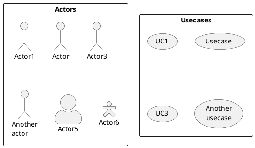

# ユースケース図

```plantuml

@startuml

rectangle Actors {
    ' 棒人間
    :Actor1:
    :Actor: as Actor2
    actor Actor3
    actor :Another\nactor: as Actor4

    ' Awesome man
    skinparam actorStyle awesome
    :Actor5:

    ' Hollow man
    skinparam actorStyle hollow
    :Actor6:
}

rectangle Usecases {
    (UC1)
    (Usecase) as (UC2)
    usecase UC3
    usecase (Another\nusecase) as UC4
}

@enduml

```
