# クラス図

## 要素

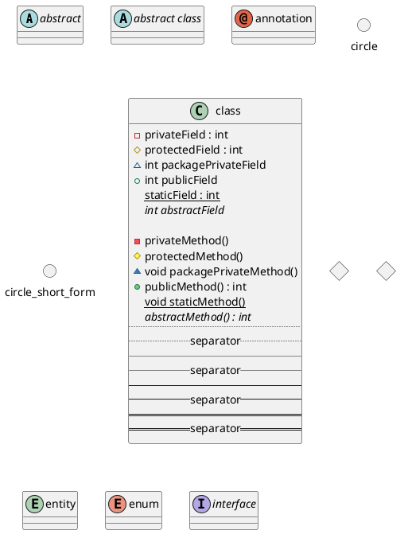
```plantuml

@startuml

abstract        abstract
abstract class  "abstract class"
annotation      annotation
circle          circle
()              circle_short_form
class           class
diamond         diamond
<>              diamond_short_form
entity          entity
enum            enum
interface       interface


class class {
    -privateField : int
    #protectedField : int
    ~int packagePrivateField
    +int publicField
    {static} staticField : int
    {abstract} int abstractField

    ' skinparam classAttributeIconSize 0 でマークをつけない
    -privateMethod()
    #protectedMethod()
    ~void packagePrivateMethod()
    +publicMethod() : int
    {static} void staticMethod()
    {abstract} abstractMethod() : int
    ..
    .. separator ..
    __
    __ separator __
    --
    -- separator --
    ==
    == separator ==
}

@enduml

```

## 関係

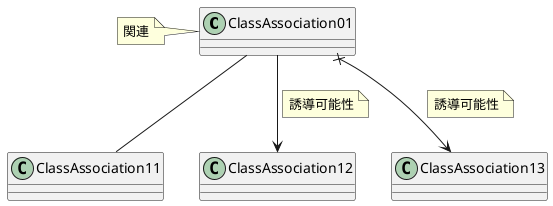
```plantuml

@startuml

ClassAssociation01 -- ClassAssociation11
ClassAssociation01 --> ClassAssociation12
note on link : 誘導可能性
ClassAssociation01 x--> ClassAssociation13
note on link : 誘導可能性

note left of ClassAssociation01 : 関連


@enduml

```

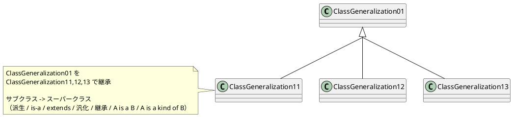
```plantuml

@startuml

' skinparam groupInheritance 1 /' 継承の矢印の矢じりをグループ化しない '/
skinparam groupInheritance 2 /' 継承の矢印の矢じりが2つ以上の場合にグループ化 '/

' ClassGeneralization01 ^-- ClassGeneralization11
ClassGeneralization01 <|-- ClassGeneralization11
ClassGeneralization01 <|-- ClassGeneralization12
ClassGeneralization01 <|-- ClassGeneralization13
ClassGeneralization11 -[hidden]> ClassGeneralization12
ClassGeneralization12 -[hidden]> ClassGeneralization13

note left of ClassGeneralization11
    ClassGeneralization01 を
    ClassGeneralization11,12,13 で継承

    サブクラス -> スーパークラス
    （派生 / is-a / extends / 汎化 / 継承 / A is a B / A is a kind of B）
end note

@enduml

```

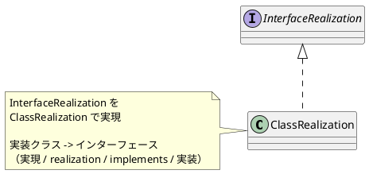
```plantuml

@startuml

class ClassRealization
interface InterfaceRealization

' InterfaceRealization ^.. ClassRealization
InterfaceRealization <|.. ClassRealization

note left of ClassRealization
    InterfaceRealization を
    ClassRealization で実現

    実装クラス -> インターフェース
    （実現 / realization / implements / 実装）
end note

@enduml

```

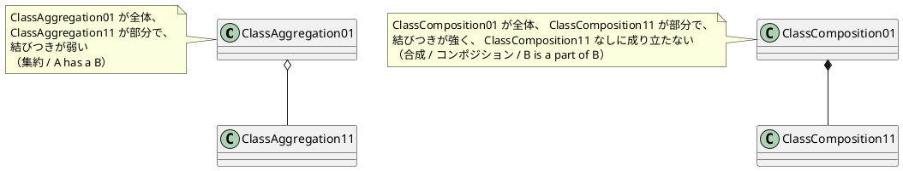
```plantuml

@startuml

ClassAggregation01 o-- ClassAggregation11

note left of ClassAggregation01
    ClassAggregation01 が全体、
    ClassAggregation11 が部分で、
    結びつきが弱い
    （集約 / A has a B）
end note

ClassComposition01 *-- ClassComposition11

note left of ClassComposition01
    ClassComposition01 が全体、 ClassComposition11 が部分で、
    結びつきが強く、 ClassComposition11 なしに成り立たない
    （合成 / コンポジション / B is a part of B）
end note

@enduml

```

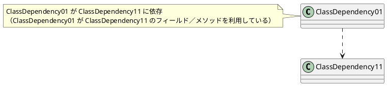
```plantuml

@startuml

ClassDependency01 ..> ClassDependency11

note left of ClassDependency01
    ClassDependency01 が ClassDependency11 に依存
    （ClassDependency01 が ClassDependency11 のフィールド／メソッドを利用している）
end note

@enduml

```

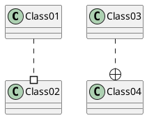
```plantuml

@startuml

Class01 ..# Class02
Class03 ..+ Class04

@enduml

```

## 多重度

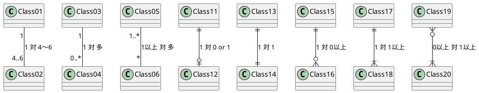
```plantuml

@startuml

Class01 "1" -- "4..6" Class02 : 1 対 4～6
Class03 "1" -- "0..*" Class04 : 1 対 多
Class05"1..*" -- "*" Class06 : 1以上 対 多


' IE記法
' 最小(オプショナリティ) / 最大(カーディナリティ)

Class11 ||--o| Class12 : 1 対 0 or 1
Class13 ||--|| Class14 : 1 対 1

Class15 ||--o{ Class16 : 1 対 0以上
Class17 ||--|{ Class18 : 1 対 1以上

Class19 }o--|{ Class20 : 0以上 対 1以上

@enduml

```

## パッケージと名前空間

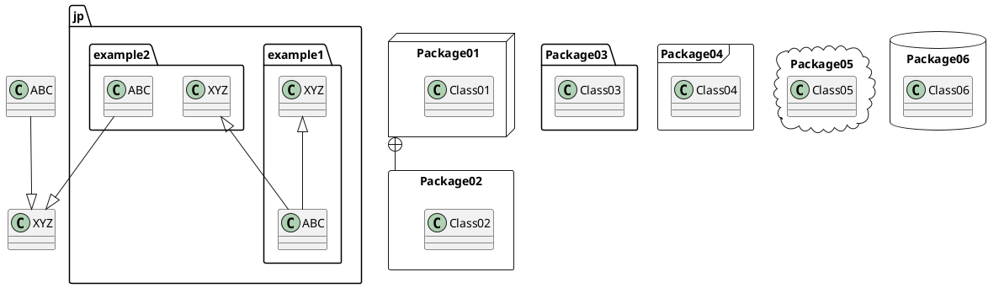
```plantuml

@startuml

package Package01 <<Node>> {
  class Class01
}

package Package02 <<Rectangle>> {
  class Class02
}

package Package03 <<Folder>> {
  class Class03
}

package Package04 <<Frame>> {
  class Class04
}

package Package05 <<Cloud>> {
  class Class05
}

package Package06 <<Database>> {
  class Class06
}

Package01 +-- Package02

' ''''''''''

class ABC
class XYZ
ABC --|> XYZ

namespace jp.example1 {
    class ABC
    class XYZ
    jp.example2.XYZ <|-- ABC
    XYZ <|-- ABC
}

namespace jp.example2 {
    class ABC
    class XYZ
    ABC --|> .XYZ
}

@enduml

```

## 外観

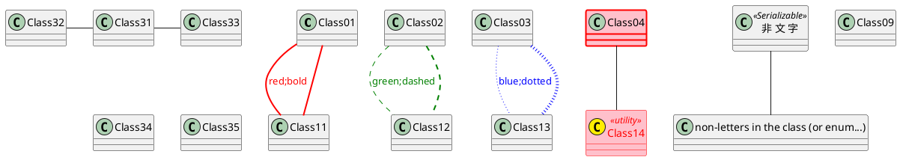
```plantuml

@startuml

' 空の属性・操作を省略
' hide empty members

' その他の省略
' hide empty fields, hide empty attributes
' hide empty methods
' hide fields, hide attributes
' hide circle
' hide stereotype
' hide members
' hide Class51
' hide <<Serializable>> members

' 孤立したクラスの省略
' hide @unlinked

' 削除
' remove Class51

' 孤立したクラスの削除
' remove @unlinked


' bold、dashed、dotted、hidden、plain
Class01 -- Class11 #line:red;line.bold;text:red : red;bold
Class02 -- Class12 #line:green;line.dashed;text:green : green;dashed
Class03 -- Class13 #line:blue;line.dotted;text:blue : blue;dotted
Class01 -[#red,bold]- Class11
Class02 -[#green,dashed,thickness=2]- Class12
Class03 -[#blue,dotted,thickness=4]- Class13

class Class04 #pink ##[bold]red
class Class14 << (C,#FFEE00) utility >> #pink;line:red;text:red
Class04 -- Class14

' 水平方向 left, right, up, down
Class31 -left- Class32
Class31 -      Class33

' bold、dashed、dotted、hidden、plain
Class34 -[hidden]>  Class35 /' 水平方向に揃える '/
Class31 -[hidden]-> Class34 /' 垂直方向に揃える '/
Class01 -[hidden]> Class02
Class02 -[hidden]> Class03

class "非 文 字" as Class07 <<Serializable>>
class Class08 as "non-letters in the class (or enum...)"
Class07 -- Class08

' 孤立したクラスの省略
' hide @unlinked
class Class09

@enduml

```

## 例

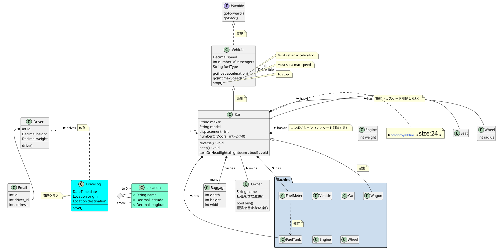
```plantuml

@startuml

' 空の属性・操作を省略
hide empty members


package Machine #CDE {
    class Vehicle
    class Car
    class Engine
    class Wagon
    class Wheel
    class FuelMeter
    class FuelTank
}


' クラス

Baggage : int depth
Baggage : int height
Baggage : int width

class Car {
    String maker
    String model
    displacement : int
    numberOfDoors : int=2 {>0}

    reverse() : void
    beep() : void
    turnOnHeadlights(highbeam : bool) : void
}

Driver : drive()
Driver : int id
Driver : Decimal height
Driver : Decimal weight

class Email {
    int id
    int driver_id
    int address
}

class Engine {
    int weight
}

class DriveLog #Aqua {
    DateTime date
    Location origin
    Location destination

    save()
}

class Location #Aquamarine {
    + String name
    + Decimal latitude
    + Decimal longitude
}

class Owner {
    String name
    bool buy()
    {field} 括弧を含む属性()
    {method} 括弧を含まない操作
}

class Vehicle {
    Decimal speed
    int numberOfPassengers
    String fuelType
    go(float acceleration)
    go(int maxSpeed)
    stop()
}

class Wheel {
    int radius
}


' インターフェース
Vehicle -() Driveable

interface Movable {
    goForward()
    goBack()
}


' リレーション

Vehicle <|-- Car
' note left on link, note right on link, note top on link, note bottom on link
note right on link : 派生

Movable <|.. Vehicle
note right on link : 実現

Driver "1..*" -> "0..*" Car : drives >
note right on link : 依存
(Driver, Car) .. DriveLog

Driver::id *-- Email::driver_id

Car *- Engine : has an >
note right on link : コンポジション（カスケード削除する）
Car *- Wheel : has 4 >
Car *- FuelMeter : has >
Car *- FuelTank : has >

Car o- Seat : has >
note right on link : 集約（カスケード削除しない）

Car <|-- Wagon
note on link : 派生

Car -- Owner : < owns

Car "1" *-- "many" Baggage : carries

FuelMeter ..> FuelTank
note right on link : 依存


' N 項関連
<> diamond
DriveLog . diamond
diamond - "from 0..*" Location
diamond - "to 0..* " Location


' Notes

' note left of, note right of, note top of, note bottom of
note right of Car
    <b>b</b> <color:royalBlue>color:royalBlue</color> <i>i</i> <s>s</s> <size:24>size:24</size> <u>u</u>
end note

' フィールド・メソッドの注釈は note left of, note right ofのみ
note right of Vehicle::"go(float acceleration)"
    Must set an acceleration
end note

note right of Vehicle::"go(int maxSpeed)"
    Must set a max speed
end note

note right of Vehicle::stop
    To stop
end note

note left of DriveLog
    関連クラス
end note

@enduml

```
