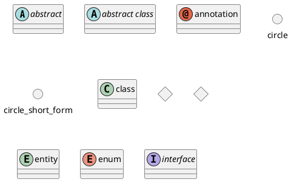
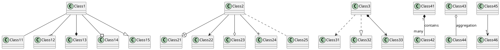
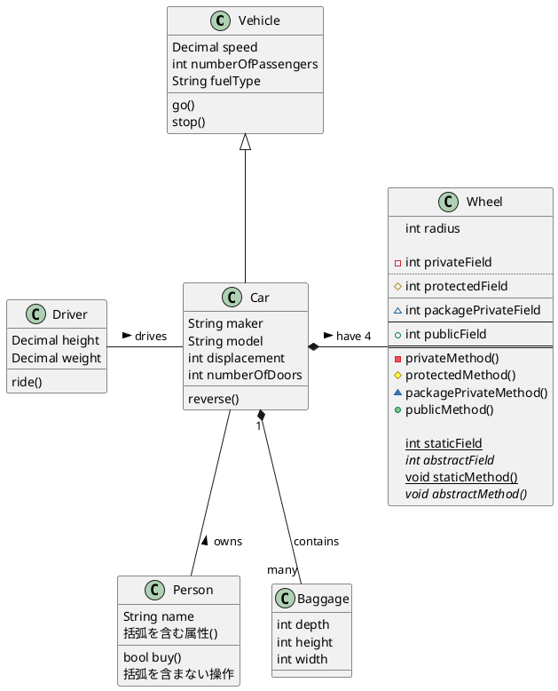

# クラス図







```plantuml

@startuml

@enduml


```

```plantuml

@startuml

@enduml


```

```plantuml

@startuml

@enduml


```

```plantuml

@startuml

@enduml


```

```plantuml

@startuml

@enduml


```
