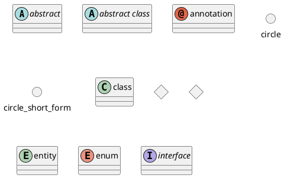
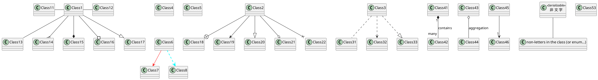
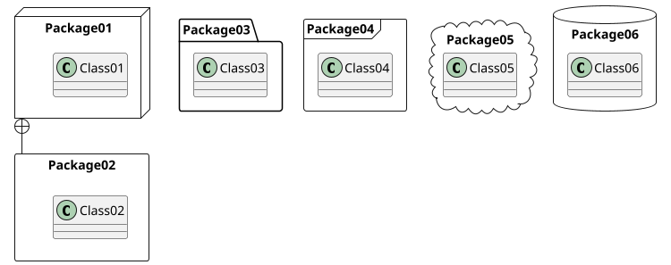
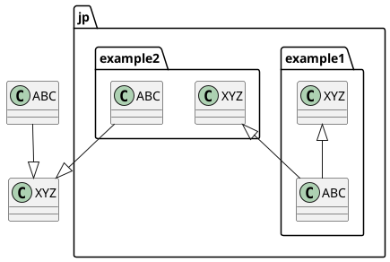
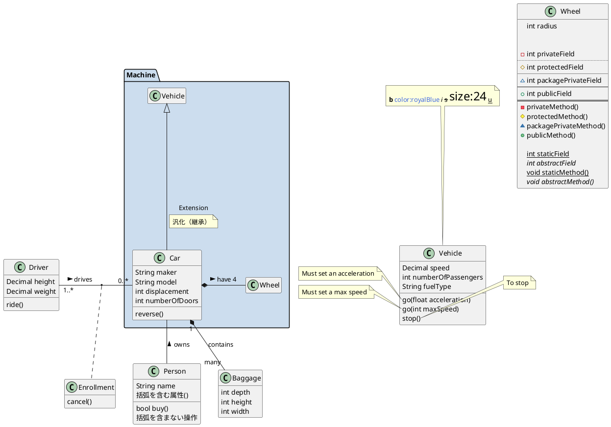
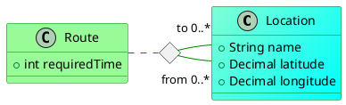
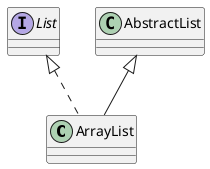

# クラス図

```plantuml

@startuml

abstract        abstract
abstract class  "abstract class"
annotation      annotation
circle          circle
()              circle_short_form
class           class
diamond         diamond
<>              diamond_short_form
entity          entity
enum            enum
interface       interface

@enduml

```

```plantuml

@startuml


' 空の属性・操作を省略
' hide empty members

' その他の省略
' hide empty fields, hide empty attributes
' hide empty methods
' hide fields, hide attributes
' hide circle
' hide stereotype
' hide members
' hide Class51
' hide <<Serializable>> members

' 孤立したクラスの省略
' hide @unlinked

' 削除
' remove Class51

' 孤立したクラスの削除
' remove @unlinked


' 水平方向 left, right, up, down
Class1 -left- Class11
Class1 -      Class12

Class1 --   Class13
Class1 --{  Class14
Class1 --*  Class15
Class1 --#  Class16
Class1 --^  Class17
Class2 --+  Class18
Class2 -->  Class19
Class2 --|> Class20
Class2 --o  Class21
Class2 --x  Class22

Class3 ..   Class31
Class3 ..>  Class32
Class3 ..|> Class33

' bold、dashed、dotted、hidden、plain
Class4 -[hidden]>  Class5 /' 水平方向に揃える '/
Class4 -[hidden]-> Class6 /' 垂直方向に揃える '/

Class6 -[#red]-> Class7
' bold、dashed、dotted、hidden、plain
Class6 -[#aqua,dashed,thickness=2]-> Class8

Class41 "1" *-- "many" Class42 : contains
Class43 o-- Class44 : aggregation
Class45 --> "1" Class46

class "非 文 字" as Class51 <<Serializable>>
class Class52 as "non-letters in the class (or enum...)"
Class51 -- Class52
class Class53

@enduml

```

```plantuml

@startuml

class foo

' bar ()- foo
' bar ()-- foo
foo -() bar

@enduml

```

```plantuml

@startuml


@startuml
scale 750 width
package Package01 <<Node>> {
  class Class01
}

package Package02 <<Rectangle>> {
  class Class02
}

package Package03 <<Folder>> {
  class Class03
}

package Package04 <<Frame>> {
  class Class04
}

package Package05 <<Cloud>> {
  class Class05
}

package Package06 <<Database>> {
  class Class06
}

Package01 +-- Package02

@enduml

```

```plantuml

@startuml

class ABC
class XYZ
ABC --|> XYZ

namespace jp.example1 {
    class ABC
    class XYZ
    jp.example2.XYZ <|-- ABC
    XYZ <|-- ABC
}

namespace jp.example2 {
    class ABC
    class XYZ
    ABC --|> .XYZ
}

@enduml

```

```plantuml

@startuml


' 空の属性・操作を省略
hide empty members


package Machine #CDE {
    class Vehicle
    class Car
    class Wheel
}

Vehicle <|-- Car : Extension
' note left on link, note right on link, note top on link, note bottom on link
note on link : 汎化（継承）


Driver "1..*" - "0..*" Car : drives >
(Driver, Car) .. Enrollment

Car *- Wheel : have 4 >

Car -- Person : < owns

Car "1" *-- "many" Baggage : contains


Baggage : int depth
Baggage : int height
Baggage : int width

Car : String maker
Car : String model
Car : int displacement
Car : int numberOfDoors
Car : reverse()

Driver : ride()
Driver : Decimal height
Driver : Decimal weight

class Enrollment {
  cancel()
}

class Person {
    String name
    bool buy()
    {field} 括弧を含む属性()
    {method} 括弧を含まない操作
}

class Vehicle {
    Decimal speed
    int numberOfPassengers
    String fuelType
    go(float acceleration)
    go(int maxSpeed)
    stop()
}

class Wheel {
    int radius

    ' skinparam classAttributeIconSize 0 でマークをつけない

    -int privateField
    ..
    #int protectedField
    __
    ~int packagePrivateField
    --
    +int publicField
    ==
    -privateMethod()
    #protectedMethod()
    ~packagePrivateMethod()
    +publicMethod()

    {static} int staticField
    {abstract} int abstractField
    {static} void staticMethod()
    {abstract} void abstractMethod()
}

' note left of, note right of, note top of, note bottom of
note top of Vehicle
    <b>b</b> <color:royalBlue>color:royalBlue</color> <i>i</i> <s>s</s> <size:24>size:24</size> <u>u</u>
end note

note left of Vehicle::"go(float acceleration)"
    Must set an acceleration
end note

note left of Vehicle::"go(int maxSpeed)"
    Must set a max speed
end note

note right of Vehicle::stop
    To stop
end note

@enduml

```

```plantuml

@startuml

skinparam class {
    ' BackgroundColor PaleGreen
    ArrowColor Green
    BorderColor Green
}
skinparam classBackgroundColor PaleGreen

class Location #Aquamarine/Aqua {
    + String name
    + Decimal latitude
    + Decimal longitude
}

class Route {
    +int requiredTime
}

<> diamond

Route . diamond
diamond - "from 0..*" Location
diamond - "to 0..* " Location

@enduml

```

```plantuml

@startuml

class ArrayList implements List
class ArrayList extends AbstractList

@enduml

```
