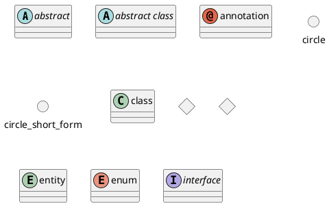
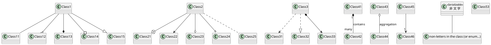
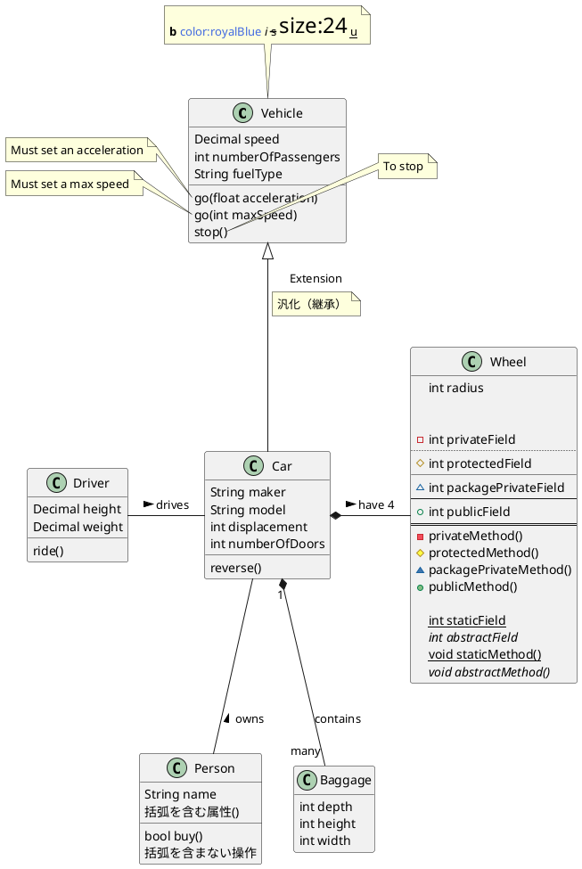

# クラス図

```plantuml

@startuml

abstract        abstract
abstract class  "abstract class"
annotation      annotation
circle          circle
()              circle_short_form
class           class
diamond         diamond
<>              diamond_short_form
entity          entity
enum            enum
interface       interface

@enduml

```

```plantuml

@startuml


' 空の属性・操作を省略
' hide empty members

' その他の省略
' hide empty fields, hide empty attributes
' hide empty methods
' hide fields, hide attributes
' hide circle
' hide stereotype
' hide members
' hide Class51
' hide <<Serializable>> members

' 孤立したクラスの省略
' hide @unlinked

' 削除
' remove Class51

' 孤立したクラスの削除
' remove @unlinked


Class1 --   Class11
Class1 --{  Class12
Class1 --*  Class13
Class1 --#  Class14
Class1 --^  Class15

Class2 --+  Class21
Class2 -->  Class22
Class2 --o  Class23
Class2 --x  Class24
Class2 ..   Class25

Class3 ..>  Class31
Class3 ..|> Class32
Class3 *--> Class33

Class41 "1" *-- "many" Class42 : contains
Class43 o-- Class44 : aggregation
Class45 --> "1" Class46

class "非 文 字" as Class51 <<Serializable>>
class Class52 as "non-letters in the class (or enum...)"
Class51 -- Class52
class Class53

@enduml

```

```plantuml

@startuml


' 空の属性・操作を省略
hide empty members


Vehicle <|-- Car : Extension
' note left on link, note right on link, note top on link, note bottom on link
note on link : 汎化（継承）

Driver - Car : drives >
Car *- Wheel : have 4 >
Car -- Person : < owns
Car "1" *-- "many" Baggage : contains

Baggage : int depth
Baggage : int height
Baggage : int width

Car : String maker
Car : String model
Car : int displacement
Car : int numberOfDoors
Car : reverse()

Driver : ride()
Driver : Decimal height
Driver : Decimal weight

class Person {
    String name
    bool buy()
    {field} 括弧を含む属性()
    {method} 括弧を含まない操作
}

class Vehicle {
    Decimal speed
    int numberOfPassengers
    String fuelType
    go(float acceleration)
    go(int maxSpeed)
    stop()
}

class Wheel {
    int radius

    ' skinparam classAttributeIconSize 0 でマークをつけない

    -int privateField
    ..
    #int protectedField
    __
    ~int packagePrivateField
    --
    +int publicField
    ==
    -privateMethod()
    #protectedMethod()
    ~packagePrivateMethod()
    +publicMethod()

    {static} int staticField
    {abstract} int abstractField
    {static} void staticMethod()
    {abstract} void abstractMethod()
}

' note left of, note right of, note top of, note bottom of
note top of Vehicle
    <b>b</b> <color:royalBlue>color:royalBlue</color> <i>i</i> <s>s</s> <size:24>size:24</size> <u>u</u>
end note

note left of Vehicle::"go(float acceleration)"
    Must set an acceleration
end note

note left of Vehicle::"go(int maxSpeed)"
    Must set a max speed
end note

note right of Vehicle::stop
    To stop
end note

@enduml

```
